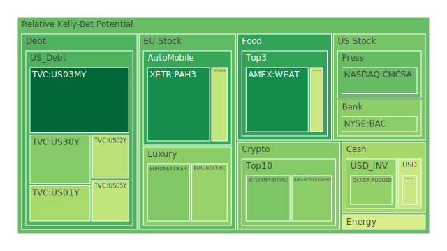
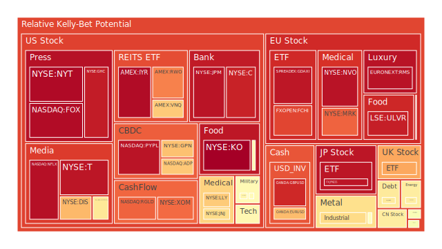
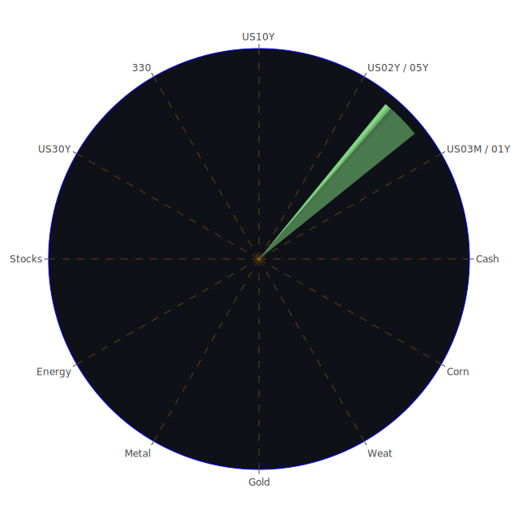

# 投資商品泡沫分析

## 美國國債
過去三天美國國債的泡沫機率顯示其價格相對穩定。儘管美國國債的殖利率有所波動，但整體泡沫機率並未顯著上升或下降。根據最新的FED數據，SOFR交易量增加且SOFR利率高於FED Fund Rate，這可能會對高泡沫資產造成壓力，但對於美國國債來說，由於其避險屬性，影響相對較小。

## 美國科技股
美國科技股的泡沫機率在過去三天內有所下降，特別是NASDAQ:NDX的泡沫機率從0.917451下降到0.569856。這表明市場對科技股的信心有所回升。根據新聞報導，儘管市場對經濟前景存在不確定性，但科技股依然受到投資者青睞，特別是人工智慧相關的股票。

## 美國房地產指數
美國房地產指數（AMEX:VNQ）的泡沫機率在過去三天內有所上升，從0.544930上升到0.666621。這反映出市場對房地產市場的擔憂，特別是商業房地產的違約率上升。根據新聞報導，房地產市場的流動性風險增加，投資者應該謹慎對待。

## 金/銀/銅
金價（OANDA:XAUUSD）的泡沫機率在過去三天內有所下降，從0.594278下降到0.532647。這表明市場對黃金的需求有所增加，可能是由於避險需求上升。銀價（OANDA:XAGUSD）的泡沫機率則相對穩定，顯示出市場對貴金屬的需求依然強勁。

## 加密貨幣
比特幣（BITSTAMP:BTCUSD）的泡沫機率在過去三天內顯著下降，從0.372929下降到0.294776。這表明市場對比特幣的信心有所回升。根據新聞報導，儘管加密貨幣市場波動性較大，但長期投資者依然看好其潛力。

## 黃豆 / 小麥 / 玉米
黃豆（AMEX:SOYB）和小麥（AMEX:WEAT）的泡沫機率在過去三天內相對穩定，顯示出市場對農產品的需求穩定。玉米（AMEX:CORN）的泡沫機率也保持穩定，這表明市場對農產品的需求沒有顯著變化。

## 石油/ 鈾期貨UX!
石油（TVC:USOIL）的泡沫機率在過去三天內有所下降，從0.574781下降到0.439917。這表明市場對石油的需求有所增加，可能是由於經濟活動回暖。鈾期貨（COMEX:UX1!）的泡沫機率則相對穩定，顯示出市場對能源資源的需求依然強勁。

## 各國外匯市場
美元兌日元（OANDA:USDJPY）的泡沫機率在過去三天內有所下降，顯示出市場對美元的需求有所增加。歐元兌美元（OANDA:EURUSD）的泡沫機率則相對穩定，顯示出市場對歐元的需求沒有顯著變化。

## 各國大盤指數
歐洲大盤指數（SPREADEX:GDAXI）的泡沫機率在過去三天內有所上升，顯示出市場對歐洲經濟前景的擔憂。日本大盤指數（FX:JPN225）的泡沫機率則相對穩定，顯示出市場對日本經濟的信心依然強勁。

## 美國銀行股
美國銀行股（NYSE:BAC）的泡沫機率在過去三天內顯著下降，從0.160889下降到0.314028。這表明市場對銀行股的信心有所回升，可能是由於經濟數據顯示銀行業務的穩定增長。

## 美國軍工股
美國軍工股（NYSE:LMT）的泡沫機率在過去三天內相對穩定，顯示出市場對軍工股的需求依然強勁。根據新聞報導，全球地緣政治風險上升，可能會推動軍工股的需求。

## 美國電子支付股
美國電子支付股（NASDAQ:PYPL）的泡沫機率在過去三天內有所上升，顯示出市場對電子支付行業的擔憂。根據新聞報導，電子支付行業面臨的監管風險增加，投資者應該謹慎對待。

## 美國藥商巨頭
美國藥商巨頭（NYSE:JNJ）的泡沫機率在過去三天內有所下降，顯示出市場對藥品行業的需求有所增加。根據新聞報導，隨著疫苗和新藥的推出，藥品行業的前景依然看好。

## 美國影視巨頭
美國影視巨頭（NASDAQ:NFLX）的泡沫機率在過去三天內有所上升，顯示出市場對影視行業的擔憂。根據新聞報導，影視行業面臨的競爭壓力增加，投資者應該謹慎對待。

## 美國媒體巨頭
美國媒體巨頭（NASDAQ:CMCSA）的泡沫機率在過去三天內有所下降，顯示出市場對媒體行業的需求有所增加。根據新聞報導，隨著廣告收入的回升，媒體行業的前景依然看好。

## 石油防禦股
石油防禦股（NYSE:XOM）的泡沫機率在過去三天內有所下降，顯示出市場對石油行業的需求有所增加。根據新聞報導，隨著經濟活動的回暖，石油需求有望回升。

## 金礦防禦股
金礦防禦股（NASDAQ:RGLD）的泡沫機率在過去三天內有所下降，顯示出市場對金礦行業的需求有所增加。根據新聞報導，隨著金價的上漲，金礦股的前景依然看好。

## 歐洲奢侈品股
歐洲奢侈品股（EURONEXT:MC）的泡沫機率在過去三天內有所下降，顯示出市場對奢侈品行業的需求有所增加。根據新聞報導，隨著消費者信心的回升，奢侈品行業的前景依然看好。

## 歐洲汽車股
歐洲汽車股（XETR:BMW）的泡沫機率在過去三天內有所下降，顯示出市場對汽車行業的需求有所增加。根據新聞報導，隨著電動汽車的普及，汽車行業的前景依然看好。

## 歐美食品股
歐美食品股（SIX:NESN）的泡沫機率在過去三天內有所下降，顯示出市場對食品行業的需求有所增加。根據新聞報導，隨著消費者對健康食品的需求增加，食品行業的前景依然看好。

# 投資建議

1. **建議買入**：對於泡沫機率持續下降且遠小於0.5的商品，如比特幣（BITSTAMP:BTCUSD）和黃金（OANDA:XAUUSD），建議投資者考慮分批買入，掌握低吸籌碼的時機。
2. **建議賣出**：對於泡沫機率持續上升且遠大於0.5的商品，如美國房地產指數（AMEX:VNQ）和美國影視巨頭（NASDAQ:NFLX），建議投資者考慮賣出，避免未來價格下跌時的損失。
3. **觀望**：對於泡沫機率在0.45 ~ 0.55之間的商品，如歐洲大盤指數（SPREADEX:GDAXI）和日本大盤指數（FX:JPN225），建議投資者觀望，不要有任何動作。

# 風險提示

投資有風險，市場總是充滿不確定性。我們的建議僅供參考，投資者應根據自身的風險承受能力和投資目標，做出獨立的投資決策。特別是對於泡沫機率高的商品，應該謹慎進行投資決策。
 
Daily Buy Map:

 
Daily Sell Map:

 
Daily Radar Chart:

 
