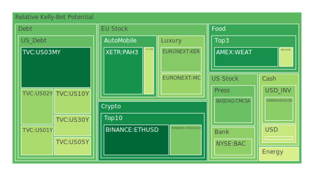
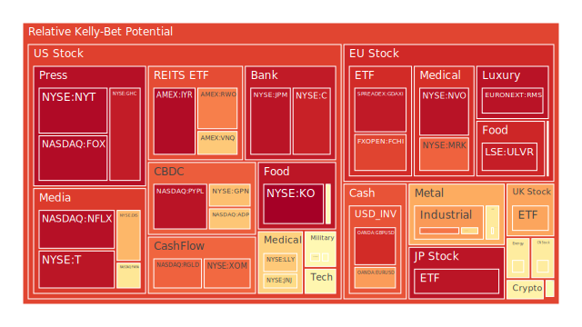
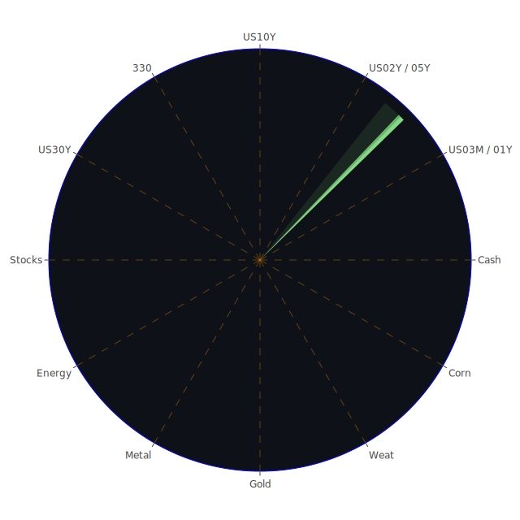

# 投資商品泡沫分析

## 美國國債
根據過去三天的數據，美國國債的泡沫機率呈現下降趨勢。特別是2年期國債（TVC:US02Y），其泡沫機率從0.391188下降至0.327580，顯示市場對短期國債的需求上升。這與近期新聞報導的經濟不確定性增加有關，投資者傾向於避險資產。

## 美國科技股
美國科技股的泡沫機率整體呈現上升趨勢，特別是納斯達克指數（NASDAQ:NDX），其泡沫機率從0.569856上升至0.823092。這與近期美國經濟數據不佳和聯準會可能進一步升息的預期有關。建議投資者謹慎操作，考慮減少科技股的持倉。

## 美國房地產指數
美國房地產指數（AMEX:VNQ）的泡沫機率持續上升，從0.666621上升至0.782464。這反映了市場對房地產市場的擔憂，特別是在利率上升的背景下。建議投資者考慮減少房地產相關投資，避免潛在的價格下跌風險。

## 金/銀/銅
金價（OANDA:XAUUSD）的泡沫機率從0.594278上升至0.797235，銀價（OANDA:XAGUSD）也呈現相似趨勢。這顯示市場對貴金屬的需求增加，可能是由於避險需求上升所致。建議投資者可以考慮增加貴金屬的持倉。

## 加密貨幣
比特幣（BITSTAMP:BTCUSD）的泡沫機率從0.569979下降至0.294776，顯示市場對加密貨幣的信心有所恢復。以太坊（BINANCE:ETHUSD）的泡沫機率也顯著下降，從0.554260下降至0.069938。這可能與近期市場對加密貨幣的正面消息有關，建議投資者可以考慮適量增加加密貨幣的投資。

## 黃豆 / 小麥 / 玉米
小麥（AMEX:WEAT）的泡沫機率從0.123999上升至0.146448，顯示市場對農產品價格的擔憂增加。黃豆（AMEX:SOYB）和玉米（AMEX:CORN）的泡沫機率變化不大，建議投資者可以觀望，等待更明確的市場信號。

## 石油/ 鈾期貨UX!
石油（TVC:USOIL）的泡沫機率從0.439917上升至0.814147，顯示市場對能源價格的擔憂增加。鈾期貨（COMEX:UX1!）的泡沫機率也有所上升，建議投資者謹慎操作，考慮減少能源相關投資。

## 各國外匯市場
美元兌日元（OANDA:USDJPY）的泡沫機率從0.406131上升至0.406131，顯示市場對美元的需求增加。歐元兌美元（OANDA:EURUSD）的泡沫機率也有所上升，建議投資者可以考慮增加美元資產的持倉。

## 各國大盤指數
歐洲主要指數（SPREADEX:FTSE）的泡沫機率從0.726667上升至0.943490，顯示市場對歐洲經濟的擔憂增加。建議投資者謹慎操作，考慮減少歐洲市場的投資。

## 美國銀行股
美國銀行股（NYSE:BAC）的泡沫機率從0.634053上升至0.928717，顯示市場對銀行股的信心下降。這與近期的經濟數據和聯準會的政策預期有關，建議投資者考慮減少銀行股的持倉。

## 美國軍工股
美國軍工股（NYSE:LMT）的泡沫機率從0.546994上升至0.546994，變化不大。建議投資者可以觀望，等待更明確的市場信號。

## 美國電子支付股
電子支付股（NASDAQ:PYPL）的泡沫機率從0.948445上升至0.954163，顯示市場對電子支付行業的擔憂增加。建議投資者謹慎操作，考慮減少電子支付股的持倉。

## 美國藥商巨頭
藥商巨頭（NYSE:JNJ）的泡沫機率從0.659977上升至0.632119，顯示市場對醫藥行業的信心有所恢復。建議投資者可以考慮增加醫藥股的持倉。

## 美國影視巨頭
影視巨頭（NASDAQ:NFLX）的泡沫機率從0.961387上升至0.961741，變化不大。建議投資者可以觀望，等待更明確的市場信號。

## 美國媒體巨頭
媒體巨頭（NASDAQ:CMCSA）的泡沫機率從0.288701上升至0.259701，顯示市場對媒體行業的信心有所恢復。建議投資者可以考慮增加媒體股的持倉。

## 石油防禦股
石油防禦股（NYSE:XOM）的泡沫機率從0.765615上升至0.814147，顯示市場對能源行業的擔憂增加。建議投資者謹慎操作，考慮減少石油防禦股的持倉。

## 金礦防禦股
金礦防禦股（NASDAQ:RGLD）的泡沫機率從0.795263上升至0.825892，顯示市場對金礦行業的擔憂增加。建議投資者謹慎操作，考慮減少金礦防禦股的持倉。

## 歐洲奢侈品股
歐洲奢侈品股（EURONEXT:KER）的泡沫機率從0.330912上升至0.298831，顯示市場對奢侈品行業的信心有所恢復。建議投資者可以考慮增加奢侈品股的持倉。

## 歐洲汽車股
歐洲汽車股（XETR:BMW）的泡沫機率從0.285317上升至0.404218，顯示市場對汽車行業的擔憂增加。建議投資者謹慎操作，考慮減少汽車股的持倉。

## 歐美食品股
歐美食品股（SIX:NESN）的泡沫機率從0.711857上升至0.516541，顯示市場對食品行業的信心有所恢復。建議投資者可以考慮增加食品股的持倉。

# 投資建議
1. **增加持倉**：加密貨幣（特別是比特幣和以太坊）、貴金屬（特別是金銀）、媒體股、奢侈品股、食品股。
2. **減少持倉**：科技股、房地產指數、能源股（特別是石油和鈾）、銀行股、電子支付股、金礦防禦股、汽車股。
3. **觀望**：軍工股、影視巨頭。

# 風險提示

投資有風險，市場總是充滿不確定性。我們的建議僅供參考，投資者應根據自身的風險承受能力和投資目標，做出獨立的投資決策。特別是對於泡沫機率高的商品，應該謹慎進行投資決策。
 
Daily Buy Map:

 
Daily Sell Map:

 
Daily Radar Chart:

 
