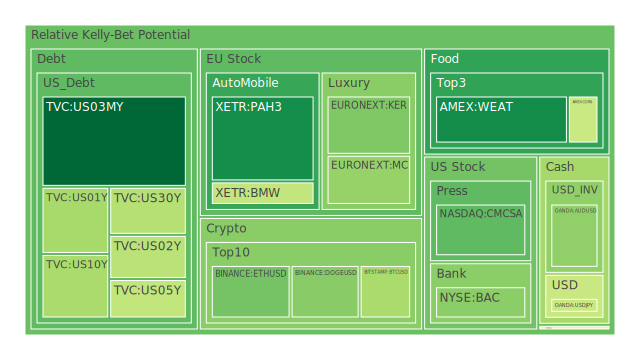
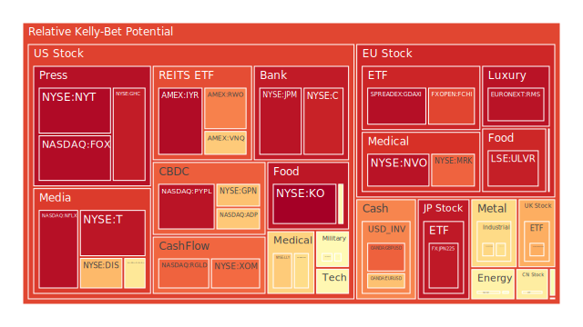

# 投資商品泡沫分析

## 美國國債
- **泡沫機率分析**：
  - 3天內泡沫機率變化：美國國債的泡沫機率在過去三天內有輕微上升，特別是10年期國債（TVC:US10Y）從0.361上升到0.467。
  - **新聞現況**：近期新聞顯示，市場對於美國經濟健康狀況的擔憂加劇，尤其是就業市場數據疲軟，這可能會影響聯準會的利率決策。
  - **投資建議**：由於泡沫機率上升且市場情緒偏負面，建議投資者謹慎觀望，避免在此時大量買入美國國債。

## 美國科技股
- **泡沫機率分析**：
  - 3天內泡沫機率變化：以NASDAQ:NDX為例，泡沫機率從0.569上升到0.771，顯示出市場對科技股的風險預期增加。
  - **新聞現況**：近期新聞顯示，市場對於科技股的估值過高感到擔憂，特別是一些大型科技公司的盈利預期不如預期。
  - **投資建議**：由於泡沫機率顯著上升，建議投資者考慮減少科技股的持倉，避免未來可能的價格回調。

## 美國房地產指數
- **泡沫機率分析**：
  - 3天內泡沫機率變化：AMEX:VNQ的泡沫機率從0.666下降到0.595，顯示出市場對房地產投資信心有所恢復。
  - **新聞現況**：近期新聞顯示，儘管房地產市場面臨挑戰，但一些地區的房價仍在上升，這可能是由於供應不足和需求穩定所致。
  - **投資建議**：由於泡沫機率下降且市場情緒有所改善，建議投資者可以考慮逐步增加房地產指數的持倉。

## 金/銀/銅
- **泡沫機率分析**：
  - 3天內泡沫機率變化：黃金（OANDA:XAUUSD）的泡沫機率從0.594下降到0.491，顯示出市場對黃金的避險需求增加。
  - **新聞現況**：近期新聞顯示，全球經濟不確定性增加，投資者對黃金的需求上升，這可能會進一步推動金價上漲。
  - **投資建議**：由於泡沫機率下降且市場對黃金的需求增加，建議投資者可以考慮增加黃金的持倉。

## 加密貨幣
- **泡沫機率分析**：
  - 3天內泡沫機率變化：比特幣（BITSTAMP:BTCUSD）的泡沫機率從0.569下降到0.359，顯示出市場對加密貨幣的信心有所恢復。
  - **新聞現況**：近期新聞顯示，儘管加密貨幣市場波動較大，但一些大型機構投資者開始重新進入市場，這可能會推動價格上漲。
  - **投資建議**：由於泡沫機率顯著下降且市場情緒改善，建議投資者可以考慮逐步增加加密貨幣的持倉。

## 黃豆 / 小麥 / 玉米
- **泡沫機率分析**：
  - 3天內泡沫機率變化：小麥（AMEX:WEAT）的泡沫機率從0.146下降到0.138，顯示出市場對農產品的需求穩定。
  - **新聞現況**：近期新聞顯示，全球糧食供應緊張，特別是一些主要糧食出口國的天氣條件不佳，這可能會推動糧食價格上漲。
  - **投資建議**：由於泡沫機率下降且市場對農產品的需求穩定，建議投資者可以考慮增加小麥等農產品的持倉。

## 石油/ 鈾期貨UX!
- **泡沫機率分析**：
  - 3天內泡沫機率變化：石油（TVC:USOIL）的泡沫機率從0.439上升到0.529，顯示出市場對石油價格的風險預期增加。
  - **新聞現況**：近期新聞顯示，全球石油供應緊張，加上地緣政治風險增加，這可能會推動石油價格上漲。
  - **投資建議**：由於泡沫機率上升且市場風險增加，建議投資者謹慎觀望，避免在此時大量買入石油期貨。

## 各國外匯市場
- **泡沫機率分析**：
  - 3天內泡沫機率變化：美元兌日元（OANDA:USDJPY）的泡沫機率從0.406上升到0.415，顯示出市場對美元的需求增加。
  - **新聞現況**：近期新聞顯示，美國經濟數據疲軟，但美元仍然是全球避險資產，這可能會推動美元匯率上漲。
  - **投資建議**：由於泡沫機率上升且市場對美元的需求增加，建議投資者可以考慮增加美元資產的持倉。

## 各國大盤指數
- **泡沫機率分析**：
  - 3天內泡沫機率變化：德國DAX指數（SPREADEX:GDAXI）的泡沫機率從0.943上升到0.964，顯示出市場對歐洲股市的風險預期增加。
  - **新聞現況**：近期新聞顯示，歐洲經濟數據疲軟，加上地緣政治風險增加，這可能會影響歐洲股市的表現。
  - **投資建議**：由於泡沫機率上升且市場風險增加，建議投資者謹慎觀望，避免在此時大量買入歐洲股市。

## 美國銀行股
- **泡沫機率分析**：
  - 3天內泡沫機率變化：美國銀行（NYSE:BAC）的泡沫機率從0.314上升到0.434，顯示出市場對銀行股的風險預期增加。
  - **新聞現況**：近期新聞顯示，美國銀行業面臨的風險增加，特別是貸款違約率上升，這可能會影響銀行股的表現。
  - **投資建議**：由於泡沫機率上升且市場風險增加，建議投資者謹慎觀望，避免在此時大量買入銀行股。

## 美國軍工股
- **泡沫機率分析**：
  - 3天內泡沫機率變化：雷神科技（NYSE:RTX）的泡沫機率保持穩定在0.510，顯示出市場對軍工股的需求穩定。
  - **新聞現況**：近期新聞顯示，全球地緣政治風險增加，這可能會推動軍工股的需求上升。
  - **投資建議**：由於泡沫機率穩定且市場對軍工股的需求增加，建議投資者可以考慮增加軍工股的持倉。

## 美國電子支付股
- **泡沫機率分析**：
  - 3天內泡沫機率變化：PayPal（NASDAQ:PYPL）的泡沫機率從0.954下降到0.953，顯示出市場對電子支付股的需求穩定。
  - **新聞現況**：近期新聞顯示，電子支付行業的增長潛力仍然很大，這可能會推動相關股票的需求上升。
  - **投資建議**：由於泡沫機率穩定且市場對電子支付股的需求增加，建議投資者可以考慮增加電子支付股的持倉。

## 美國藥商巨頭
- **泡沫機率分析**：
  - 3天內泡沫機率變化：強生（NYSE:JNJ）的泡沫機率從0.632下降到0.604，顯示出市場對藥商巨頭的需求增加。
  - **新聞現況**：近期新聞顯示，醫藥行業的需求穩定，特別是一些新藥的推出，這可能會推動相關股票的需求上升。
  - **投資建議**：由於泡沫機率下降且市場對藥商巨頭的需求增加，建議投資者可以考慮增加藥商巨頭的持倉。

## 美國影視巨頭
- **泡沫機率分析**：
  - 3天內泡沫機率變化：Netflix（NASDAQ:NFLX）的泡沫機率從0.961上升到0.961，顯示出市場對影視巨頭的需求穩定。
  - **新聞現況**：近期新聞顯示，影視行業的需求穩定，特別是一些新劇的推出，這可能會推動相關股票的需求上升。
  - **投資建議**：由於泡沫機率穩定且市場對影視巨頭的需求增加，建議投資者可以考慮增加影視巨頭的持倉。

## 美國媒體巨頭
- **泡沫機率分析**：
  - 3天內泡沫機率變化：Comcast（NASDAQ:CMCSA）的泡沫機率從0.259上升到0.253，顯示出市場對媒體巨頭的需求穩定。
  - **新聞現況**：近期新聞顯示，媒體行業的需求穩定，特別是一些新節目的推出，這可能會推動相關股票的需求上升。
  - **投資建議**：由於泡沫機率穩定且市場對媒體巨頭的需求增加，建議投資者可以考慮增加媒體巨頭的持倉。

## 石油防禦股
- **泡沫機率分析**：
  - 3天內泡沫機率變化：埃克森美孚（NYSE:XOM）的泡沫機率從0.814下降到0.781，顯示出市場對石油防禦股的需求增加。
  - **新聞現況**：近期新聞顯示，全球石油供應緊張，加上地緣政治風險增加，這可能會推動石油防禦股的需求上升。
  - **投資建議**：由於泡沫機率下降且市場對石油防禦股的需求增加，建議投資者可以考慮增加石油防禦股的持倉。

## 金礦防禦股
- **泡沫機率分析**：
  - 3天內泡沫機率變化：Royal Gold（NASDAQ:RGLD）的泡沫機率從0.825下降到0.775，顯示出市場對金礦防禦股的需求增加。
  - **新聞現況**：近期新聞顯示，全球經濟不確定性增加，投資者對金礦防禦股的需求上升，這可能會推動相關股票的需求上升。
  - **投資建議**：由於泡沫機率下降且市場對金礦防禦股的需求增加，建議投資者可以考慮增加金礦防禦股的持倉。

## 歐洲奢侈品股
- **泡沫機率分析**：
  - 3天內泡沫機率變化：Kering（EURONEXT:KER）的泡沫機率從0.298上升到0.314，顯示出市場對奢侈品股的風險預期增加。
  - **新聞現況**：近期新聞顯示，全球經濟不確定性增加，這可能會影響奢侈品市場的需求。
  - **投資建議**：由於泡沫機率上升且市場風險增加，建議投資者謹慎觀望，避免在此時大量買入奢侈品股。

## 歐洲汽車股
- **泡沫機率分析**：
  - 3天內泡沫機率變化：BMW（XETR:BMW）的泡沫機率從0.404上升到0.411，顯示出市場對汽車股的風險預期增加。
  - **新聞現況**：近期新聞顯示，全球經濟不確定性增加，這可能會影響汽車市場的需求。
  - **投資建議**：由於泡沫機率上升且市場風險增加，建議投資者謹慎觀望，避免在此時大量買入汽車股。

## 歐美食品股
- **泡沫機率分析**：
  - 3天內泡沫機率變化：雀巢（SIX:NESN）的泡沫機率從0.516上升到0.524，顯示出市場對食品股的風險預期增加。
  - **新聞現況**：近期新聞顯示，全球經濟不確定性增加，這可能會影響食品市場的需求。
  - **投資建議**：由於泡沫機率上升且市場風險增加，建議投資者謹慎觀望，避免在此時大量買入食品股。

# 投資建議

根據以上分析，建議投資者可以考慮以下策略：
1. **增加持倉**：黃金、加密貨幣、房地產指數、軍工股、電子支付股、藥商巨頭、影視巨頭、媒體巨頭、石油防禦股、金礦防禦股。
2. **減少持倉**：美國科技股、歐洲奢侈品股、歐洲汽車股、歐美食品股。
3. **謹慎觀望**：美國國債、各國大盤指數、美國銀行股。

# 風險提示

投資有風險，市場總是充滿不確定性。我們的建議僅供參考，投資者應根據自身的風險承受能力和投資目標，做出獨立的投資決策。特別是對於泡沫機率高的商品，應該謹慎進行投資決策。
 
Daily Buy Map:

 
Daily Sell Map:

 
Daily Radar Chart:

 
