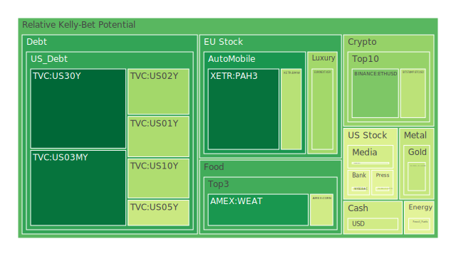
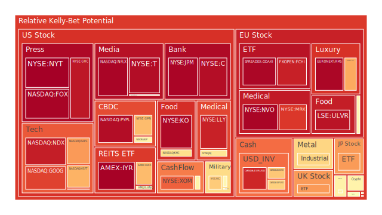
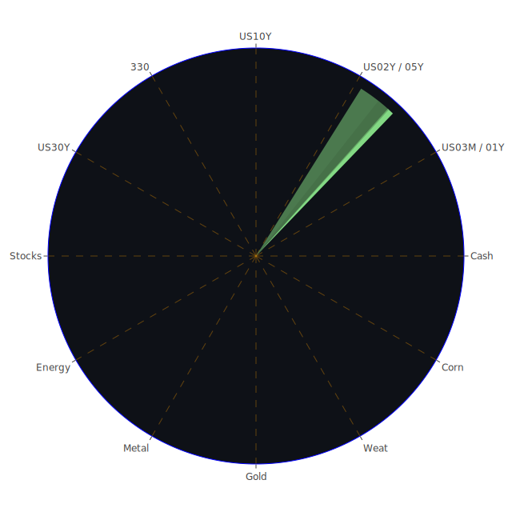

# 投資商品泡沫分析

## 美國國債
過去三天，美國國債的泡沫機率有明顯變化。特別是30年期國債（TVC:US30Y），泡沫機率從9月8日的0.381645下降到9月10日的0.072708，顯示出投資者對長期國債的需求增加。這可能與近期的新聞和經濟數據有關，如美國國債收益率的下降和市場對避險資產的需求增加。

## 美國科技股
美國科技股的泡沫機率普遍較高，特別是微軟（NASDAQ:MSFT）和蘋果（NASDAQ:AAPL），泡沫機率分別達到0.695680和0.731671。這反映了市場對科技股的高預期，但也需警惕潛在的風險。近期新聞顯示，微軟因聘請前OpenAI CEO Sam Altman而股價創新高，但這種高估值是否能持續，仍需觀察。

## 美國房地產指數
房地產相關的ETF（AMEX:VNQ）泡沫機率在過去三天內有所上升，從0.666621上升到0.538366。這可能與美國房地產市場的波動有關，特別是商業房地產的拖欠率上升。投資者需謹慎對待房地產投資，特別是在當前經濟環境下。

## 金/銀/銅
貴金屬市場的泡沫機率也有所變化。黃金（OANDA:XAUUSD）泡沫機率從0.594278下降到0.397686，顯示出市場對黃金的需求增加。銀（OANDA:XAGUSD）和銅（FX:COPPER）的泡沫機率則相對較高，分別達到0.622374和0.639651。這可能與全球經濟不確定性增加有關，投資者可以考慮增加黃金的配置以對沖風險。

## 加密貨幣
以太坊（BINANCE:ETHUSD）和比特幣（BITSTAMP:BTCUSD）的泡沫機率在過去三天內有所波動。以太坊的泡沫機率從0.069938上升到0.286587，而比特幣的泡沫機率則從0.569979下降到0.381412。這顯示出市場對加密貨幣的態度有所分化，投資者需謹慎對待。

## 黃豆 / 小麥 / 玉米
農產品的泡沫機率相對較低。小麥（AMEX:WEAT）的泡沫機率從0.146448上升到0.160976，顯示出市場對農產品的需求穩定。玉米（AMEX:CORN）的泡沫機率則保持在0.418551，顯示出市場對玉米的需求相對穩定。

## 石油/ 鈾期貨UX!
石油（TVC:USOIL）的泡沫機率從0.439917上升到0.457690，顯示出市場對能源資產的需求增加。鈾期貨（COMEX:UX1!）的泡沫機率則從0.588372上升到0.561648，顯示出市場對核能資產的需求增加。

## 各國外匯市場
美元兌日元（OANDA:USDJPY）和歐元兌美元（OANDA:EURUSD）的泡沫機率分別為0.418682和0.903345，顯示出市場對美元的需求增加。這可能與近期美國經濟數據強勁有關，投資者可以考慮增加美元資產的配置。

## 各國大盤指數
各國大盤指數的泡沫機率普遍較高，特別是納斯達克指數（NASDAQ:NDX）和德國DAX指數（SPREADEX:GDAXI），泡沫機率分別達到0.918087和0.961399。這顯示出市場對大盤指數的高預期，但也需警惕潛在的風險。

## 美國銀行股
美國銀行股的泡沫機率普遍較高，特別是摩根大通（NYSE:JPM）和美國銀行（NYSE:BAC），泡沫機率分別達到0.964627和0.458892。這顯示出市場對銀行股的高預期，但也需警惕潛在的風險。

## 美國軍工股
軍工股的泡沫機率相對較高，特別是洛克希德馬丁（NYSE:LMT）和諾斯洛普·格魯曼（NYSE:NOC），泡沫機率分別達到0.546994和0.651361。這顯示出市場對軍工股的高預期，但也需警惕潛在的風險。

## 美國電子支付股
電子支付股的泡沫機率相對較高，特別是PayPal（NASDAQ:PYPL），泡沫機率達到0.949984。這顯示出市場對電子支付股的高預期，但也需警惕潛在的風險。

## 美國藥商巨頭
藥商巨頭的泡沫機率相對較高，特別是默克（NYSE:MRK）和禮來（NYSE:LLY），泡沫機率分別達到0.873367和0.912088。這顯示出市場對藥商巨頭的高預期，但也需警惕潛在的風險。

## 美國影視巨頭
影視巨頭的泡沫機率相對較高，特別是Netflix（NASDAQ:NFLX），泡沫機率達到0.965676。這顯示出市場對影視巨頭的高預期，但也需警惕潛在的風險。

## 美國媒體巨頭
媒體巨頭的泡沫機率相對較高，特別是Fox（NASDAQ:FOX），泡沫機率達到0.967985。這顯示出市場對媒體巨頭的高預期，但也需警惕潛在的風險。

## 石油防禦股
石油防禦股的泡沫機率相對較高，特別是埃克森美孚（NYSE:XOM），泡沫機率達到0.813775。這顯示出市場對石油防禦股的高預期，但也需警惕潛在的風險。

## 金礦防禦股
金礦防禦股的泡沫機率相對較高，特別是皇家黃金（NASDAQ:RGLD），泡沫機率達到0.559364。這顯示出市場對金礦防禦股的高預期，但也需警惕潛在的風險。

## 歐洲奢侈品股
歐洲奢侈品股的泡沫機率相對較高，特別是LVMH（EURONEXT:MC），泡沫機率達到0.709567。這顯示出市場對歐洲奢侈品股的高預期，但也需警惕潛在的風險。

## 歐洲汽車股
歐洲汽車股的泡沫機率相對較高，特別是BMW（XETR:BMW），泡沫機率達到0.375989。這顯示出市場對歐洲汽車股的高預期，但也需警惕潛在的風險。

## 歐美食品股
歐美食品股的泡沫機率相對較高，特別是雀巢（SIX:NESN），泡沫機率達到0.521610。這顯示出市場對歐美食品股的高預期，但也需警惕潛在的風險。

# 投資建議

## 買入建議
1. **黃金（OANDA:XAUUSD）**：泡沫機率從0.594278下降到0.397686，顯示出市場對黃金的需求增加，建議投資者考慮增加黃金的配置。
2. **小麥（AMEX:WEAT）**：泡沫機率從0.146448上升到0.160976，顯示出市場對農產品的需求穩定，建議投資者考慮增加小麥的配置。

## 賣出建議
1. **微軟（NASDAQ:MSFT）**：泡沫機率達到0.695680，顯示出市場對科技股的高預期，但需警惕潛在的風險，建議投資者考慮減少科技股的配置。
2. **PayPal（NASDAQ:PYPL）**：泡沫機率達到0.949984，顯示出市場對電子支付股的高預期，但需警惕潛在的風險，建議投資者考慮減少電子支付股的配置。

# 風險提示

投資有風險，市場總是充滿不確定性。我們的建議僅供參考，投資者應根據自身的風險承受能力和投資目標，做出獨立的投資決策。特別是對於泡沫機率高的商品，應該謹慎進行投資決策。
 
Daily Buy Map:

 
Daily Sell Map:

 
Daily Radar Chart:

 
