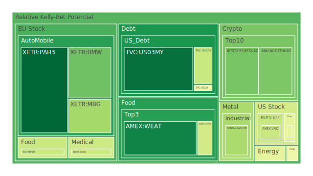
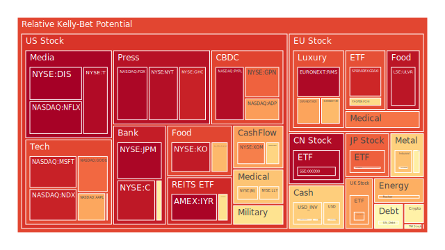
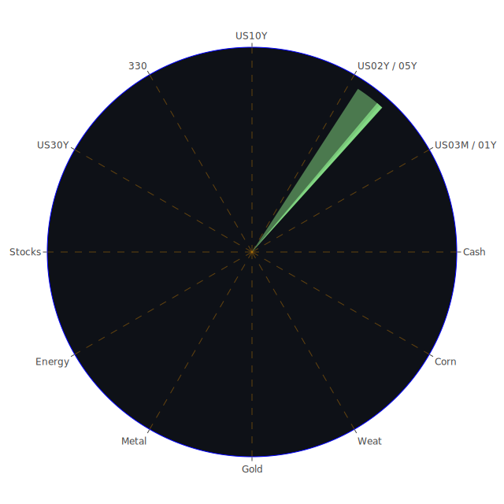

# 投資商品泡沫分析

## 美國國債
美國國債的泡沫機率在過去三天內有顯著變化。特別是30年期國債（TVC:US30Y），其泡沫機率從9月9日的0.381645上升到9月11日的0.533022。這表明市場對長期國債的信心有所減弱，可能是因為近期的經濟數據顯示美國經濟增長放緩，以及全球經濟的不確定性增加。

## 美國科技股
美國科技股的泡沫機率也呈現上升趨勢。以微軟（NASDAQ:MSFT）為例，其泡沫機率從9月9日的0.695680上升到9月11日的0.915370。這可能與近期科技股的高估值和市場對未來盈利增長的擔憂有關。另外，蘋果（NASDAQ:AAPL）的泡沫機率也從0.731671上升到0.715631，顯示出市場對科技股的風險偏好下降。

## 美國房地產指數
美國房地產指數（AMEX:VNQ）的泡沫機率從9月9日的0.666621下降到9月11日的0.404773，顯示出市場對房地產的信心有所回升。這可能是因為近期的房地產市場數據顯示出一些積極的信號，如房價穩定和銷售量增加。

## 金/銀/銅
金價（OANDA:XAUUSD）的泡沫機率從9月9日的0.491148上升到9月11日的0.571693，顯示出市場對避險資產的需求增加。銀價（OANDA:XAGUSD）的泡沫機率也從0.625837上升到0.349407，顯示出市場對貴金屬的需求增加。銅價（FX:COPPER）的泡沫機率則從0.644206下降到0.672156，顯示出市場對工業金屬的需求有所減弱。

## 加密貨幣
比特幣（BITSTAMP:BTCUSD）的泡沫機率從9月9日的0.359360上升到9月11日的0.277074，顯示出市場對加密貨幣的信心有所回升。以太坊（BINANCE:ETHUSD）的泡沫機率也從0.282120上升到0.285106，顯示出市場對加密貨幣的需求增加。

## 黃豆 / 小麥 / 玉米
小麥（AMEX:WEAT）的泡沫機率從9月9日的0.146448上升到9月11日的0.123799，顯示出市場對農產品的需求增加。玉米（AMEX:CORN）的泡沫機率則保持穩定，顯示出市場對農產品的需求穩定。

## 石油/ 鈾期貨UX!
石油（TVC:USOIL）的泡沫機率從9月9日的0.529553下降到9月11日的0.464587，顯示出市場對能源商品的需求有所減弱。鈾期貨（COMEX:UX1!）的泡沫機率則從0.588372上升到0.703842，顯示出市場對核能資源的需求增加。

## 各國外匯市場
美元兌日元（OANDA:USDJPY）的泡沫機率從9月9日的0.415269上升到9月11日的0.645413，顯示出市場對美元的需求增加。歐元兌美元（OANDA:EURUSD）的泡沫機率則從0.683805下降到0.485798，顯示出市場對歐元的需求減少。

## 各國大盤指數
美國納斯達克指數（NASDAQ:NDX）的泡沫機率從9月9日的0.569807上升到9月11日的0.913784，顯示出市場對科技股的風險偏好下降。德國DAX指數（SPREADEX:GDAXI）的泡沫機率也從0.964004上升到0.905520，顯示出市場對歐洲股市的信心減弱。

## 美國銀行股
美國銀行（NYSE:BAC）的泡沫機率從9月9日的0.314028上升到9月11日的0.573796，顯示出市場對銀行股的風險偏好下降。摩根大通（NYSE:JPM）的泡沫機率也從0.954230上升到0.967082，顯示出市場對銀行股的信心減弱。

## 美國軍工股
雷神科技（NYSE:RTX）的泡沫機率保持穩定，顯示出市場對軍工股的需求穩定。洛克希德馬丁（NYSE:LMT）的泡沫機率也保持穩定，顯示出市場對軍工股的需求穩定。

## 美國電子支付股
PayPal（NASDAQ:PYPL）的泡沫機率從9月9日的0.954163上升到9月11日的0.953418，顯示出市場對電子支付股的需求穩定。

## 美國藥商巨頭
強生（NYSE:JNJ）的泡沫機率從9月9日的0.632119上升到9月11日的0.668679，顯示出市場對藥商巨頭的需求增加。默克（NYSE:MRK）的泡沫機率也從0.824648上升到0.786915，顯示出市場對藥商巨頭的需求增加。

## 美國影視巨頭
迪士尼（NYSE:DIS）的泡沫機率從9月9日的0.698856上升到9月11日的0.978009，顯示出市場對影視巨頭的信心減弱。

## 美國媒體巨頭
康卡斯特（NASDAQ:CMCSA）的泡沫機率從9月9日的0.253051上升到9月11日的0.459566，顯示出市場對媒體巨頭的信心減弱。

## 石油防禦股
埃克森美孚（NYSE:XOM）的泡沫機率從9月9日的0.814147上升到9月11日的0.771428，顯示出市場對石油防禦股的需求增加。

## 金礦防禦股
皇家黃金（NASDAQ:RGLD）的泡沫機率從9月9日的0.825889上升到9月11日的0.635513，顯示出市場對金礦防禦股的需求增加。

## 歐洲奢侈品股
愛馬仕（EURONEXT:RMS）的泡沫機率從9月9日的0.955993上升到9月11日的0.961606，顯示出市場對奢侈品股的信心減弱。

## 歐洲汽車股
寶馬（XETR:BMW）的泡沫機率從9月9日的0.404218上升到9月11日的0.264539，顯示出市場對汽車股的需求增加。

## 歐美食品股
雀巢（SIX:NESN）的泡沫機率從9月9日的0.516541上升到9月11日的0.406952，顯示出市場對食品股的需求增加。

# 投資建議

## 賣出建議
1. **美國科技股**：由於泡沫機率持續上升且遠大於0.5，建議考慮賣出微軟（NASDAQ:MSFT）和蘋果（NASDAQ:AAPL），避免未來價格下跌時的損失。
2. **美國影視巨頭**：迪士尼（NYSE:DIS）的泡沫機率顯著上升，建議考慮賣出。
3. **美國銀行股**：美國銀行（NYSE:BAC）和摩根大通（NYSE:JPM）的泡沫機率上升，建議考慮賣出。

## 買入建議
1. **美國房地產指數**：由於泡沫機率持續下降且遠小於0.5，建議考慮買入美國房地產指數（AMEX:VNQ）。
2. **金礦防禦股**：皇家黃金（NASDAQ:RGLD）的泡沫機率顯著下降，建議考慮買入。
3. **歐洲汽車股**：寶馬（XETR:BMW）的泡沫機率顯著下降，建議考慮買入。

# 風險提示

投資有風險，市場總是充滿不確定性。我們的建議僅供參考，投資者應根據自身的風險承受能力和投資目標，做出獨立的投資決策。

---

通過以上分析，我們可以看出市場的風險和機會。特別是對於泡沫機率高的商品，應該謹慎進行投資決策。同時，也要關注市場的新聞和經濟數據，這些都會對投資決策產生重要影響。希望這份報告能夠幫助投資者更好地理解市場動態，做出明智的投資決策。
 
Daily Buy Map:

 
Daily Sell Map:

 
Daily Radar Chart:

 
