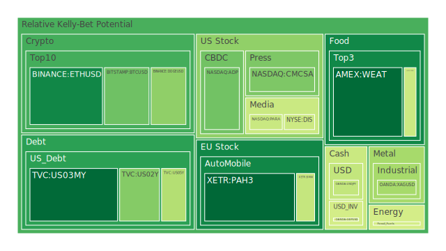
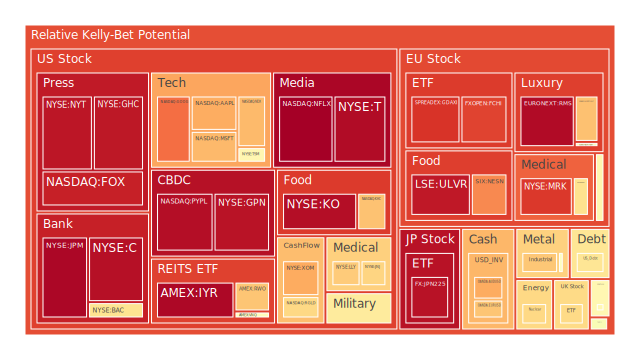
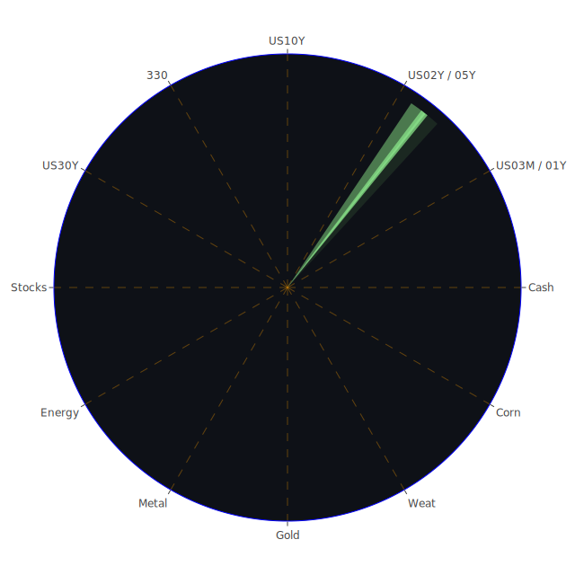

# 投資商品泡沫分析

## 美國國債
過去三天，美國國債的泡沫機率呈現上升趨勢。特別是30年期國債（TVC:US30Y），其泡沫機率從0.072708上升到0.508743。這反映出市場對長期債務的擔憂增加，特別是在聯準會縮表（QT）和高利率環境下，長期債券的吸引力減弱。

## 美國科技股
美國科技股的泡沫機率普遍較高，特別是微軟（NASDAQ:MSFT）和蘋果（NASDAQ:AAPL），其泡沫機率分別達到0.692944和0.714326。這可能是因為市場對科技股的高估值感到擔憂，加上最近的新聞顯示，微軟和蘋果都面臨來自歐盟的反壟斷調查，這進一步增加了投資者的擔憂。

## 美國房地產指數
美國房地產指數（AMEX:VNQ）的泡沫機率持續上升，從0.538366上升到0.540592。這可能是因為美國的房地產市場面臨高利率和經濟不確定性的挑戰，特別是商業地產的拖欠率上升，這對房地產市場構成壓力。

## 金/銀/銅
黃金（OANDA:XAUUSD）和白銀（OANDA:XAGUSD）的泡沫機率分別為0.525993和0.354903，顯示出投資者對貴金屬的避險需求增加。特別是黃金，儘管倫敦金和紐約金市場的拋售壓力，黃金價格仍然堅挺，這可能是因為各國央行和金磚國家大量儲備黃金。

## 加密貨幣
比特幣（BITSTAMP:BTCUSD）和以太坊（BINANCE:ETHUSD）的泡沫機率分別為0.275039和0.140266，顯示出市場對加密貨幣的需求仍然強勁。特別是以太坊，其泡沫機率顯著下降，這可能是因為市場對其技術升級和應用前景持樂觀態度。

## 黃豆 / 小麥 / 玉米
小麥（AMEX:WEAT）的泡沫機率從0.160976下降到0.087402，顯示出市場對農產品的需求增加。這可能是因為全球氣候變化和供應鏈問題導致農產品價格上漲。

## 石油/ 鈾期貨UX!
石油（TVC:USOIL）的泡沫機率為0.434246，顯示出市場對能源價格的擔憂。特別是近期OPEC+下調需求預測，導致油價下跌。鈾期貨（COMEX:UX1!）的泡沫機率為0.635949，顯示出市場對核能需求的增加。

## 各國外匯市場
美元兌日圓（OANDA:USDJPY）的泡沫機率為0.404182，顯示出市場對美元的需求增加。這可能是因為美國經濟數據強勁，聯準會可能進一步加息。

## 各國大盤指數
納斯達克指數（NASDAQ:NDX）的泡沫機率為0.692310，顯示出市場對科技股的高估值感到擔憂。特別是近期的新聞顯示，科技股面臨來自歐盟和美國的反壟斷調查，這進一步增加了投資者的擔憂。

## 美國銀行股
美國銀行（NYSE:BAC）的泡沫機率為0.613095，顯示出市場對銀行股的擔憂增加。特別是近期的新聞顯示，摩根大通（JPMorgan）下調了利息收入預期，這對銀行股構成壓力。

## 美國軍工股
雷神科技（NYSE:RTX）的泡沫機率為0.510860，顯示出市場對軍工股的需求穩定。這可能是因為全球地緣政治緊張局勢加劇，導致軍工股需求增加。

## 美國電子支付股
PayPal（NASDAQ:PYPL）的泡沫機率為0.957039，顯示出市場對電子支付股的高估值感到擔憂。特別是近期的新聞顯示，電子支付公司面臨來自歐盟的反壟斷調查，這進一步增加了投資者的擔憂。

## 美國藥商巨頭
默克（NYSE:MRK）的泡沫機率為0.882432，顯示出市場對藥商股的高估值感到擔憂。特別是近期的新聞顯示，藥商公司面臨來自歐盟和美國的反壟斷調查，這進一步增加了投資者的擔憂。

## 美國影視巨頭
迪士尼（NYSE:DIS）的泡沫機率為0.420124，顯示出市場對影視股的需求增加。特別是近期的新聞顯示，迪士尼的影視作品表現強勁，這對其股價構成支撐。

## 美國媒體巨頭
康卡斯特（NASDAQ:CMCSA）的泡沫機率為0.296043，顯示出市場對媒體股的需求增加。特別是近期的新聞顯示，康卡斯特的業績表現強勁，這對其股價構成支撐。

## 石油防禦股
埃克森美孚（NYSE:XOM）的泡沫機率為0.717049，顯示出市場對石油防禦股的高估值感到擔憂。特別是近期的新聞顯示，油價下跌對石油公司構成壓力。

## 金礦防禦股
皇家黃金（NASDAQ:RGLD）的泡沫機率為0.635513，顯示出市場對金礦股的需求增加。特別是近期的新聞顯示，黃金價格上漲對金礦公司構成支撐。

## 歐洲奢侈品股
開雲集團（EURONEXT:KER）的泡沫機率為0.520265，顯示出市場對奢侈品股的需求穩定。特別是近期的新聞顯示，奢侈品需求強勁，這對其股價構成支撐。

## 歐洲汽車股
寶馬（XETR:BMW）的泡沫機率為0.407991，顯示出市場對汽車股的需求增加。特別是近期的新聞顯示，寶馬的業績表現強勁，這對其股價構成支撐。

## 歐美食品股
雀巢（SIX:NESN）的泡沫機率為0.765372，顯示出市場對食品股的高估值感到擔憂。特別是近期的新聞顯示，食品價格上漲對食品公司構成壓力。

# 投資建議
根據以上分析，我們建議投資者考慮以下操作：

1. **賣出高泡沫商品**：對於泡沫機率持續上升且遠大於0.5的商品，如PayPal（NASDAQ:PYPL）和默克（NYSE:MRK），建議投資者考慮賣出，避免未來價格下跌時的損失。

2. **買入低泡沫商品**：對於泡沫機率持續下降且遠小於0.5的商品，如小麥（AMEX:WEAT）和以太坊（BINANCE:ETHUSD），建議投資者考慮買入，掌握低吸籌碼的時機。

3. **觀望中性商品**：對於泡沫機率在0.45到0.55之間的商品，如黃金（OANDA:XAUUSD）和迪士尼（NYSE:DIS），建議投資者觀望，不要有任何動作。

# 風險提示
投資有風險，市場總是充滿不確定性。我們的建議僅供參考，投資者應根據自身的風險承受能力和投資目標，做出獨立的投資決策。特別是對於泡沫機率高的商品，應該謹慎進行投資決策。
 
Daily Buy Map:

 
Daily Sell Map:

 
Daily Radar Chart:

 
