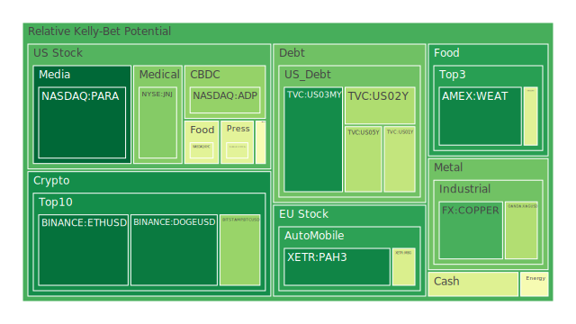
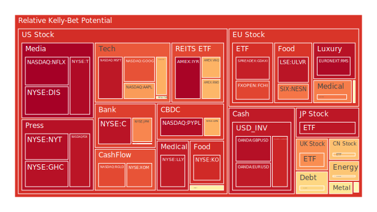
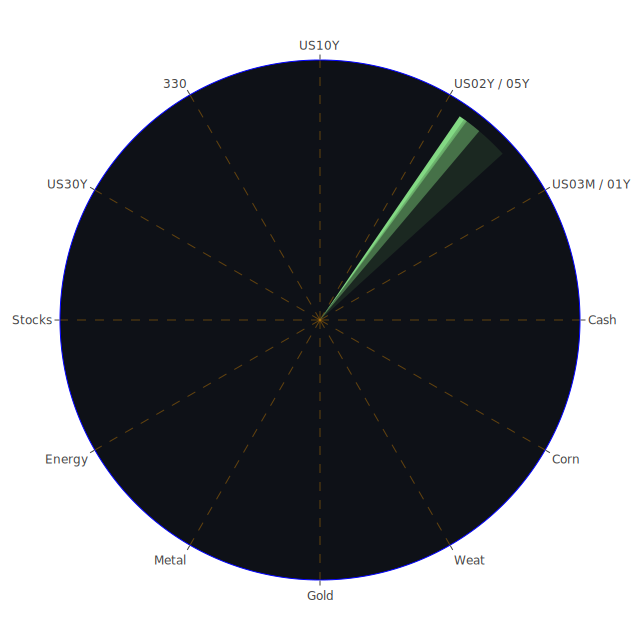

# 投資商品泡沫分析

## 美國國債
過去三天美國國債的泡沫機率呈現穩定趨勢，特別是10年期國債（TVC:US10Y），其泡沫機率從9月11日的0.555811上升到9月13日的0.631310。這表明市場對長期債券的需求減少，可能是因為投資者預期利率會上升。然而，SOFR目前為5.32%，略低於OIS FED Fund Rate的5.33%，顯示美元流動性相對充足，短期內美國國債的風險不大。

## 美國科技股
以蘋果公司（NASDAQ:AAPL）為例，其泡沫機率從9月11日的0.715631上升到9月13日的0.715762。這表明市場對科技股的熱情依然高漲，但需要注意的是，過去三天的新聞顯示Adobe和Google面臨競爭壓力和法律挑戰，這可能會對整體科技股產生負面影響。

## 美國房地產指數
房地產指數（AMEX:VNQ）的泡沫機率從9月11日的0.404773上升到9月13日的0.680001，顯示市場對房地產的信心減弱。特別是商業房地產的拖欠率上升，這可能會進一步壓低房地產價格。

## 金/銀/銅
白銀（OANDA:XAGUSD）的泡沫機率從9月11日的0.349407上升到9月13日的0.324154，顯示市場對貴金屬的需求增加。這可能是因為市場對經濟不確定性的擔憂增加，投資者轉向避險資產。

## 加密貨幣
以比特幣（BITSTAMP:BTCUSD）為例，其泡沫機率從9月11日的0.277074上升到9月13日的0.281709，顯示市場對加密貨幣的需求穩定。然而，新聞顯示巴西最高法院威脅暫停X（前Twitter），這可能會對加密貨幣市場產生不確定性。

## 黃豆 / 小麥 / 玉米
小麥（AMEX:WEAT）的泡沫機率從9月11日的0.123799下降到9月13日的0.068554，顯示市場對農產品的需求增加。這可能是因為全球供應鏈問題和氣候變化影響了農產品的供應。

## 石油/ 鈾期貨UX!
石油（TVC:USOIL）的泡沫機率從9月11日的0.464587上升到9月13日的0.470990，顯示市場對石油的需求減少。這可能是因為OPEC+下調需求預測和颶風Francine的影響。

## 各國外匯市場
美元兌日元（OANDA:USDJPY）的泡沫機率從9月11日的0.645413下降到9月13日的0.410820，顯示市場對美元的需求增加。這可能是因為日本經濟數據疲弱，投資者轉向美元避險。

## 各國大盤指數
德國DAX指數（SPREADEX:GDAXI）的泡沫機率從9月11日的0.905520上升到9月13日的0.917497，顯示市場對歐洲股市的信心減弱。這可能是因為歐洲央行再次降息和經濟復甦乏力。

## 美國銀行股
摩根大通（NYSE:JPM）的泡沫機率從9月11日的0.967082上升到9月13日的0.747853，顯示市場對銀行股的信心減弱。這可能是因為摩根大通下調利息收入預期，導致股價下跌。

## 美國軍工股
洛克希德馬丁（NYSE:LMT）的泡沫機率在過去三天保持穩定，約為0.546994，顯示市場對軍工股的需求穩定。然而，新聞顯示美國對以色列軍事行動的關注增加，這可能會對軍工股產生影響。

## 美國電子支付股
PayPal（NASDAQ:PYPL）的泡沫機率從9月11日的0.953418上升到9月13日的0.955864，顯示市場對電子支付股的信心減弱。這可能是因為市場對經濟不確定性的擔憂增加，影響了電子支付公司的業績。

## 美國藥商巨頭
Eli Lilly（NYSE:LLY）的泡沫機率從9月11日的0.661365上升到9月13日的0.924055，顯示市場對藥商股的需求減少。這可能是因為新聞顯示Eli Lilly在愛爾蘭的投資計劃，可能會增加公司的成本。

## 美國影視巨頭
迪士尼（NYSE:DIS）的泡沫機率從9月11日的0.978009下降到9月13日的0.976981，顯示市場對影視股的需求穩定。然而，新聞顯示迪士尼與DirecTV的爭端可能會影響公司的收入。

## 美國媒體巨頭
康卡斯特（NASDAQ:CMCSA）的泡沫機率從9月11日的0.459566上升到9月13日的0.423849，顯示市場對媒體股的需求減少。這可能是因為新聞顯示康卡斯特面臨競爭壓力和法律挑戰。

## 石油防禦股
埃克森美孚（NYSE:XOM）的泡沫機率從9月11日的0.771428上升到9月13日的0.825909，顯示市場對石油防禦股的需求減少。這可能是因為OPEC+下調需求預測和颶風Francine的影響。

## 金礦防禦股
Royal Gold（NASDAQ:RGLD）的泡沫機率從9月11日的0.635513上升到9月13日的0.843350，顯示市場對金礦防禦股的需求減少。這可能是因為市場對貴金屬的需求增加，投資者轉向避險資產。

## 歐洲奢侈品股
LVMH（EURONEXT:MC）的泡沫機率從9月11日的0.683381上升到9月13日的0.500132，顯示市場對奢侈品股的需求減少。這可能是因為中國需求疲弱和歐洲經濟復甦乏力。

## 歐洲汽車股
BMW（XETR:BMW）的泡沫機率從9月11日的0.264539上升到9月13日的0.527511，顯示市場對汽車股的需求減少。這可能是因為中國需求疲弱和BMW下調2024年展望。

## 歐美食品股
雀巢（SIX:NESN）的泡沫機率從9月11日的0.406952上升到9月13日的0.773797，顯示市場對食品股的需求減少。這可能是因為全球供應鏈問題和氣候變化影響了食品供應。

# 投資建議

1. **建議賣出**：對於泡沫機率持續上升且遠大於0.5的商品，如BMW（XETR:BMW）和Eli Lilly（NYSE:LLY），建議投資者考慮賣出，避免未來價格下跌時的損失。
2. **建議買入**：對於泡沫機率持續下降且遠小於0.5的商品，如小麥（AMEX:WEAT）和白銀（OANDA:XAGUSD），建議投資者考慮買入，掌握低吸籌碼的時機。
3. **觀望**：對於泡沫機率在0.45 ~ 0.55之間的商品，如康卡斯特（NASDAQ:CMCSA）和石油（TVC:USOIL），建議觀望，不要有任何動作。

# 風險提示

投資有風險，市場總是充滿不確定性。我們的建議僅供參考，投資者應根據自身的風險承受能力和投資目標，做出獨立的投資決策。特別是對於泡沫機率高的商品，應該謹慎進行投資決策。
 
Daily Buy Map:

 
Daily Sell Map:

 
Daily Radar Chart:

 
