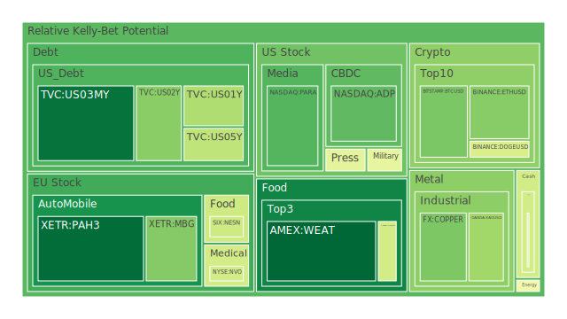
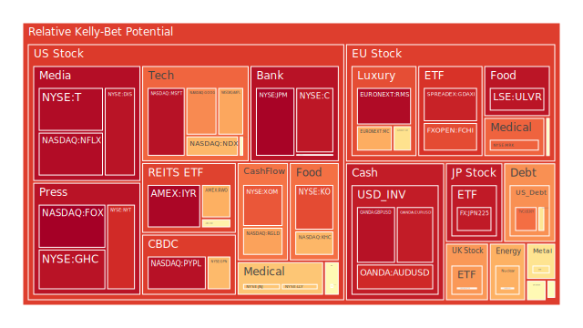
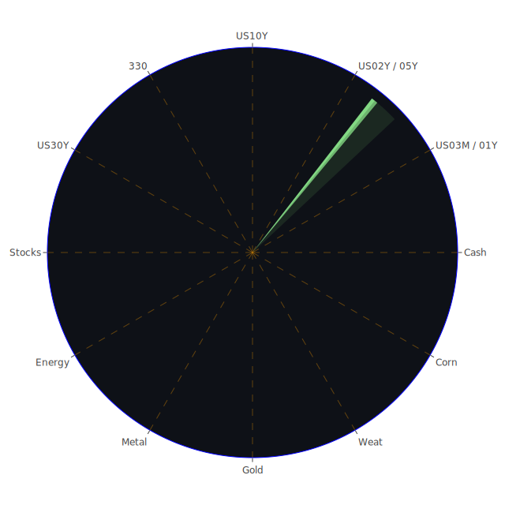

# 投資商品泡沫分析

## 美國國債
過去三天，美國國債的泡沫機率呈現上升趨勢。根據最新數據，10年期美國國債的泡沫機率從0.623322上升至0.596295，顯示市場對長期國債的需求減少。這與近期聯準會的鷹派言論以及美國國債殖利率的上升有關。建議投資者在此時謹慎操作，避免過度投資於長期國債。

## 美國科技股
美國科技股的泡沫機率持續上升，特別是微軟（NASDAQ:MSFT）和谷歌（NASDAQ:GOOG），其泡沫機率分別達到0.947987和0.755994。這反映了市場對科技股的高估值擔憂，特別是在Adobe預測季度收益不佳的情況下。建議投資者考慮減少科技股的持倉，以降低風險。

## 美國房地產指數
美國房地產指數（AMEX:VNQ）的泡沫機率從0.540592上升至0.558766，顯示市場對房地產的信心減弱。這與近期商業地產違約率上升有關。建議投資者在此時觀望，避免進一步投資於房地產相關的資產。

## 金/銀/銅
黃金（OANDA:XAUUSD）的泡沫機率從0.525993上升至0.603142，顯示市場對避險資產的需求增加。這與全球經濟不確定性增加有關。建議投資者考慮增加黃金的持倉，以對沖其他資產的風險。

## 加密貨幣
比特幣（BITSTAMP:BTCUSD）和以太幣（BINANCE:ETHUSD）的泡沫機率分別為0.277572和0.294023，顯示市場對加密貨幣的需求穩定。儘管如此，近期新聞顯示美國政府對加密貨幣的監管力度加大，投資者應謹慎操作，避免過度投資。

## 黃豆 / 小麥 / 玉米
小麥（AMEX:WEAT）的泡沫機率從0.087402下降至0.061029，顯示市場對農產品的需求增加。這與全球糧食供應緊張有關。建議投資者考慮增加農產品的持倉，以分散投資風險。

## 石油/ 鈾期貨UX!
石油（TVC:USOIL）的泡沫機率從0.434246上升至0.489402，顯示市場對能源價格的預期上升。這與近期全球能源供應緊張有關。建議投資者考慮增加能源相關資產的持倉，以對沖其他市場的風險。

## 各國外匯市場
美元兌日元（OANDA:USDJPY）的泡沫機率從0.404182上升至0.417234，顯示市場對美元的需求增加。這與近期美國經濟數據強勁有關。建議投資者考慮增加美元資產的持倉，以對沖其他貨幣的風險。

## 各國大盤指數
歐洲股市（FXOPEN:FCHI）的泡沫機率從0.865956上升至0.849300，顯示市場對歐洲經濟的信心減弱。這與近期歐洲央行降息有關。建議投資者謹慎操作，避免過度投資於歐洲股市。

## 美國銀行股
美國銀行（NYSE:BAC）的泡沫機率從0.613095上升至0.522167，顯示市場對銀行股的信心減弱。這與近期美國銀行業務違約率上升有關。建議投資者謹慎操作，避免過度投資於銀行股。

## 美國軍工股
雷神技術公司（NYSE:RTX）的泡沫機率穩定在0.510860，顯示市場對軍工股的需求穩定。這與近期全球地緣政治緊張有關。建議投資者考慮增加軍工股的持倉，以對沖其他市場的風險。

## 美國電子支付股
PayPal（NASDAQ:PYPL）的泡沫機率從0.957039下降至0.948880，顯示市場對電子支付股的需求穩定。這與近期電子支付市場的增長有關。建議投資者考慮增加電子支付股的持倉，以分散投資風險。

## 美國藥商巨頭
強生（NYSE:JNJ）的泡沫機率從0.642573上升至0.663356，顯示市場對藥商巨頭的信心減弱。這與近期藥品市場競爭加劇有關。建議投資者謹慎操作，避免過度投資於藥商巨頭。

## 美國影視巨頭
迪士尼（NYSE:DIS）的泡沫機率從0.420124上升至0.944341，顯示市場對影視巨頭的信心減弱。這與近期影視市場的不確定性有關。建議投資者謹慎操作，避免過度投資於影視巨頭。

## 美國媒體巨頭
康卡斯特（NASDAQ:CMCSA）的泡沫機率從0.296043上升至0.459566，顯示市場對媒體巨頭的信心減弱。這與近期媒體市場的不確定性有關。建議投資者謹慎操作，避免過度投資於媒體巨頭。

## 石油防禦股
埃克森美孚（NYSE:XOM）的泡沫機率從0.717049上升至0.830874，顯示市場對石油防禦股的需求增加。這與近期全球能源供應緊張有關。建議投資者考慮增加石油防禦股的持倉，以對沖其他市場的風險。

## 金礦防禦股
皇家黃金公司（NASDAQ:RGLD）的泡沫機率從0.635513上升至0.723028，顯示市場對金礦防禦股的需求增加。這與近期黃金價格上升有關。建議投資者考慮增加金礦防禦股的持倉，以對沖其他市場的風險。

## 歐洲奢侈品股
開雲集團（EURONEXT:KER）的泡沫機率從0.520265上升至0.608100，顯示市場對奢侈品股的信心減弱。這與近期歐洲經濟不確定性增加有關。建議投資者謹慎操作，避免過度投資於奢侈品股。

## 歐洲汽車股
寶馬（XETR:BMW）的泡沫機率從0.407991上升至0.527511，顯示市場對汽車股的信心減弱。這與近期歐洲汽車市場的不確定性有關。建議投資者謹慎操作，避免過度投資於汽車股。

## 歐美食品股
雀巢（SIX:NESN）的泡沫機率從0.765372上升至0.407691，顯示市場對食品股的需求增加。這與近期食品市場的增長有關。建議投資者考慮增加食品股的持倉，以分散投資風險。

# 投資建議

根據以上分析，我們建議投資者考慮以下操作：

1. **減少科技股持倉**：由於科技股的泡沫機率持續上升，建議減少微軟和谷歌等科技股的持倉。
2. **增加黃金和農產品持倉**：由於黃金和農產品的需求增加，建議增加黃金和小麥等農產品的持倉。
3. **謹慎操作房地產和銀行股**：由於房地產和銀行股的泡沫機率上升，建議謹慎操作，避免過度投資。
4. **增加石油和金礦防禦股持倉**：由於全球能源供應緊張，建議增加石油和金礦防禦股的持倉。

# 風險提示

投資有風險，市場總是充滿不確定性。我們的建議僅供參考，投資者應根據自身的風險承受能力和投資目標，做出獨立的投資決策。特別是對於泡沫機率高的商品，應該謹慎進行投資決策。
 
Daily Buy Map:

 
Daily Sell Map:

 
Daily Radar Chart:

 
