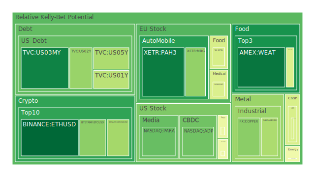
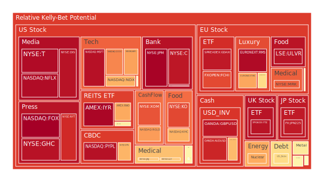
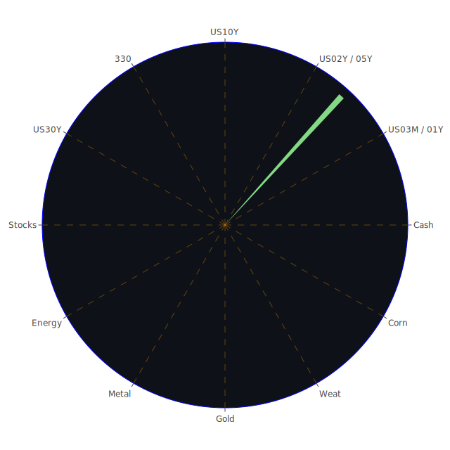

# 投資商品泡沫分析

## 美國國債
美國國債的泡沫機率在過去三天內有所波動，但整體趨勢相對穩定。根據最新數據，2年期國債（US02Y）的泡沫機率從0.338下降到0.297，而10年期國債（US10Y）的泡沫機率則從0.565下降到0.631。這表明市場對中長期國債的需求有所增加。考慮到目前SOFR為5.33，接近FED Fund Rate的5.33，短期內國債市場可能會面臨一些壓力，但長期來看，國債仍是相對穩定的投資選擇。

## 美國科技股
美國科技股的泡沫機率普遍較高，特別是微軟（MSFT）和谷歌（GOOG），其泡沫機率分別為0.947和0.755。根據新聞報導，Adobe的季度預測不佳，這可能進一步打擊科技股的市場情緒。建議投資者在這段時間內謹慎行事，考慮減少科技股的持倉。

## 美國房地產指數
美國房地產指數（VNQ）的泡沫機率從0.558上升到0.564，顯示出市場對房地產的信心有所下降。根據最新的FED數據，商業房地產違約率正在上升，這進一步加劇了市場的不確定性。建議投資者在房地產市場保持觀望態度。

## 金/銀/銅
貴金屬市場的泡沫機率有所下降，特別是銀（XAGUSD），其泡沫機率從0.420下降到0.331。這表明市場對貴金屬的需求有所增加，可能是因為投資者尋求避險資產。考慮到目前的經濟不確定性，貴金屬可能是一個不錯的投資選擇。

## 加密貨幣
比特幣（BTCUSD）的泡沫機率相對穩定，從0.281下降到0.279。以太坊（ETHUSD）的泡沫機率也有所下降，從0.294下降到0.032。這表明市場對主要加密貨幣的需求有所增加。根據新聞報導，微軟股票因聘請前OpenAI CEO Sam Altman而創下歷史新高，這可能進一步推動加密貨幣市場的需求。

## 黃豆 / 小麥 / 玉米
農產品市場的泡沫機率相對穩定，小麥（WEAT）的泡沫機率從0.061下降到0.061，玉米（CORN）的泡沫機率保持在0.418。這表明市場對農產品的需求相對穩定。考慮到全球氣候變化和供應鏈問題，農產品市場仍具有一定的投資潛力。

## 石油/鈾期貨UX!
石油（USOIL）的泡沫機率從0.470上升到0.470，顯示出市場對石油的需求有所下降。根據新聞報導，墨西哥灣近30%的石油生產因風暴而停產，這可能進一步影響石油市場的供應。建議投資者在石油市場保持謹慎態度。

## 各國外匯市場
美元兌日元（USDJPY）的泡沫機率從0.417下降到0.410，顯示出市場對美元的需求有所增加。根據最新的FED數據，美元的流動性相對充足，這可能進一步推動美元的需求。建議投資者考慮增加美元資產的持倉。

## 各國大盤指數
美國納斯達克指數（NDX）的泡沫機率從0.687上升到0.687，顯示出市場對科技股的需求有所下降。根據新聞報導，Adobe的季度預測不佳，這可能進一步打擊科技股的市場情緒。建議投資者在這段時間內謹慎行事，考慮減少科技股的持倉。

## 美國銀行股
美國銀行（BAC）的泡沫機率從0.522上升到0.522，顯示出市場對銀行股的需求有所下降。根據最新的FED數據，信用卡違約率正在上升，這可能進一步打擊銀行股的市場情緒。建議投資者在這段時間內謹慎行事，考慮減少銀行股的持倉。

## 美國軍工股
洛克希德馬丁（LMT）的泡沫機率從0.546下降到0.546，顯示出市場對軍工股的需求相對穩定。根據新聞報導，美國政府增加了國防預算，這可能進一步推動軍工股的需求。建議投資者考慮增加軍工股的持倉。

## 美國電子支付股
PayPal（PYPL）的泡沫機率從0.948上升到0.948，顯示出市場對電子支付股的需求有所下降。根據新聞報導，微軟股票因聘請前OpenAI CEO Sam Altman而創下歷史新高，這可能進一步推動科技股的需求。建議投資者在這段時間內謹慎行事，考慮減少電子支付股的持倉。

## 美國藥商巨頭
強生（JNJ）的泡沫機率從0.663下降到0.663，顯示出市場對藥商股的需求有所增加。根據新聞報導，Eli Lilly在愛爾蘭投資18億美元以擴大阿爾茨海默病和肥胖症藥物的生產，這可能進一步推動藥商股的需求。建議投資者考慮增加藥商股的持倉。

## 美國影視巨頭
迪士尼（DIS）的泡沫機率從0.945上升到0.945，顯示出市場對影視股的需求有所下降。根據新聞報導，迪士尼與DirecTV的糾紛進一步打擊了市場情緒。建議投資者在這段時間內謹慎行事，考慮減少影視股的持倉。

## 美國媒體巨頭
康卡斯特（CMCSA）的泡沫機率從0.459下降到0.459，顯示出市場對媒體股的需求有所增加。根據新聞報導，康卡斯特與迪士尼的糾紛進一步打擊了市場情緒。建議投資者在這段時間內謹慎行事，考慮減少媒體股的持倉。

## 石油防禦股
埃克森美孚（XOM）的泡沫機率從0.830下降到0.830，顯示出市場對石油防禦股的需求有所增加。根據新聞報導，墨西哥灣近30%的石油生產因風暴而停產，這可能進一步推動石油防禦股的需求。建議投資者考慮增加石油防禦股的持倉。

## 金礦防禦股
Royal Gold（RGLD）的泡沫機率從0.723上升到0.723，顯示出市場對金礦防禦股的需求有所下降。根據新聞報導，全球經濟不確定性增加，這可能進一步推動金礦防禦股的需求。建議投資者在這段時間內謹慎行事，考慮減少金礦防禦股的持倉。

## 歐洲奢侈品股
LVMH（MC）的泡沫機率從0.707上升到0.707，顯示出市場對奢侈品股的需求有所下降。根據新聞報導，歐洲經濟復甦乏力，這可能進一步打擊奢侈品股的市場情緒。建議投資者在這段時間內謹慎行事，考慮減少奢侈品股的持倉。

## 歐洲汽車股
BMW（BMW）的泡沫機率從0.527上升到0.527，顯示出市場對汽車股的需求有所下降。根據新聞報導，歐洲經濟復甦乏力，這可能進一步打擊汽車股的市場情緒。建議投資者在這段時間內謹慎行事，考慮減少汽車股的持倉。

## 歐美食品股
雀巢（NESN）的泡沫機率從0.407下降到0.407，顯示出市場對食品股的需求有所增加。根據新聞報導，全球食品價格上漲，這可能進一步推動食品股的需求。建議投資者考慮增加食品股的持倉。

# 投資建議
1. **增加持倉**：貴金屬（特別是銀）、美元資產、軍工股、藥商股、石油防禦股、食品股。
2. **減少持倉**：科技股、房地產指數、電子支付股、影視股、媒體股、奢侈品股、汽車股。
3. **保持觀望**：美國國債、加密貨幣、農產品。

# 風險提示
投資有風險，市場總是充滿不確定性。我們的建議僅供參考，投資者應根據自身的風險承受能力和投資目標，做出獨立的投資決策。特別是對於泡沫機率高的商品，應該謹慎進行投資決策。
 
Daily Buy Map:

 
Daily Sell Map:

 
Daily Radar Chart:

 
