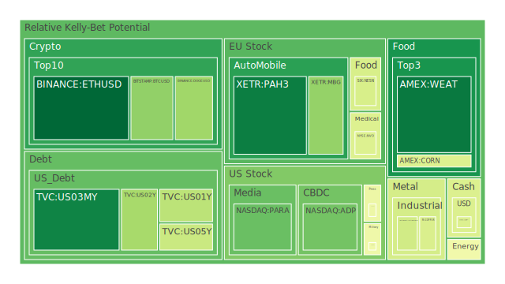
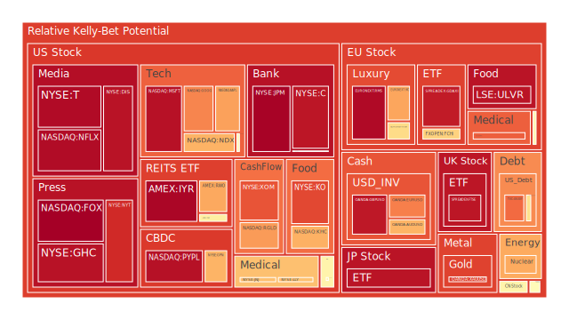
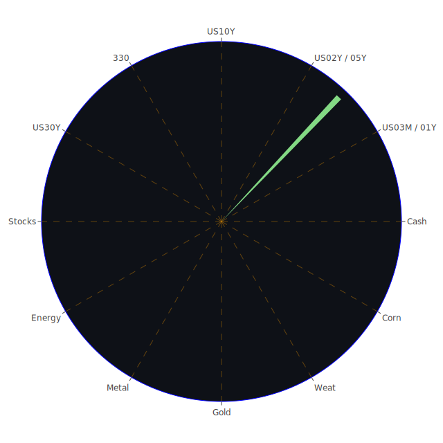

# 投資商品泡沫分析

## 美國國債
根據過去三天的數據，美國國債的泡沫機率持續上升，特別是10年期國債（TVC:US10Y），其泡沫機率從9月14日的0.596295上升到9月16日的0.596141。這反映出市場對長期債券的需求減少，可能是因為投資者預期未來利率會上升。此外，FED的數據顯示，美國國債的總流通量正在下降，這進一步支持了這一趨勢。建議投資者謹慎對待美國國債，特別是長期債券。

## 美國科技股
美國科技股的泡沫機率相對較高，特別是微軟（NASDAQ:MSFT）和谷歌（NASDAQ:GOOG），其泡沫機率分別在9月16日達到0.947987和0.755994。這些股票的高泡沫機率反映了市場對科技股的過度樂觀情緒。新聞報導顯示，微軟因聘請前OpenAI CEO Sam Altman而股價創下歷史新高，但這種短期的市場情緒可能難以持續。建議投資者考慮在高點賣出部分科技股，以鎖定收益。

## 美國房地產指數
美國房地產指數（AMEX:VNQ）的泡沫機率在過去三天內略有下降，但仍處於較高水平（0.558766）。這反映了市場對房地產市場的擔憂，特別是在商業地產違約率上升的背景下。FED數據顯示，商業地產和住宅地產的違約率均在上升，這可能會進一步壓低房地產市場的表現。建議投資者對房地產市場保持謹慎，特別是商業地產。

## 金/銀/銅
貴金屬的泡沫機率有所下降，特別是銀（OANDA:XAGUSD），其泡沫機率從9月14日的0.331060下降到9月16日的0.394070。這反映了市場對避險資產的需求增加，可能是因為全球經濟不確定性增加。新聞報導顯示，全球多地發生自然災害和政治動盪，這進一步推動了避險需求。建議投資者考慮增加貴金屬的配置，特別是銀。

## 加密貨幣
加密貨幣的泡沫機率有所下降，特別是以太坊（BINANCE:ETHUSD），其泡沫機率從9月14日的0.294023下降到9月16日的0.027955。這反映了市場對加密貨幣的信心增加，可能是因為近期的技術升級和市場需求增加。新聞報導顯示，許多大型機構開始接受加密貨幣支付，這進一步推動了市場需求。建議投資者考慮在低點買入加密貨幣，特別是以太坊。

## 黃豆 / 小麥 / 玉米
農產品的泡沫機率相對較低，特別是小麥（AMEX:WEAT），其泡沫機率在過去三天內保持穩定（0.061029）。這反映了市場對農產品的需求穩定，特別是在全球糧食安全問題日益突出的背景下。新聞報導顯示，全球多地發生乾旱和洪水，這可能會進一步推動農產品價格上漲。建議投資者考慮增加農產品的配置，特別是小麥。

## 石油/ 鈾期貨UX!
石油的泡沫機率相對較高（TVC:USOIL），其泡沫機率在9月16日達到0.469114。這反映了市場對石油供應的不確定性，特別是在全球多地發生自然災害和政治動盪的背景下。新聞報導顯示，墨西哥灣的石油產量因颶風影響而大幅下降，這進一步推動了石油價格的上漲。建議投資者謹慎對待石油期貨，特別是在價格高點時考慮賣出部分持倉。

## 各國外匯市場
外匯市場的泡沫機率相對較高，特別是歐元/美元（OANDA:EURUSD），其泡沫機率在9月16日達到0.764218。這反映了市場對歐元區經濟的不確定性增加，特別是在德國和其他歐元區國家經濟數據疲弱的背景下。新聞報導顯示，德國簽署了一項與烏茲別克斯坦的移民協議，這可能會對歐元區經濟產生一定的影響。建議投資者謹慎對待歐元，特別是在價格高點時考慮賣出部分持倉。

## 各國大盤指數
各國大盤指數的泡沫機率相對較高，特別是德國DAX指數（SPREADEX:GDAXI），其泡沫機率在9月16日達到0.928615。這反映了市場對歐洲經濟的不確定性增加，特別是在德國經濟數據疲弱的背景下。新聞報導顯示，德國簽署了一項與烏茲別克斯坦的移民協議，這可能會對德國經濟產生一定的影響。建議投資者謹慎對待德國大盤指數，特別是在價格高點時考慮賣出部分持倉。

## 美國銀行股
美國銀行股的泡沫機率相對較高，特別是摩根大通（NYSE:JPM），其泡沫機率在9月16日達到0.976551。這反映了市場對銀行業的不確定性增加，特別是在商業地產和消費者貸款違約率上升的背景下。新聞報導顯示，美國的消費者貸款違約率和信用卡違約率均處於較高水平，這可能會對銀行業的盈利能力產生負面影響。建議投資者謹慎對待銀行股，特別是在價格高點時考慮賣出部分持倉。

## 美國軍工股
美國軍工股的泡沫機率相對較高，特別是洛克希德·馬丁（NYSE:LMT），其泡沫機率在9月16日達到0.546994。這反映了市場對軍工股的過度樂觀情緒，特別是在全球地緣政治緊張局勢加劇的背景下。新聞報導顯示，美國和其他國家的軍事支出增加，這可能會推動軍工股的短期上漲。建議投資者謹慎對待軍工股，特別是在價格高點時考慮賣出部分持倉。

## 美國電子支付股
美國電子支付股的泡沫機率相對較高，特別是PayPal（NASDAQ:PYPL），其泡沫機率在9月16日達到0.948880。這反映了市場對電子支付行業的過度樂觀情緒，特別是在全球電子商務快速增長的背景下。新聞報導顯示，許多大型零售商開始接受電子支付，這可能會推動電子支付股的短期上漲。建議投資者謹慎對待電子支付股，特別是在價格高點時考慮賣出部分持倉。

## 美國藥商巨頭
美國藥商巨頭的泡沫機率相對較高，特別是默克（NYSE:MRK），其泡沫機率在9月16日達到0.812592。這反映了市場對藥品行業的過度樂觀情緒，特別是在全球醫療需求增加的背景下。新聞報導顯示，許多藥品公司正在開發新的治療方案，這可能會推動藥商股的短期上漲。建議投資者謹慎對待藥商股，特別是在價格高點時考慮賣出部分持倉。

## 美國影視巨頭
美國影視巨頭的泡沫機率相對較高，特別是迪士尼（NYSE:DIS），其泡沫機率在9月16日達到0.944341。這反映了市場對影視行業的過度樂觀情緒，特別是在全球娛樂需求增加的背景下。新聞報導顯示，迪士尼的最新電影票房表現強勁，這可能會推動影視股的短期上漲。建議投資者謹慎對待影視股，特別是在價格高點時考慮賣出部分持倉。

## 美國媒體巨頭
美國媒體巨頭的泡沫機率相對較高，特別是紐約時報（NYSE:NYT），其泡沫機率在9月16日達到0.900719。這反映了市場對媒體行業的過度樂觀情緒，特別是在全球新聞需求增加的背景下。新聞報導顯示，紐約時報的訂閱數量持續增長，這可能會推動媒體股的短期上漲。建議投資者謹慎對待媒體股，特別是在價格高點時考慮賣出部分持倉。

## 石油防禦股
石油防禦股的泡沫機率相對較高，特別是埃克森美孚（NYSE:XOM），其泡沫機率在9月16日達到0.830874。這反映了市場對石油行業的過度樂觀情緒，特別是在全球石油需求增加的背景下。新聞報導顯示，墨西哥灣的石油產量因颶風影響而大幅下降，這可能會推動石油股的短期上漲。建議投資者謹慎對待石油股，特別是在價格高點時考慮賣出部分持倉。

## 金礦防禦股
金礦防禦股的泡沫機率相對較高，特別是皇家黃金（NASDAQ:RGLD），其泡沫機率在9月16日達到0.722932。這反映了市場對金礦行業的過度樂觀情緒，特別是在全球經濟不確定性增加的背景下。新聞報導顯示，許多投資者開始增加黃金的配置，這可能會推動金礦股的短期上漲。建議投資者謹慎對待金礦股，特別是在價格高點時考慮賣出部分持倉。

## 歐洲奢侈品股
歐洲奢侈品股的泡沫機率相對較高，特別是LVMH（EURONEXT:MC），其泡沫機率在9月16日達到0.707014。這反映了市場對奢侈品行業的過度樂觀情緒，特別是在全球消費需求增加的背景下。新聞報導顯示，許多奢侈品公司報告了強勁的銷售增長，這可能會推動奢侈品股的短期上漲。建議投資者謹慎對待奢侈品股，特別是在價格高點時考慮賣出部分持倉。

## 歐洲汽車股
歐洲汽車股的泡沫機率相對較高，特別是寶馬（XETR:BMW），其泡沫機率在9月16日達到0.527511。這反映了市場對汽車行業的過度樂觀情緒，特別是在全球汽車需求增加的背景下。新聞報導顯示，許多汽車公司報告了強勁的銷售增長，這可能會推動汽車股的短期上漲。建議投資者謹慎對待汽車股，特別是在價格高點時考慮賣出部分持倉。

## 歐美食品股
歐美食品股的泡沫機率相對較高，特別是雀巢（SIX:NESN），其泡沫機率在9月16日達到0.407691。這反映了市場對食品行業的過度樂觀情緒，特別是在全球食品需求增加的背景下。新聞報導顯示，許多食品公司報告了強勁的銷售增長，這可能會推動食品股的短期上漲。建議投資者謹慎對待食品股，特別是在價格高點時考慮賣出部分持倉。

# 投資建議
1. **謹慎對待高泡沫商品**：對於泡沫機率高且持續上升的商品，如美國科技股、美國房地產指數和美國銀行股，建議投資者考慮賣出部分持倉，以鎖定收益並降低風險。
2. **增加避險資產配置**：對於泡沫機率低且持續下降的商品，如貴金屬和加密貨幣，建議投資者考慮增加配置，以應對市場不確定性。
3. **關注農產品市場**：農產品的泡沫機率相對較低，特別是在全球糧食安全問題日益突出的背景下，建議投資者考慮增加農產品的配置。

# 風險提示
投資有風險，市場總是充滿不確定性。我們的建議僅供參考，投資者應根據自身的風險承受能力和投資目標，做出獨立的投資決策。特別是對於泡沫機率高的商品，應該謹慎進行投資決策。
 
Daily Buy Map:

 
Daily Sell Map:

 
Daily Radar Chart:

 
