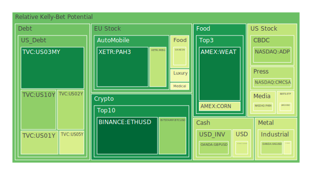
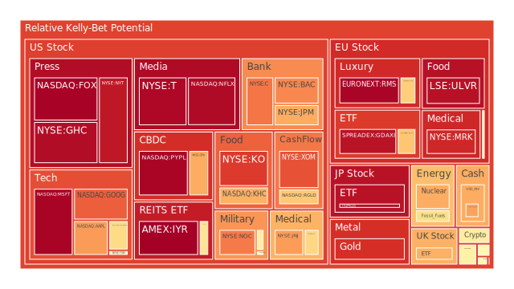
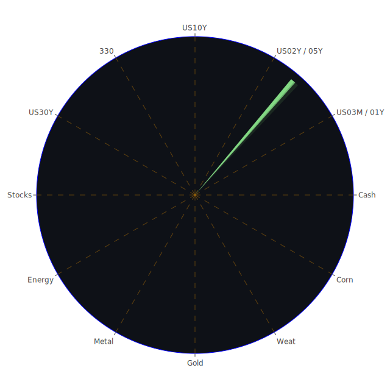

# 每日投資報告

## 投資商品泡沫分析

## 美國國債
近期美國國債的泡沫機率顯示出一些波動。10年期國債（TVC:US10Y）的泡沫機率從9月15日的0.631310下降至9月17日的0.274258，這表明投資者對於長期國債的信心有所增強。然而，2年期國債（TVC:US02Y）和5年期國債（TVC:US05Y）的泡沫機率則相對穩定，分別在0.327096和0.403225左右。這可能與近期FED的政策變動和市場對未來利率走勢的預期有關。

## 美國科技股
美國科技股的泡沫機率普遍較高，特別是微軟（NASDAQ:MSFT）和谷歌（NASDAQ:GOOG），其泡沫機率分別為0.962610和0.804362。這反映了市場對科技股的高估值和潛在的風險。近期新聞顯示，微軟批准了一項新的600億美元的股票回購計劃，這可能會在短期內支撐其股價，但長期風險仍需謹慎對待。

## 美國房地產指數
美國房地產指數（AMEX:VNQ）的泡沫機率在0.578589左右，顯示出市場對房地產的信心有所回升。然而，商業房地產的違約率正在上升，這可能會對房地產市場造成壓力。投資者應該密切關注這一領域的發展，特別是在利率變動和經濟增長放緩的背景下。

## 金/銀/銅
金價（OANDA:XAUUSD）的泡沫機率較高，達到0.879497，這可能與市場對避險資產的需求增加有關。銀（OANDA:XAGUSD）和銅（FX:COPPER）的泡沫機率則相對較低，分別為0.362432和0.447560。近期新聞顯示，投資者對金價的看漲情緒較高，這可能會在短期內支撐金價。

## 加密貨幣
以太坊（BINANCE:ETHUSD）的泡沫機率持續下降，從9月15日的0.032515下降至9月17日的0.022638，顯示出市場對以太坊的信心增強。比特幣（BITSTAMP:BTCUSD）的泡沫機率則相對穩定，約為0.280529。這可能與市場對加密貨幣的長期看好有關，但短期內仍需謹慎對待。

## 黃豆 / 小麥 / 玉米
黃豆（AMEX:SOYB）和小麥（AMEX:WEAT）的泡沫機率相對穩定，分別為0.502119和0.064461。玉米（AMEX:CORN）的泡沫機率則保持在0.418551左右。這些農產品的價格波動較小，投資者可以考慮在價格低點時進行佈局。

## 石油/ 鈾期貨UX!
石油（TVC:USOIL）的泡沫機率較高，達到0.593153，顯示出市場對石油價格的擔憂。鈾期貨（COMEX:UX1!）的泡沫機率則相對較低，約為0.687552。近期新聞顯示，投資者對石油的看跌情緒較強，這可能會在短期內壓低油價。

## 各國外匯市場
美元兌日元（OANDA:USDJPY）的泡沫機率為0.405802，顯示出市場對美元的信心有所回升。歐元兌美元（OANDA:EURUSD）的泡沫機率則較高，達到0.517988，這可能與市場對歐元區經濟前景的擔憂有關。

## 各國大盤指數
德國DAX指數（SPREADEX:GDAXI）的泡沫機率較高，達到0.932319，顯示出市場對歐洲經濟前景的擔憂。法國CAC指數（FXOPEN:FCHI）的泡沫機率也較高，約為0.642382。這些指數的高泡沫機率反映了市場對歐洲經濟的不確定性。

## 美國銀行股
美國銀行（NYSE:BAC）的泡沫機率較高，達到0.741109，顯示出市場對銀行業的擔憂。摩根大通（NYSE:JPM）的泡沫機率也較高，約為0.689659。這可能與市場對未來利率走勢和經濟增長放緩的擔憂有關。

## 美國軍工股
洛克希德馬丁（NYSE:LMT）的泡沫機率為0.546994，顯示出市場對軍工股的信心相對穩定。然而，雷神技術公司（NYSE:RTX）的泡沫機率較高，約為0.510860，這可能與近期的地緣政治風險有關。

## 美國電子支付股
PayPal（NASDAQ:PYPL）的泡沫機率較高，達到0.959679，顯示出市場對電子支付股的高估值和潛在風險。近期新聞顯示，PayPal的業績表現不如預期，這可能會在短期內壓低其股價。

## 美國藥商巨頭
默克（NYSE:MRK）的泡沫機率較高，達到0.892721，顯示出市場對藥商股的擔憂。禮來公司（NYSE:LLY）的泡沫機率也較高，約為0.608123。這可能與市場對藥品價格和監管風險的擔憂有關。

## 美國影視巨頭
Netflix（NASDAQ:NFLX）的泡沫機率較高，達到0.949406，顯示出市場對影視股的高估值和潛在風險。近期新聞顯示，Netflix的訂閱用戶增長放緩，這可能會在短期內壓低其股價。

## 美國媒體巨頭
紐約時報（NYSE:NYT）的泡沫機率較高，達到0.923958，顯示出市場對媒體股的擔憂。這可能與市場對廣告收入和訂閱用戶增長的擔憂有關。

## 石油防禦股
埃克森美孚（NYSE:XOM）的泡沫機率較高，達到0.822220，顯示出市場對石油防禦股的高估值和潛在風險。近期新聞顯示，投資者對石油價格的看跌情緒較強，這可能會在短期內壓低其股價。

## 金礦防禦股
皇家黃金公司（NASDAQ:RGLD）的泡沫機率較高，達到0.635513，顯示出市場對金礦股的高估值和潛在風險。近期新聞顯示，投資者對金價的看漲情緒較高，這可能會在短期內支撐金礦股的股價。

## 歐洲奢侈品股
LVMH（EURONEXT:MC）的泡沫機率較高，達到0.642382，顯示出市場對奢侈品股的高估值和潛在風險。近期新聞顯示，奢侈品市場的需求有所放緩，這可能會在短期內壓低其股價。

## 歐洲汽車股
BMW（XETR:BMW）的泡沫機率較高，達到0.527511，顯示出市場對汽車股的擔憂。這可能與市場對汽車需求放緩和供應鏈問題的擔憂有關。

## 歐美食品股
雀巢（SIX:NESN）的泡沫機率較高，達到0.408864，顯示出市場對食品股的高估值和潛在風險。近期新聞顯示，食品價格上漲可能會對消費者需求造成壓力，這可能會在短期內壓低其股價。

## 投資建議

1. **建議賣出**：對於泡沫機率持續上升且遠大於0.5的商品，如微軟（NASDAQ:MSFT）、谷歌（NASDAQ:GOOG）和Netflix（NASDAQ:NFLX），建議投資者考慮賣出，避免未來價格下跌時的損失。

2. **建議買入**：對於泡沫機率持續下降且遠小於0.5的商品，如以太坊（BINANCE:ETHUSD）和美國國債（TVC:US10Y），建議投資者考慮買入，掌握低吸籌碼的時機。

3. **觀望**：對於泡沫機率在0.45至0.55之間的商品，如黃豆（AMEX:SOYB）和小麥（AMEX:WEAT），建議投資者觀望，不要有任何動作。

## 風險提示

投資有風險，市場總是充滿不確定性。我們的建議僅供參考，投資者應根據自身的風險承受能力和投資目標，做出獨立的投資決策。特別是對於泡沫機率高的商品，應該謹慎進行投資決策。

希望這份報告能夠幫助您在複雜的市場中做出明智的投資決策。祝您投資順利！
 
Daily Buy Map:

 
Daily Sell Map:

 
Daily Radar Chart:

 
