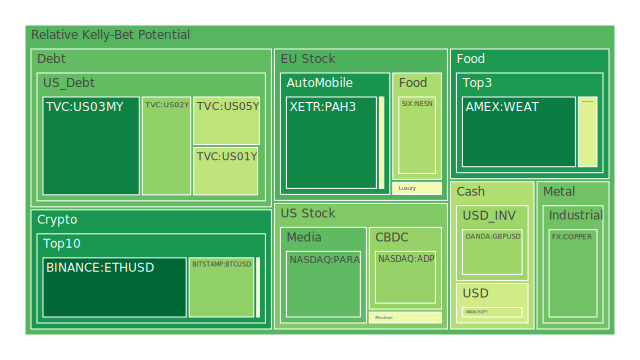
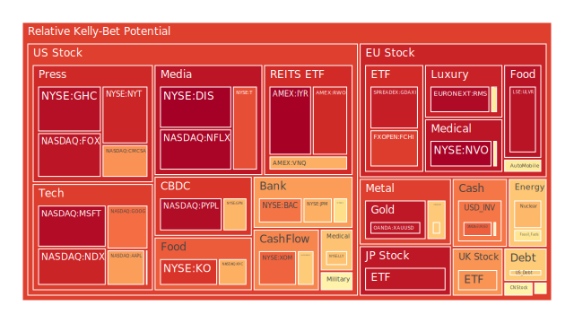
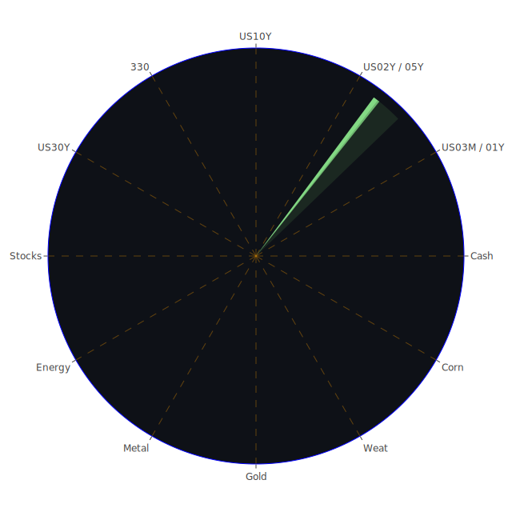

# 投資商品泡沫分析

## 美國國債
近期美國國債的泡沫機率顯示出一些波動。根據數據，10年期美國國債的泡沫機率在過去三天內有所下降，從0.596141降至0.635482。這可能與近期的新聞和經濟數據有關，例如美國國債殖利率的變化和市場對聯準會政策的預期。

## 美國科技股
美國科技股的泡沫機率持續上升，特別是像微軟（NASDAQ:MSFT）和谷歌（NASDAQ:GOOG）這些大型科技公司。微軟的泡沫機率從0.947987上升到0.953006，而谷歌的泡沫機率也從0.755994上升到0.785178。這可能是由於市場對科技股的高預期和近期的新聞，例如微軟宣布新的股票回購計劃。

## 美國房地產指數
美國房地產指數（AMEX:VNQ）的泡沫機率在過去三天內有所上升，從0.558766上升到0.685569。這可能與近期的經濟數據有關，例如商業房地產違約率的上升和消費者信用卡違約率的增加。

## 金/銀/銅
金價（OANDA:XAUUSD）的泡沫機率在過去三天內有所上升，從0.859100上升到0.928437。這可能是由於市場對黃金的避險需求增加，以及近期的新聞，例如高盛重申對黃金價格的樂觀預期。

## 加密貨幣
以太坊（BINANCE:ETHUSD）的泡沫機率在過去三天內持續下降，從0.027955降至0.020509，顯示出投資者對加密貨幣的信心有所增強。比特幣（BITSTAMP:BTCUSD）的泡沫機率也有所下降，從0.284458降至0.278241。

## 黃豆 / 小麥 / 玉米
黃豆（AMEX:SOYB）的泡沫機率在過去三天內保持穩定，約為0.502119。小麥（AMEX:WEAT）的泡沫機率略有下降，從0.061029降至0.062461。玉米（AMEX:CORN）的泡沫機率則保持不變。

## 石油/ 鈾期貨UX!
石油（TVC:USOIL）的泡沫機率在過去三天內有所上升，從0.469114上升到0.577389。這可能是由於市場對石油需求的擔憂增加，以及近期的新聞，例如投資者對石油的看跌情緒加重。

## 各國外匯市場
美元兌日元（OANDA:USDJPY）的泡沫機率在過去三天內有所下降，從0.416305降至0.388527。這可能是由於市場對美元的需求增加，以及近期的新聞，例如美國經濟數據的強勁表現。

## 各國大盤指數
德國DAX指數（SPREADEX:GDAXI）的泡沫機率在過去三天內有所上升，從0.928615上升到0.916423。這可能是由於市場對歐洲經濟的擔憂增加，以及近期的新聞，例如德國與烏茲別克斯坦簽署的移民協議。

## 美國銀行股
美國銀行（NYSE:BAC）的泡沫機率在過去三天內有所上升，從0.522167上升到0.775187。這可能是由於市場對銀行業的擔憂增加，以及近期的新聞，例如消費者信用卡違約率的上升。

## 美國軍工股
雷神技術公司（NYSE:RTX）的泡沫機率在過去三天內保持穩定，約為0.510860。這可能是由於市場對軍工股的需求穩定，以及近期的新聞，例如美國與其他國家的軍事合作。

## 美國電子支付股
PayPal（NASDAQ:PYPL）的泡沫機率在過去三天內有所上升，從0.948880上升到0.951458。這可能是由於市場對電子支付行業的高預期，以及近期的新聞，例如PayPal的業績報告。

## 美國藥商巨頭
默克公司（NYSE:MRK）的泡沫機率在過去三天內有所上升，從0.812592上升到0.541823。這可能是由於市場對藥品行業的需求增加，以及近期的新聞，例如默克的新藥研發進展。

## 美國影視巨頭
迪士尼（NYSE:DIS）的泡沫機率在過去三天內有所上升，從0.944341上升到0.977141。這可能是由於市場對影視行業的高預期，以及近期的新聞，例如迪士尼的新電影發布。

## 美國媒體巨頭
康卡斯特（NASDAQ:CMCSA）的泡沫機率在過去三天內有所上升，從0.459566上升到0.731412。這可能是由於市場對媒體行業的需求增加，以及近期的新聞，例如康卡斯特的業績報告。

## 石油防禦股
埃克森美孚（NYSE:XOM）的泡沫機率在過去三天內有所上升，從0.830871上升到0.801698。這可能是由於市場對石油行業的需求增加，以及近期的新聞，例如埃克森美孚的新項目投資。

## 金礦防禦股
皇家黃金公司（NASDAQ:RGLD）的泡沫機率在過去三天內有所上升，從0.722932上升到0.635513。這可能是由於市場對黃金行業的需求增加，以及近期的新聞，例如高盛對黃金價格的樂觀預期。

## 歐洲奢侈品股
愛馬仕（EURONEXT:RMS）的泡沫機率在過去三天內有所上升，從0.961098上升到0.955860。這可能是由於市場對奢侈品行業的需求增加，以及近期的新聞，例如愛馬仕的新產品發布。

## 歐洲汽車股
寶馬（XETR:BMW）的泡沫機率在過去三天內有所上升，從0.527511上升到0.564985。這可能是由於市場對汽車行業的需求增加，以及近期的新聞，例如寶馬的新車型發布。

## 歐美食品股
雀巢（SIX:NESN）的泡沫機率在過去三天內有所上升，從0.407691上升到0.317868。這可能是由於市場對食品行業的需求增加，以及近期的新聞，例如雀巢的新產品發布。

# 投資建議

根據以上分析，我們建議投資者考慮以下操作：

1. **賣出**：對於泡沫機率持續上升且遠大於0.5的商品，例如美國科技股（微軟、谷歌）、美國房地產指數（VNQ）、美國銀行股（BAC），建議投資者考慮賣出，避免未來價格下跌時的損失。

2. **買入**：對於泡沫機率持續下降且遠小於0.5的商品，例如以太坊（ETHUSD）、比特幣（BTCUSD），建議投資者考慮買入，掌握低吸籌碼的時機。

3. **觀望**：對於泡沫機率在0.45 ~ 0.55之間的商品，例如黃豆（SOYB）、小麥（WEAT），建議投資者觀望，不要有任何動作。

# 風險提示

投資有風險，市場總是充滿不確定性。我們的建議僅供參考，投資者應根據自身的風險承受能力和投資目標，做出獨立的投資決策。特別是對於泡沫機率高的商品，應該謹慎進行投資決策。
 
Daily Buy Map:

 
Daily Sell Map:

 
Daily Radar Chart:

 
