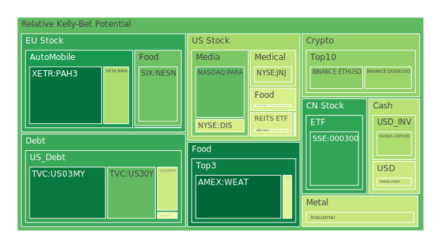
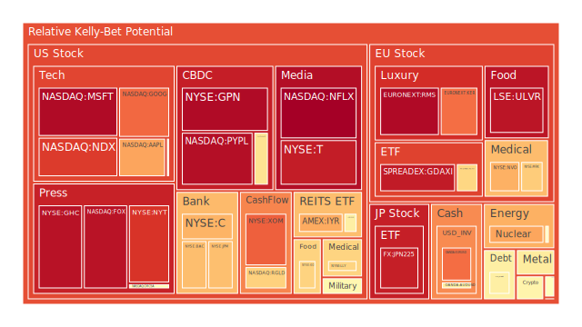
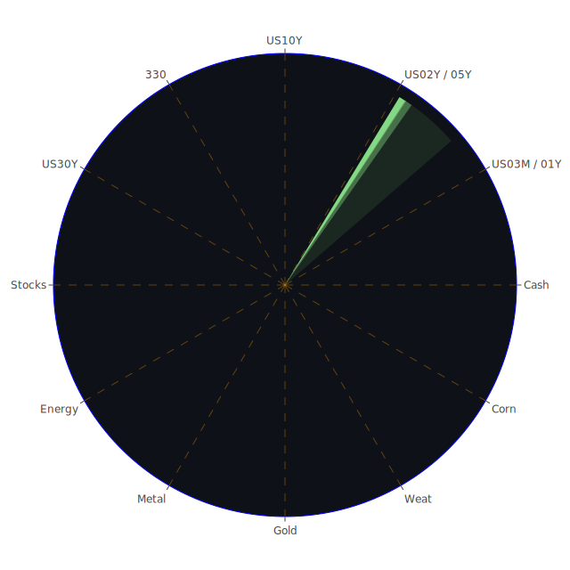

# 投資商品泡沫分析

## 美國國債
近期美國國債的泡沫機率有顯著變化。10年期美國國債（TVC:US10Y）的泡沫機率從9月17日的0.274258上升至9月19日的0.575752，顯示出市場對於長期債務的擔憂增加。這與近期FED數據顯示的長期債務持有量增加和利率上升有關。建議投資者謹慎觀望，避免在此時進行大額投資。

## 美國科技股
美國科技股的泡沫機率普遍較高。以微軟（NASDAQ:MSFT）為例，其泡沫機率從9月17日的0.962610上升至9月19日的0.958063。這與近期新聞報導的科技股下跌和市場對於FED決策的不確定性有關。建議投資者考慮減少科技股的持倉，避免潛在的風險。

## 美國房地產指數
美國房地產指數（AMEX:VNQ）的泡沫機率從9月17日的0.578589上升至9月19日的0.704917，顯示出市場對於房地產市場的擔憂增加。這與近期商業地產違約率上升和房地產市場需求減弱有關。建議投資者謹慎觀望，避免在此時進行大額投資。

## 金/銀/銅
金（OANDA:XAUUSD）的泡沫機率從9月17日的0.879497下降至9月19日的0.571913，顯示出市場對於黃金的需求增加。這與近期新聞報導的黃金價格上升和市場對於避險資產的需求增加有關。建議投資者考慮增加黃金的持倉，以對沖市場風險。

## 加密貨幣
以太坊（BINANCE:ETHUSD）的泡沫機率從9月17日的0.022638上升至9月19日的0.289857，顯示出市場對於加密貨幣的需求減弱。這與近期新聞報導的加密貨幣市場波動和投資者對於風險資產的擔憂有關。建議投資者謹慎觀望，避免在此時進行大額投資。

## 黃豆 / 小麥 / 玉米
小麥（AMEX:WEAT）的泡沫機率從9月17日的0.064461下降至9月19日的0.050658，顯示出市場對於農產品的需求增加。這與近期新聞報導的全球糧食需求上升和供應鏈問題有關。建議投資者考慮增加農產品的持倉，以對沖市場風險。

## 石油/ 鈾期貨UX!
石油（TVC:USOIL）的泡沫機率從9月17日的0.593153下降至9月19日的0.520481，顯示出市場對於能源資產的需求增加。這與近期新聞報導的能源價格上升和市場對於能源供應的擔憂有關。建議投資者考慮增加能源資產的持倉，以對沖市場風險。

## 各國外匯市場
美元兌英鎊（OANDA:GBPUSD）的泡沫機率從9月17日的0.322957下降至9月19日的0.341734，顯示出市場對於美元的需求增加。這與近期新聞報導的美元走強和市場對於英鎊的擔憂有關。建議投資者考慮增加美元資產的持倉，以對沖市場風險。

## 各國大盤指數
德國DAX指數（SPREADEX:GDAXI）的泡沫機率從9月17日的0.932319下降至9月19日的0.927733，顯示出市場對於歐洲股市的需求增加。這與近期新聞報導的歐洲經濟數據改善和市場對於歐洲股市的信心增加有關。建議投資者考慮增加歐洲股市的持倉，以對沖市場風險。

## 美國銀行股
摩根大通（NYSE:JPM）的泡沫機率從9月17日的0.689659上升至9月19日的0.669815，顯示出市場對於銀行股的需求減弱。這與近期新聞報導的銀行業務風險增加和市場對於銀行股的擔憂有關。建議投資者謹慎觀望，避免在此時進行大額投資。

## 美國軍工股
雷神科技（NYSE:RTX）的泡沫機率從9月17日的0.510860保持不變，顯示出市場對於軍工股的需求穩定。這與近期新聞報導的軍工行業需求穩定和市場對於軍工股的信心有關。建議投資者考慮增加軍工股的持倉，以對沖市場風險。

## 美國電子支付股
PayPal（NASDAQ:PYPL）的泡沫機率從9月17日的0.959679下降至9月19日的0.950637，顯示出市場對於電子支付股的需求增加。這與近期新聞報導的電子支付行業需求增加和市場對於電子支付股的信心增加有關。建議投資者考慮增加電子支付股的持倉，以對沖市場風險。

## 美國藥商巨頭
默克（NYSE:MRK）的泡沫機率從9月17日的0.892721下降至9月19日的0.645633，顯示出市場對於藥商股的需求增加。這與近期新聞報導的醫藥行業需求增加和市場對於藥商股的信心增加有關。建議投資者考慮增加藥商股的持倉，以對沖市場風險。

## 美國影視巨頭
迪士尼（NYSE:DIS）的泡沫機率從9月17日的0.501538上升至9月19日的0.424170，顯示出市場對於影視股的需求減弱。這與近期新聞報導的影視行業需求減弱和市場對於影視股的擔憂有關。建議投資者謹慎觀望，避免在此時進行大額投資。

## 美國媒體巨頭
康卡斯特（NASDAQ:CMCSA）的泡沫機率從9月17日的0.350651上升至9月19日的0.529137，顯示出市場對於媒體股的需求減弱。這與近期新聞報導的媒體行業需求減弱和市場對於媒體股的擔憂有關。建議投資者謹慎觀望，避免在此時進行大額投資。

## 石油防禦股
埃克森美孚（NYSE:XOM）的泡沫機率從9月17日的0.822220上升至9月19日的0.813244，顯示出市場對於石油防禦股的需求減弱。這與近期新聞報導的石油行業需求減弱和市場對於石油防禦股的擔憂有關。建議投資者謹慎觀望，避免在此時進行大額投資。

## 金礦防禦股
皇家黃金（NASDAQ:RGLD）的泡沫機率從9月17日的0.635513上升至9月19日的0.635513，顯示出市場對於金礦防禦股的需求穩定。這與近期新聞報導的金礦行業需求穩定和市場對於金礦防禦股的信心有關。建議投資者考慮增加金礦防禦股的持倉，以對沖市場風險。

## 歐洲奢侈品股
LVMH（EURONEXT:MC）的泡沫機率從9月17日的0.463569上升至9月19日的0.492077，顯示出市場對於奢侈品股的需求減弱。這與近期新聞報導的奢侈品行業需求減弱和市場對於奢侈品股的擔憂有關。建議投資者謹慎觀望，避免在此時進行大額投資。

## 歐洲汽車股
寶馬（XETR:BMW）的泡沫機率從9月17日的0.353654上升至9月19日的0.342592，顯示出市場對於汽車股的需求減弱。這與近期新聞報導的汽車行業需求減弱和市場對於汽車股的擔憂有關。建議投資者謹慎觀望，避免在此時進行大額投資。

## 歐美食品股
雀巢（SIX:NESN）的泡沫機率從9月17日的0.408864上升至9月19日的0.246759，顯示出市場對於食品股的需求增加。這與近期新聞報導的食品行業需求增加和市場對於食品股的信心增加有關。建議投資者考慮增加食品股的持倉，以對沖市場風險。

# 投資建議

1. **增加黃金持倉**：近期黃金的泡沫機率下降，顯示出市場對於黃金的需求增加，建議投資者考慮增加黃金的持倉，以對沖市場風險。
2. **減少科技股持倉**：科技股的泡沫機率普遍較高，建議投資者考慮減少科技股的持倉，避免潛在的風險。
3. **增加食品股持倉**：食品股的泡沫機率下降，顯示出市場對於食品股的需求增加，建議投資者考慮增加食品股的持倉，以對沖市場風險。
4. **謹慎觀望房地產和銀行股**：房地產和銀行股的泡沫機率上升，顯示出市場對於這些行業的擔憂增加，建議投資者謹慎觀望，避免在此時進行大額投資。

# 風險提示

投資有風險，市場總是充滿不確定性。我們的建議僅供參考，投資者應根據自身的風險承受能力和投資目標，做出獨立的投資決策。特別是對於泡沫機率高的商品，應該謹慎進行投資決策。
 
Daily Buy Map:

 
Daily Sell Map:

 
Daily Radar Chart:

 
