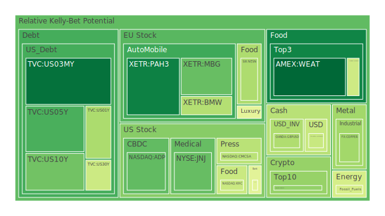
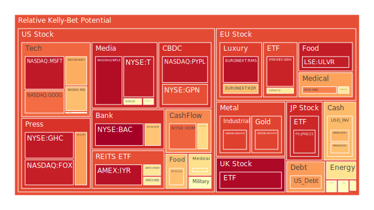
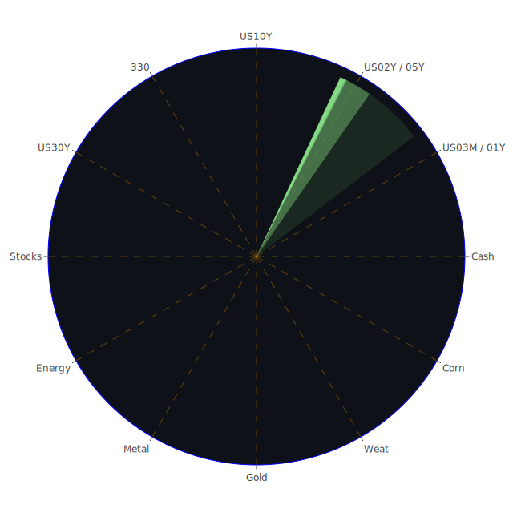

# 投資商品泡沫分析

## 美國國債
根據過去三天的數據，美國國債的泡沫機率呈現上升趨勢，特別是短期國債（如1年期和2年期國債）。這可能與近期的聯準會政策有關，特別是SOFR交易量增加，顯示市場對流動性需求上升。建議投資者謹慎觀察，特別是短期國債，避免在泡沫機率高的時候進行大量投資。

## 美國科技股
美國科技股的泡沫機率在過去三天內持續上升，特別是像Google (NASDAQ:GOOG) 和Apple (NASDAQ:AAPL) 這些大公司。這可能與近期的負面新聞有關，如華爾街對科技股的擔憂以及全球經濟不確定性增加。建議投資者考慮減少持有量，避免未來可能的價格下跌。

## 美國房地產指數
美國房地產指數（AMEX:VNQ）的泡沫機率在過去三天內有所上升，這可能與近期的房地產市場不穩定有關。聯準會的利率政策和高房貸利率可能會進一步壓抑房地產市場。建議投資者謹慎觀察，避免在泡沫機率高的時候進行大量投資。

## 金/銀/銅
金價（OANDA:XAUUSD）和銀價（OANDA:XAGUSD）的泡沫機率在過去三天內有所上升，這可能與全球經濟不確定性增加有關。銅價（FX:COPPER）的泡沫機率則有所下降，顯示市場對工業金屬需求有所回升。建議投資者考慮減少對金銀的投資，增加對銅的投資。

## 加密貨幣
以太幣（BINANCE:ETHUSD）和比特幣（BITSTAMP:BTCUSD）的泡沫機率在過去三天內有所下降，顯示市場對加密貨幣的需求有所回升。建議投資者考慮增加對加密貨幣的投資，特別是在泡沫機率較低的時候。

## 黃豆 / 小麥 / 玉米
小麥（AMEX:WEAT）和玉米（AMEX:CORN）的泡沫機率在過去三天內有所下降，顯示市場對農產品的需求有所回升。建議投資者考慮增加對這些農產品的投資，特別是在泡沫機率較低的時候。

## 石油/ 鈾期貨UX!
石油（TVC:USOIL）和鈾期貨（COMEX:UX1!）的泡沫機率在過去三天內有所上升，這可能與全球能源市場的不確定性增加有關。建議投資者謹慎觀察，避免在泡沫機率高的時候進行大量投資。

## 各國外匯市場
美元兌日圓（OANDA:USDJPY）和英鎊兌美元（OANDA:GBPUSD）的泡沫機率在過去三天內有所上升，顯示市場對美元的需求有所增加。建議投資者考慮減少對這些貨幣的投資，避免未來可能的價格波動。

## 各國大盤指數
美國納斯達克指數（NASDAQ:NDX）和德國DAX指數（SPREADEX:GDAXI）的泡沫機率在過去三天內有所上升，顯示市場對全球股市的不確定性增加。建議投資者謹慎觀察，避免在泡沫機率高的時候進行大量投資。

## 美國銀行股
美國銀行股（如NYSE:BAC）的泡沫機率在過去三天內有所上升，這可能與近期的金融市場不穩定有關。建議投資者謹慎觀察，避免在泡沫機率高的時候進行大量投資。

## 美國軍工股
美國軍工股（如NYSE:RTX）的泡沫機率在過去三天內有所上升，這可能與近期的地緣政治風險增加有關。建議投資者謹慎觀察，避免在泡沫機率高的時候進行大量投資。

## 美國電子支付股
美國電子支付股（如NASDAQ:PYPL）的泡沫機率在過去三天內有所上升，這可能與近期的市場不確定性增加有關。建議投資者謹慎觀察，避免在泡沫機率高的時候進行大量投資。

## 美國藥商巨頭
美國藥商巨頭（如NYSE:JNJ）的泡沫機率在過去三天內有所上升，這可能與近期的市場不確定性增加有關。建議投資者謹慎觀察，避免在泡沫機率高的時候進行大量投資。

## 美國影視巨頭
美國影視巨頭（如NASDAQ:NFLX）的泡沫機率在過去三天內有所上升，這可能與近期的市場不確定性增加有關。建議投資者謹慎觀察，避免在泡沫機率高的時候進行大量投資。

## 美國媒體巨頭
美國媒體巨頭（如NASDAQ:CMCSA）的泡沫機率在過去三天內有所上升，這可能與近期的市場不確定性增加有關。建議投資者謹慎觀察，避免在泡沫機率高的時候進行大量投資。

## 石油防禦股
石油防禦股（如NYSE:XOM）的泡沫機率在過去三天內有所上升，這可能與全球能源市場的不確定性增加有關。建議投資者謹慎觀察，避免在泡沫機率高的時候進行大量投資。

## 金礦防禦股
金礦防禦股（如NASDAQ:RGLD）的泡沫機率在過去三天內有所上升，這可能與全球經濟不確定性增加有關。建議投資者謹慎觀察，避免在泡沫機率高的時候進行大量投資。

## 歐洲奢侈品股
歐洲奢侈品股（如EURONEXT:RMS）的泡沫機率在過去三天內有所上升，這可能與全球經濟不確定性增加有關。建議投資者謹慎觀察，避免在泡沫機率高的時候進行大量投資。

## 歐洲汽車股
歐洲汽車股（如XETR:BMW）的泡沫機率在過去三天內有所上升，這可能與全球經濟不確定性增加有關。建議投資者謹慎觀察，避免在泡沫機率高的時候進行大量投資。

## 歐美食品股
歐美食品股（如NYSE:KO）的泡沫機率在過去三天內有所上升，這可能與全球經濟不確定性增加有關。建議投資者謹慎觀察，避免在泡沫機率高的時候進行大量投資。

# 投資建議
1. **謹慎觀察高泡沫機率的商品**：如美國科技股、美國房地產指數、美國銀行股等，避免在泡沫機率高的時候進行大量投資。
2. **考慮增加低泡沫機率的商品**：如加密貨幣、農產品等，特別是在泡沫機率較低的時候。
3. **關注聯準會政策和全球經濟動態**：這些因素對市場有重大影響，投資者應密切關注相關新聞和經濟數據。

# 風險提示

投資有風險，市場總是充滿不確定性。我們的建議僅供參考，投資者應根據自身的風險承受能力和投資目標，做出獨立的投資決策。
 
Daily Buy Map:

 
Daily Sell Map:

 
Daily Radar Chart:

 
