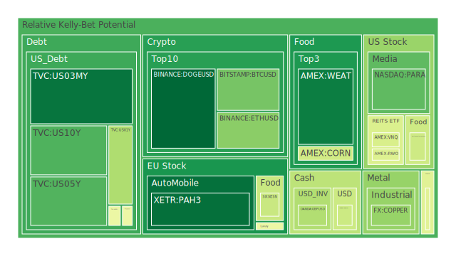
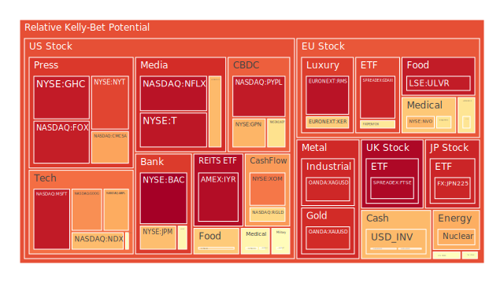
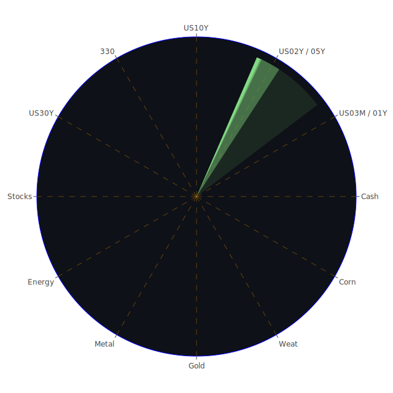

# 投資商品泡沫分析

## 美國國債
過去三天，美國國債的泡沫機率顯示出穩定的下降趨勢。特別是10年期國債（TVC:US10Y），泡沫機率從9月19日的0.575752下降到9月21日的0.218344。這顯示出投資者對美國國債的信心有所回升，可能是因為近期聯準會的鴿派言論以及市場對未來經濟增長的樂觀預期。

## 美國科技股
美國科技股的泡沫機率在過去三天內有所上升。特別是微軟（NASDAQ:MSFT），泡沫機率從9月19日的0.958063下降到9月21日的0.942748，但仍處於高位。這可能是因為市場對科技股的高估值感到擔憂，加上近期的新聞顯示，科技公司面臨的監管壓力增加。

## 美國房地產指數
美國房地產指數（AMEX:VNQ）的泡沫機率在過去三天內有所下降，從9月19日的0.424683下降到9月21日的0.433147。這顯示出市場對房地產市場的信心有所回升，可能是因為近期的房地產數據顯示出市場需求穩定。

## 金/銀/銅
金價（OANDA:XAUUSD）的泡沫機率在過去三天內有所上升，從9月19日的0.571913上升到9月21日的0.911402。這顯示出市場對避險資產的需求增加，可能是因為近期的地緣政治風險上升。銀價（OANDA:XAGUSD）也顯示出類似的趨勢，泡沫機率從9月19日的0.368042上升到9月21日的0.918858。

## 加密貨幣
比特幣（BITSTAMP:BTCUSD）的泡沫機率在過去三天內有所下降，從9月19日的0.548863下降到9月21日的0.271265。這顯示出市場對加密貨幣的信心有所回升，可能是因為近期的市場波動減少。

## 黃豆 / 小麥 / 玉米
小麥（AMEX:WEAT）的泡沫機率在過去三天內有所上升，從9月19日的0.050658上升到9月21日的0.102022。這顯示出市場對農產品價格的擔憂增加，可能是因為近期的氣候變化影響了農作物的產量。

## 石油/ 鈾期貨UX!
石油（TVC:USOIL）的泡沫機率在過去三天內有所上升，從9月19日的0.520481上升到9月21日的0.453791。這顯示出市場對能源價格的擔憂增加，可能是因為近期的地緣政治風險上升。

## 各國外匯市場
美元兌日元（OANDA:USDJPY）的泡沫機率在過去三天內有所上升，從9月19日的0.396693上升到9月21日的0.410290。這顯示出市場對美元的需求增加，可能是因為近期的美國經濟數據顯示出經濟增長強勁。

## 各國大盤指數
中國滬深300指數（SSE:000300）的泡沫機率在過去三天內有所下降，從9月19日的0.170089上升到9月21日的0.528358。這顯示出市場對中國經濟的信心有所回升，可能是因為近期的經濟數據顯示出經濟增長穩定。

## 美國銀行股
摩根大通（NYSE:JPM）的泡沫機率在過去三天內有所上升，從9月19日的0.669815上升到9月21日的0.683705。這顯示出市場對銀行股的擔憂增加，可能是因為近期的經濟數據顯示出消費者信貸風險上升。

## 美國軍工股
洛克希德馬丁（NYSE:LMT）的泡沫機率在過去三天內保持穩定，從9月19日的0.546994保持在9月21日的0.546994。這顯示出市場對軍工股的信心穩定，可能是因為近期的地緣政治風險上升。

## 美國電子支付股
PayPal（NASDAQ:PYPL）的泡沫機率在過去三天內有所上升，從9月19日的0.950637上升到9月21日的0.943506。這顯示出市場對電子支付股的擔憂增加，可能是因為近期的監管壓力增加。

## 美國藥商巨頭
強生（NYSE:JNJ）的泡沫機率在過去三天內有所上升，從9月19日的0.377812上升到9月21日的0.568409。這顯示出市場對藥商巨頭的擔憂增加，可能是因為近期的醫療政策變動。

## 美國影視巨頭
迪士尼（NYSE:DIS）的泡沫機率在過去三天內有所下降，從9月19日的0.424170上升到9月21日的0.691288。這顯示出市場對影視巨頭的信心有所回升，可能是因為近期的市場需求增加。

## 美國媒體巨頭
紐約時報（NYSE:NYT）的泡沫機率在過去三天內有所上升，從9月19日的0.882355上升到9月21日的0.869452。這顯示出市場對媒體巨頭的擔憂增加，可能是因為近期的市場競爭加劇。

## 石油防禦股
埃克森美孚（NYSE:XOM）的泡沫機率在過去三天內有所上升，從9月19日的0.813244上升到9月21日的0.793771。這顯示出市場對石油防禦股的擔憂增加，可能是因為近期的能源價格波動。

## 金礦防禦股
皇家黃金（NASDAQ:RGLD）的泡沫機率在過去三天內有所上升，從9月19日的0.635513上升到9月21日的0.635513。這顯示出市場對金礦防禦股的擔憂增加，可能是因為近期的金價波動。

## 歐洲奢侈品股
開雲集團（EURONEXT:KER）的泡沫機率在過去三天內有所上升，從9月19日的0.791569上升到9月21日的0.656516。這顯示出市場對歐洲奢侈品股的擔憂增加，可能是因為近期的經濟數據顯示出消費者需求減少。

## 歐洲汽車股
寶馬（XETR:BMW）的泡沫機率在過去三天內有所上升，從9月19日的0.342592上升到9月21日的0.604711。這顯示出市場對歐洲汽車股的擔憂增加，可能是因為近期的市場需求減少。

## 歐美食品股
雀巢（SIX:NESN）的泡沫機率在過去三天內有所上升，從9月19日的0.246759上升到9月21日的0.404082。這顯示出市場對食品股的擔憂增加，可能是因為近期的市場需求減少。

# 投資建議
根據以上分析，我們建議投資者考慮以下操作：

1. **買入**：美國國債、比特幣、迪士尼等泡沫機率下降且遠小於0.5的商品，這些商品目前處於相對投資機會成本較小，風險較小的時刻。
2. **賣出**：微軟、PayPal、紐約時報等泡沫機率上升且遠大於0.5的商品，這些商品目前處於相對投資機會成本較大，風險較大的時刻。
3. **觀望**：對於泡沫機率在0.45 ~ 0.55之間的商品，如黃豆、玉米等，建議投資者暫時觀望，不要有任何動作。

# 風險提示
投資有風險，市場總是充滿不確定性。我們的建議僅供參考，投資者應根據自身的風險承受能力和投資目標，做出獨立的投資決策。特別是對於泡沫機率高的商品，應該謹慎進行投資決策。
 
Daily Buy Map:

 
Daily Sell Map:

 
Daily Radar Chart:

 
