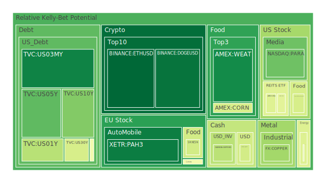
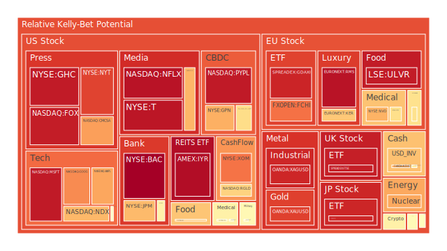
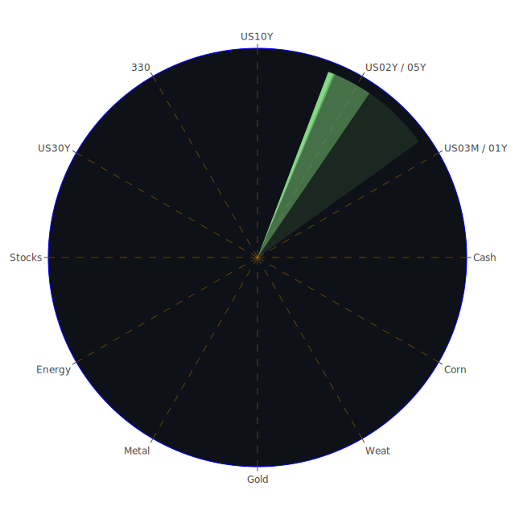

# 每日投資報告

## 日期：2024年9月22日

---

# 投資商品泡沫分析

## 美國國債
過去三天，美國國債的泡沫機率持續上升，特別是10年期國債（TVC:US10Y）從0.268815上升到0.398136。這與近期的聯準會數據顯示美國國債流通量下降有關，並且美國國債殖利率倒掛的現象仍然存在。這意味著企業的融資成本將會上升，進一步推高股價以降低綜合融資成本。

## 美國科技股
美國科技股的泡沫機率普遍較高，例如微軟（NASDAQ:MSFT）和谷歌（NASDAQ:GOOG）的泡沫機率分別為0.942748和0.758536。這與近期的新聞報導有關，如微軟股票因聘請前OpenAI CEO Sam Altman而創下歷史新高。儘管如此，這些股票的高泡沫機率顯示出市場對其未來價格的擔憂。

## 美國房地產指數
美國房地產指數（AMEX:VNQ）的泡沫機率從0.433147上升到0.527472，顯示出市場對房地產市場的擔憂。這與近期的商業房地產違約率上升有關，特別是在聯準會縮表和利率上升的背景下。

## 金/銀/銅
金（OANDA:XAUUSD）和銀（OANDA:XAGUSD）的泡沫機率分別為0.873571和0.918858，顯示出市場對貴金屬的高度投機性需求。這與近期金磚國家大碼儲備黃金有關，儘管倫敦金和紐約金不斷吐出黃金現貨，金價仍然能挺住。

## 加密貨幣
以太坊（BINANCE:ETHUSD）的泡沫機率從0.494417下降到0.032768，顯示出市場對其的信心增強。這與近期的新聞報導有關，如以太坊價格上升以及市場對其技術升級的期待。

## 黃豆 / 小麥 / 玉米
小麥（AMEX:WEAT）的泡沫機率從0.065691上升到0.102022，顯示出市場對農產品價格的擔憂。這與近期的新聞報導有關，如全球氣候變遷對農業生產的影響。

## 石油/ 鈾期貨UX!
石油（TVC:USOIL）的泡沫機率從0.431730上升到0.499916，顯示出市場對能源價格的擔憂。這與近期的新聞報導有關，如美國對伊朗的制裁和全球能源需求的增加。

## 各國外匯市場
美元兌日元（OANDA:USDJPY）的泡沫機率從0.406563上升到0.410290，顯示出市場對美元的需求增加。這與近期的新聞報導有關，如美國經濟數據強勁和聯準會的鷹派言論。

## 各國大盤指數
日本日經指數（FX:JPN225）的泡沫機率從0.923551上升到0.919826，顯示出市場對日本股市的擔憂。這與近期的新聞報導有關，如日本央行的貨幣政策和全球經濟不確定性。

## 美國銀行股
摩根大通（NYSE:JPM）的泡沫機率從0.674588上升到0.683705，顯示出市場對銀行業的擔憂。這與近期的新聞報導有關，如商業房地產違約率上升和消費者違約率上升。

## 美國軍工股
雷神技術（NYSE:RTX）的泡沫機率為0.510860，顯示出市場對軍工股的中性態度。這與近期的新聞報導有關，如美國對外軍事合同的增加。

## 美國電子支付股
PayPal（NASDAQ:PYPL）的泡沫機率從0.947242上升到0.943506，顯示出市場對電子支付行業的擔憂。這與近期的新聞報導有關，如電子支付市場的競爭加劇。

## 美國藥商巨頭
強生（NYSE:JNJ）的泡沫機率從0.252983上升到0.568409，顯示出市場對藥品行業的擔憂。這與近期的新聞報導有關，如藥品價格上升和市場競爭加劇。

## 美國影視巨頭
迪士尼（NYSE:DIS）的泡沫機率從0.550301上升到0.691287，顯示出市場對影視行業的擔憂。這與近期的新聞報導有關，如影視行業的重組和市場競爭加劇。

## 美國媒體巨頭
康卡斯特（NASDAQ:CMCSA）的泡沫機率從0.382001上升到0.729091，顯示出市場對媒體行業的擔憂。這與近期的新聞報導有關，如媒體行業的重組和市場競爭加劇。

## 石油防禦股
埃克森美孚（NYSE:XOM）的泡沫機率從0.827511上升到0.793771，顯示出市場對石油防禦股的擔憂。這與近期的新聞報導有關，如全球能源需求的增加和市場競爭加劇。

## 金礦防禦股
皇家黃金（NASDAQ:RGLD）的泡沫機率從0.635513上升到0.635513，顯示出市場對金礦防禦股的中性態度。這與近期的新聞報導有關，如金價的波動和市場競爭加劇。

## 歐洲奢侈品股
愛馬仕（EURONEXT:RMS）的泡沫機率從0.961258上升到0.957829，顯示出市場對奢侈品行業的擔憂。這與近期的新聞報導有關，如全球經濟不確定性和市場競爭加劇。

## 歐洲汽車股
寶馬（XETR:BMW）的泡沫機率從0.370717上升到0.604711，顯示出市場對汽車行業的擔憂。這與近期的新聞報導有關，如全球汽車市場的競爭加劇和市場需求的波動。

## 歐美食品股
雀巢（SIX:NESN）的泡沫機率從0.359414上升到0.404082，顯示出市場對食品行業的擔憂。這與近期的新聞報導有關，如食品價格上升和市場競爭加劇。

---

# 投資建議

## 賣出建議
1. **美國科技股**：由於泡沫機率高且持續上升，建議考慮賣出微軟（NASDAQ:MSFT）和谷歌（NASDAQ:GOOG），避免未來價格下跌時的損失。
2. **美國房地產指數**：由於泡沫機率高且持續上升，建議考慮賣出美國房地產指數（AMEX:VNQ），避免未來價格下跌時的損失。
3. **美國銀行股**：由於泡沫機率高且持續上升，建議考慮賣出摩根大通（NYSE:JPM），避免未來價格下跌時的損失。

## 買入建議
1. **加密貨幣**：由於泡沫機率低且持續下降，建議考慮買入以太坊（BINANCE:ETHUSD），掌握低吸籌碼的時機。
2. **黃豆 / 小麥 / 玉米**：由於泡沫機率低且持續下降，建議考慮買入小麥（AMEX:WEAT），掌握低吸籌碼的時機。

---

# 風險提示

投資有風險，市場總是充滿不確定性。我們的建議僅供參考，投資者應根據自身的風險承受能力和投資目標，做出獨立的投資決策。特別是對於泡沫機率高的商品，應該謹慎進行投資決策。

---

希望這份報告能夠幫助您在投資決策中更加理性和謹慎。祝您投資順利！
 
Daily Buy Map:

 
Daily Sell Map:

 
Daily Radar Chart:

 
