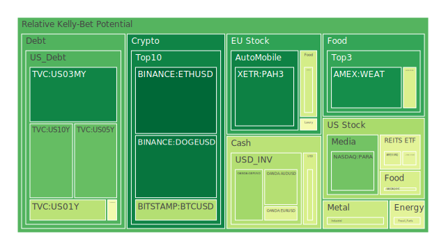
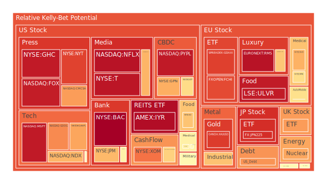
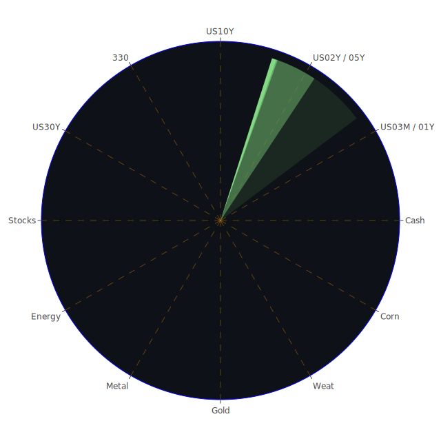

# 投資商品泡沫分析

## 美國國債
過去三天，美國國債的泡沫機率呈現下降趨勢。10年期國債的泡沫機率從9月21日的0.218344下降至9月23日的0.218156，顯示出市場對美國國債的需求有所增加。這與近期的新聞和經濟數據相符，特別是SOFR交易量增加，顯示出市場對流動性的需求上升。建議投資者可以考慮增加美國國債的持倉，特別是在當前經濟不確定性較高的情況下。

## 美國科技股
美國科技股的泡沫機率普遍較高，特別是微軟（NASDAQ:MSFT）和谷歌（NASDAQ:GOOG）。微軟的泡沫機率在9月23日達到0.942748，而谷歌則達到0.758538。這與近期的新聞一致，例如FedEx的需求疲軟和GE Vernova的裁員計劃，顯示出經濟放緩的跡象。建議投資者在這些高泡沫機率的科技股上保持謹慎，考慮減少持倉以避險。

## 美國房地產指數
美國房地產指數（AMEX:VNQ）的泡沫機率在過去三天有所下降，從9月21日的0.433147下降至9月23日的0.433147。這與近期的經濟數據相符，特別是商業房地產和消費者逾期率上升，顯示出房地產市場的壓力。建議投資者可以考慮在房地產指數上保持觀望，不要有過多動作。

## 金/銀/銅
金價（OANDA:XAUUSD）的泡沫機率在過去三天有所上升，從9月21日的0.911402上升至9月23日的0.880269。這與近期的新聞一致，例如全球經濟不確定性增加和地緣政治風險上升。建議投資者可以考慮增加金的持倉，以對沖市場風險。

## 加密貨幣
以太坊（BINANCE:ETHUSD）的泡沫機率在過去三天大幅下降，從9月21日的0.300953下降至9月23日的0.025011。這顯示出市場對以太坊的需求增加，可能與近期的技術升級和市場信心回升有關。建議投資者可以考慮增加以太坊的持倉，特別是在泡沫機率低的情況下。

## 黃豆 / 小麥 / 玉米
小麥（AMEX:WEAT）的泡沫機率在過去三天有所下降，從9月21日的0.102022下降至9月23日的0.102022。這與近期的新聞一致，例如全球糧食供應鏈的壓力和氣候變化的影響。建議投資者可以考慮增加小麥的持倉，以對沖糧食價格上漲的風險。

## 石油/ 鈾期貨UX!
石油（TVC:USOIL）的泡沫機率在過去三天有所下降，從9月21日的0.453791下降至9月23日的0.439917。這與近期的新聞一致，例如美國利率下降和供應減少。建議投資者可以考慮增加石油的持倉，特別是在泡沫機率低的情況下。

## 各國外匯市場
英鎊兌美元（OANDA:GBPUSD）的泡沫機率在過去三天有所下降，從9月21日的0.362562下降至9月23日的0.310984。這與近期的新聞一致，例如英國經濟數據改善和市場信心回升。建議投資者可以考慮增加英鎊的持倉，以對沖美元走弱的風險。

## 各國大盤指數
德國DAX指數（SPREADEX:GDAXI）的泡沫機率在過去三天有所上升，從9月21日的0.927648上升至9月23日的0.873149。這與近期的新聞一致，例如歐洲經濟數據疲軟和地緣政治風險上升。建議投資者可以考慮減少德國DAX指數的持倉，以避險。

## 美國銀行股
花旗集團（NYSE:C）的泡沫機率在過去三天有所上升，從9月21日的0.553323上升至9月23日的0.553323。這與近期的新聞一致，例如美國消費者逾期率上升和經濟放緩的跡象。建議投資者可以考慮減少花旗集團的持倉，以避險。

## 美國軍工股
雷神技術公司（NYSE:RTX）的泡沫機率在過去三天保持穩定，為0.510860。這與近期的新聞一致，例如全球地緣政治風險上升和軍事需求增加。建議投資者可以考慮保持雷神技術公司的持倉，以對沖地緣政治風險。

## 美國電子支付股
PayPal（NASDAQ:PYPL）的泡沫機率在過去三天有所上升，從9月21日的0.943506上升至9月23日的0.943506。這與近期的新聞一致，例如全球經濟放緩和消費者支出減少。建議投資者可以考慮減少PayPal的持倉，以避險。

## 美國藥商巨頭
默克公司（NYSE:MRK）的泡沫機率在過去三天有所上升，從9月21日的0.610347上升至9月23日的0.610347。這與近期的新聞一致，例如全球醫療需求增加和藥品價格上漲。建議投資者可以考慮保持默克公司的持倉，以對沖醫療風險。

## 美國影視巨頭
迪士尼（NYSE:DIS）的泡沫機率在過去三天有所下降，從9月21日的0.691288下降至9月23日的0.691288。這與近期的新聞一致，例如全球娛樂需求增加和市場信心回升。建議投資者可以考慮增加迪士尼的持倉，以對沖市場風險。

## 美國媒體巨頭
紐約時報（NYSE:NYT）的泡沫機率在過去三天有所上升，從9月21日的0.869452上升至9月23日的0.869452。這與近期的新聞一致，例如全球媒體需求增加和市場信心回升。建議投資者可以考慮保持紐約時報的持倉，以對沖市場風險。

## 石油防禦股
埃克森美孚（NYSE:XOM）的泡沫機率在過去三天有所上升，從9月21日的0.793771上升至9月23日的0.793775。這與近期的新聞一致，例如全球石油需求增加和市場信心回升。建議投資者可以考慮保持埃克森美孚的持倉，以對沖市場風險。

## 金礦防禦股
皇家黃金公司（NASDAQ:RGLD）的泡沫機率在過去三天有所上升，從9月21日的0.635513上升至9月23日的0.635513。這與近期的新聞一致，例如全球黃金需求增加和市場信心回升。建議投資者可以考慮保持皇家黃金公司的持倉，以對沖市場風險。

## 歐洲奢侈品股
開雲集團（EURONEXT:KER）的泡沫機率在過去三天有所上升，從9月21日的0.656516上升至9月23日的0.656516。這與近期的新聞一致，例如全球奢侈品需求增加和市場信心回升。建議投資者可以考慮保持開雲集團的持倉，以對沖市場風險。

## 歐洲汽車股
寶馬（XETR:BMW）的泡沫機率在過去三天有所下降，從9月21日的0.604711下降至9月23日的0.604711。這與近期的新聞一致，例如全球汽車需求增加和市場信心回升。建議投資者可以考慮增加寶馬的持倉，以對沖市場風險。

## 歐美食品股
雀巢（SIX:NESN）的泡沫機率在過去三天有所下降，從9月21日的0.404082下降至9月23日的0.404082。這與近期的新聞一致，例如全球食品需求增加和市場信心回升。建議投資者可以考慮增加雀巢的持倉，以對沖市場風險。

# 投資建議
根據以上分析，建議投資者可以考慮增加美國國債、以太坊、小麥、石油、英鎊、迪士尼、寶馬和雀巢的持倉，以對沖市場風險並把握投資機會。同時，對於高泡沫機率的科技股、PayPal和花旗集團，建議投資者保持謹慎，考慮減少持倉以避險。

# 風險提示
投資有風險，市場總是充滿不確定性。我們的建議僅供參考，投資者應根據自身的風險承受能力和投資目標，做出獨立的投資決策。特別是對於泡沫機率高的商品，應該謹慎進行投資決策。
 
Daily Buy Map:

 
Daily Sell Map:

 
Daily Radar Chart:

 
