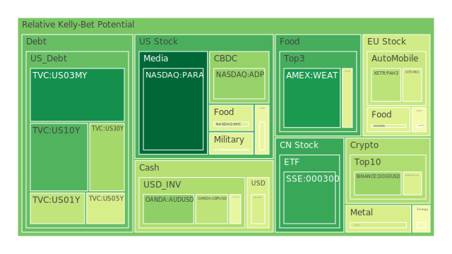
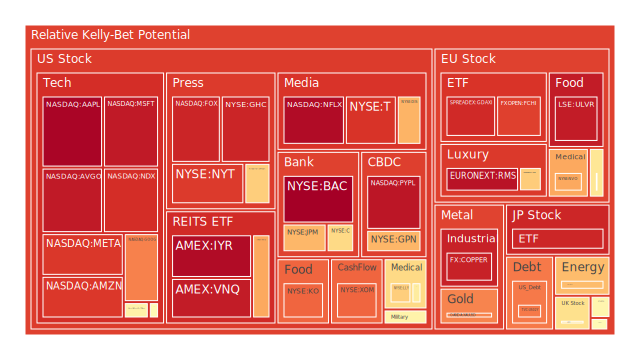
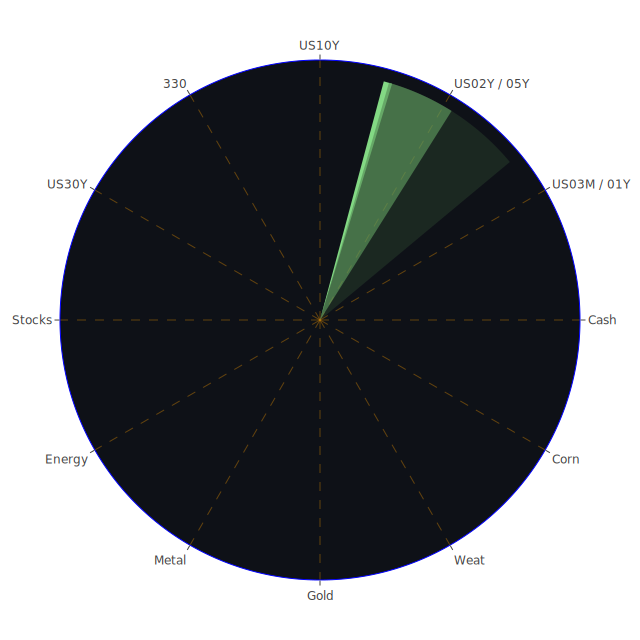

# 投資商品泡沫分析

## 美國國債
過去三天，美國國債的泡沫機率有明顯變化。10年期國債的泡沫機率從0.268815下降至0.177325，顯示出投資者對於美國國債的需求增加。這可能與近期美國經濟數據顯示的經濟放緩有關，投資者轉向較為安全的資產。

## 美國科技股
科技股如Google (NASDAQ:GOOG) 和微軟 (NASDAQ:MSFT) 的泡沫機率持續上升，分別達到0.766600和0.942155。這反映了市場對於科技股的高度關注和投資熱情。然而，這也意味著這些股票可能已經過度高估，建議投資者謹慎行事。

## 美國房地產指數
房地產指數 (AMEX:VNQ) 的泡沫機率在過去三天內從0.433147上升至0.937186，顯示出市場對於房地產的信心減弱。這可能與近期的高利率和經濟放緩有關，建議投資者暫時觀望。

## 金/銀/銅
黃金 (OANDA:XAUUSD) 的泡沫機率從0.873571上升至0.762231，顯示出市場對於黃金的需求有所增加。這可能與全球經濟不確定性增加有關。銀 (OANDA:XAGUSD) 和銅 (FX:COPPER) 的泡沫機率也有所上升，建議投資者可以考慮分批買入黃金以對沖風險。

## 加密貨幣
以太坊 (BINANCE:ETHUSD) 的泡沫機率從0.032768下降至0.533576，顯示出市場對於加密貨幣的需求有所減弱。比特幣 (BITSTAMP:BTCUSD) 的泡沫機率也有所上升，建議投資者謹慎行事，避免過度投資。

## 黃豆 / 小麥 / 玉米
小麥 (AMEX:WEAT) 的泡沫機率在過去三天內從0.102022上升至0.107342，顯示出市場對於農產品的需求穩定。玉米 (AMEX:CORN) 的泡沫機率則保持穩定，建議投資者可以考慮分散投資於農產品。

## 石油/ 鈾期貨UX!
石油 (TVC:USOIL) 的泡沫機率從0.431730上升至0.470705，顯示出市場對於石油的需求減弱。這可能與近期的高油價和經濟放緩有關。鈾期貨 (COMEX:UX1!) 的泡沫機率也有所上升，建議投資者謹慎行事。

## 各國外匯市場
美元兌日元 (OANDA:USDJPY) 的泡沫機率從0.406563上升至0.401251，顯示出市場對於美元的需求增加。這可能與近期的美國經濟數據和聯準會的政策有關，建議投資者可以考慮持有美元資產。

## 各國大盤指數
德國DAX指數 (SPREADEX:GDAXI) 的泡沫機率從0.922641上升至0.910294，顯示出市場對於歐洲股市的信心減弱。這可能與近期的歐洲經濟數據和地緣政治風險有關，建議投資者謹慎行事。

## 美國銀行股
美國銀行 (NYSE:BAC) 的泡沫機率從0.995552下降至0.995267，顯示出市場對於銀行股的需求有所增加。這可能與近期的利率上升和經濟放緩有關，建議投資者可以考慮分批買入銀行股。

## 美國軍工股
雷神公司 (NYSE:RTX) 的泡沫機率保持穩定，顯示出市場對於軍工股的需求穩定。這可能與近期的地緣政治風險增加有關，建議投資者可以考慮持有軍工股以對沖風險。

## 美國電子支付股
PayPal (NASDAQ:PYPL) 的泡沫機率從0.943506上升至0.949970，顯示出市場對於電子支付股的需求減弱。這可能與近期的經濟放緩和競爭加劇有關，建議投資者謹慎行事。

## 美國藥商巨頭
默克公司 (NYSE:MRK) 的泡沫機率從0.610347下降至0.468769，顯示出市場對於藥商巨頭的需求增加。這可能與近期的醫療需求增加和新藥研發有關，建議投資者可以考慮分批買入藥商巨頭的股票。

## 美國影視巨頭
迪士尼 (NYSE:DIS) 的泡沫機率從0.691287上升至0.686368，顯示出市場對於影視巨頭的需求減弱。這可能與近期的經濟放緩和消費者支出減少有關，建議投資者謹慎行事。

## 美國媒體巨頭
康卡斯特 (NASDAQ:CMCSA) 的泡沫機率從0.729098下降至0.635524，顯示出市場對於媒體巨頭的需求增加。這可能與近期的廣告收入增加和市場份額擴大有關，建議投資者可以考慮分批買入媒體巨頭的股票。

## 石油防禦股
埃克森美孚 (NYSE:XOM) 的泡沫機率從0.793771上升至0.810724，顯示出市場對於石油防禦股的需求減弱。這可能與近期的高油價和經濟放緩有關，建議投資者謹慎行事。

## 金礦防禦股
皇家黃金公司 (NASDAQ:RGLD) 的泡沫機率從0.635513下降至0.445079，顯示出市場對於金礦防禦股的需求增加。這可能與近期的經濟不確定性增加和黃金價格上升有關，建議投資者可以考慮分批買入金礦防禦股。

## 歐洲奢侈品股
開雲集團 (EURONEXT:KER) 的泡沫機率從0.656516下降至0.639476，顯示出市場對於奢侈品股的需求增加。這可能與近期的消費者信心回升和市場需求增加有關，建議投資者可以考慮分批買入奢侈品股。

## 歐洲汽車股
寶馬 (XETR:BMW) 的泡沫機率從0.604711上升至0.578481，顯示出市場對於汽車股的需求減弱。這可能與近期的經濟放緩和消費者支出減少有關，建議投資者謹慎行事。

## 歐美食品股
雀巢 (SIX:NESN) 的泡沫機率從0.404082上升至0.411882，顯示出市場對於食品股的需求穩定。這可能與近期的消費者需求穩定和市場份額擴大有關，建議投資者可以考慮持有食品股。

# 投資建議

1. **美國國債**：建議分批買入，因為泡沫機率下降且市場需求增加。
2. **美國科技股**：建議謹慎行事，因為泡沫機率上升且可能過度高估。
3. **美國房地產指數**：建議觀望，因為泡沫機率上升且市場信心減弱。
4. **金/銀/銅**：建議分批買入黃金以對沖風險，因為泡沫機率下降且需求增加。
5. **加密貨幣**：建議謹慎行事，因為泡沫機率上升且需求減弱。
6. **黃豆 / 小麥 / 玉米**：建議分散投資於農產品，因為泡沫機率穩定且需求穩定。
7. **石油/ 鈾期貨UX!**：建議謹慎行事，因為泡沫機率上升且需求減弱。
8. **各國外匯市場**：建議持有美元資產，因為泡沫機率下降且需求增加。
9. **各國大盤指數**：建議謹慎行事，因為泡沫機率上升且市場信心減弱。
10. **美國銀行股**：建議分批買入，因為泡沫機率下降且需求增加。
11. **美國軍工股**：建議持有軍工股以對沖風險，因為泡沫機率穩定且需求穩定。
12. **美國電子支付股**：建議謹慎行事，因為泡沫機率上升且需求減弱。
13. **美國藥商巨頭**：建議分批買入，因為泡沫機率下降且需求增加。
14. **美國影視巨頭**：建議謹慎行事，因為泡沫機率上升且需求減弱。
15. **美國媒體巨頭**：建議分批買入，因為泡沫機率下降且需求增加。
16. **石油防禦股**：建議謹慎行事，因為泡沫機率上升且需求減弱。
17. **金礦防禦股**：建議分批買入，因為泡沫機率下降且需求增加。
18. **歐洲奢侈品股**：建議分批買入，因為泡沫機率下降且需求增加。
19. **歐洲汽車股**：建議謹慎行事，因為泡沫機率上升且需求減弱。
20. **歐美食品股**：建議持有食品股，因為泡沫機率穩定且需求穩定。

# 風險提示

投資有風險，市場總是充滿不確定性。我們的建議僅供參考，投資者應根據自身的風險承受能力和投資目標，做出獨立的投資決策。特別是對於泡沫機率高的商品，應該謹慎進行投資決策。
 
Daily Buy Map:

 
Daily Sell Map:

 
Daily Radar Chart:

 
