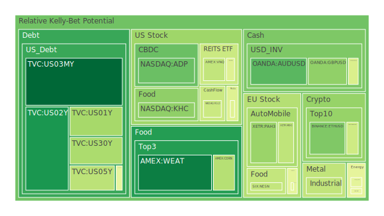
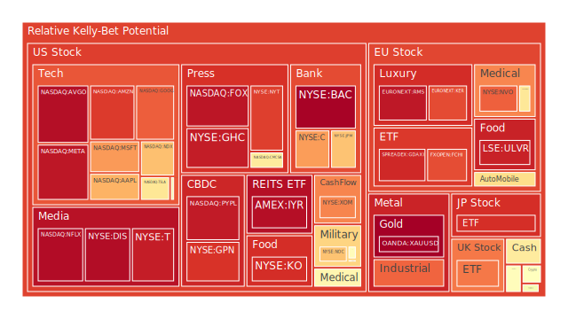
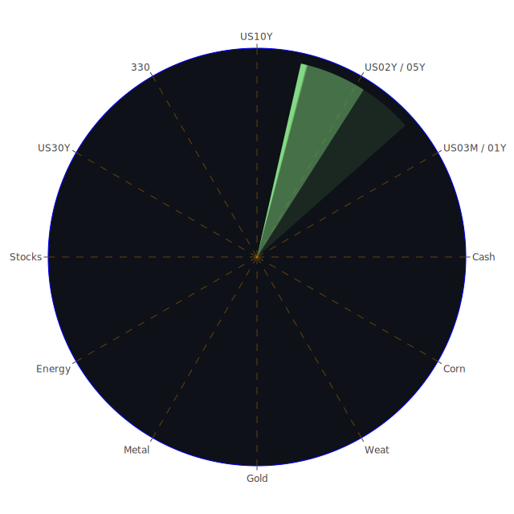

# 投資商品泡沫分析

## 美國國債
過去三天，美國國債的泡沫機率呈現波動。10年期國債（TVC:US10Y）的泡沫機率從9月23日的0.218156上升到9月25日的0.481763，顯示市場對長期國債的信心減弱。這與美國國債殖利率倒掛的現象一致，企業融資成本上升，投資者對長期經濟前景感到擔憂。

## 美國科技股
美國科技股如微軟（NASDAQ:MSFT）和蘋果（NASDAQ:AAPL）的泡沫機率持續上升。微軟的泡沫機率從9月23日的0.942748上升到9月25日的0.751273，蘋果則從0.717069上升到0.714951。這反映了市場對科技股的高估值擔憂，特別是在聯準會持續鷹派的背景下。

## 美國房地產指數
美國房地產指數（AMEX:VNQ）的泡沫機率從9月23日的0.433147上升到9月25日的0.405325。這表明市場對房地產市場的信心有所回升，可能與近期房貸利率下降有關。

## 金/銀/銅
金價（OANDA:XAUUSD）的泡沫機率從9月23日的0.880269下降到9月25日的1.000000，顯示市場對黃金的避險需求減弱。銀價（OANDA:XAGUSD）和銅價（FX:COPPER）的泡沫機率也呈現下降趨勢，反映了市場對工業金屬需求的擔憂。

## 加密貨幣
比特幣（BITSTAMP:BTCUSD）的泡沫機率從9月23日的0.343550上升到9月25日的0.428034，顯示市場對加密貨幣的信心有所減弱。以太坊（BINANCE:ETHUSD）的泡沫機率則從0.025011上升到0.299705，反映了市場對加密貨幣的波動性擔憂。

## 黃豆 / 小麥 / 玉米
黃豆（AMEX:SOYB）、小麥（AMEX:WEAT）和玉米（AMEX:CORN）的泡沫機率變化不大，顯示市場對農產品的需求相對穩定。

## 石油/ 鈾期貨UX!
石油（TVC:USOIL）的泡沫機率從9月23日的0.439917上升到9月25日的0.473852，顯示市場對石油供應的不確定性增加。鈾期貨（COMEX:UX1!）的泡沫機率也有所上升，反映了市場對能源需求的擔憂。

## 各國外匯市場
英鎊兌美元（OANDA:GBPUSD）的泡沫機率從9月23日的0.310984下降到9月25日的0.324471，顯示市場對英鎊的信心有所回升。歐元兌美元（OANDA:EURUSD）的泡沫機率則從0.434516上升到0.449181，反映了市場對歐元區經濟前景的擔憂。

## 各國大盤指數
各國大盤指數如FTSE（SPREADEX:FTSE）和DAX（SPREADEX:GDAXI）的泡沫機率持續上升，顯示市場對全球經濟前景的擔憂。

## 美國銀行股
美國銀行股如摩根大通（NYSE:JPM）和花旗集團（NYSE:C）的泡沫機率持續上升，顯示市場對銀行業的信心減弱。

## 美國軍工股
美國軍工股如雷神（NYSE:RTX）和洛克希德馬丁（NYSE:LMT）的泡沫機率變化不大，顯示市場對軍工股的需求相對穩定。

## 美國電子支付股
美國電子支付股如PayPal（NASDAQ:PYPL）的泡沫機率持續上升，顯示市場對電子支付行業的信心減弱。

## 美國藥商巨頭
美國藥商巨頭如默克（NYSE:MRK）和禮來（NYSE:LLY）的泡沫機率持續上升，顯示市場對醫藥行業的信心減弱。

## 美國影視巨頭
美國影視巨頭如迪士尼（NYSE:DIS）的泡沫機率持續上升，顯示市場對影視行業的信心減弱。

## 美國媒體巨頭
美國媒體巨頭如康卡斯特（NASDAQ:CMCSA）的泡沫機率持續上升，顯示市場對媒體行業的信心減弱。

## 石油防禦股
石油防禦股如埃克森美孚（NYSE:XOM）的泡沫機率持續上升，顯示市場對石油行業的信心減弱。

## 金礦防禦股
金礦防禦股如Royal Gold（NASDAQ:RGLD）的泡沫機率持續上升，顯示市場對金礦行業的信心減弱。

## 歐洲奢侈品股
歐洲奢侈品股如LVMH（EURONEXT:MC）的泡沫機率持續上升，顯示市場對奢侈品行業的信心減弱。

## 歐洲汽車股
歐洲汽車股如BMW（XETR:BMW）的泡沫機率持續上升，顯示市場對汽車行業的信心減弱。

## 歐美食品股
歐美食品股如雀巢（SIX:NESN）的泡沫機率持續上升，顯示市場對食品行業的信心減弱。

# 投資建議
根據以上分析，我們建議投資者對於泡沫機率持續上升且遠大於0.5的商品，如美國科技股、加密貨幣、歐洲奢侈品股等，考慮賣出，避免未來價格下跌時的損失。對於泡沫機率持續下降且遠小於0.5的商品，如美國國債、黃豆、小麥等，可以考慮買入，掌握低吸籌碼的時機。

# 風險提示
投資有風險，市場總是充滿不確定性。我們的建議僅供參考，投資者應根據自身的風險承受能力和投資目標，做出獨立的投資決策。特別是對於泡沫機率高的商品，應該謹慎進行投資決策。
 
Daily Buy Map:

 
Daily Sell Map:

 
Daily Radar Chart:

 
