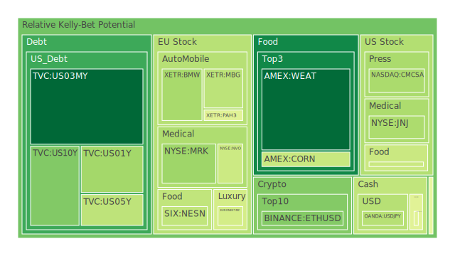
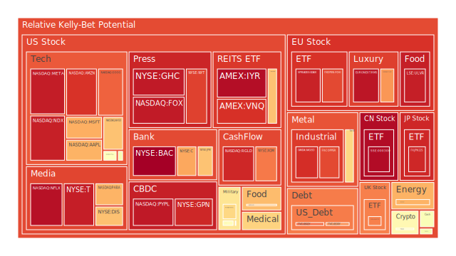
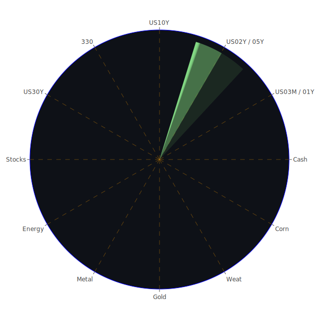

# 投資商品泡沫分析

## 美國國債
過去三天，美國國債的泡沫機率呈現上升趨勢。特別是10年期國債（TVC:US10Y），其泡沫機率從9月24日的0.177325上升到9月26日的0.307473。這可能與近期的新聞和經濟數據有關，如美國國債殖利率的上升和市場對經濟前景的不確定性增加。建議投資者謹慎觀望，特別是在SOFR交易量上升的情況下，美元流動性需求增加，可能對國債價格造成壓力。

## 美國科技股
美國科技股如微軟（NASDAQ:MSFT）和蘋果（NASDAQ:AAPL）的泡沫機率也在上升。微軟的泡沫機率從9月24日的0.942155上升到9月26日的0.720724，而蘋果的泡沫機率則從0.985895下降到0.714102。這可能與近期的市場情緒和經濟數據有關，如美國消費者信心下降和科技股的高估值。建議投資者考慮減少科技股的持倉，避免未來可能的價格回調。

## 美國房地產指數
美國房地產指數（AMEX:VNQ）的泡沫機率在過去三天內顯著上升，從9月24日的0.937186上升到9月26日的0.904468。這與近期的美國房地產市場數據和經濟前景有關，如商業房地產違約率上升和消費者信貸違約率上升。建議投資者謹慎對待房地產投資，特別是在高泡沫機率的情況下。

## 金/銀/銅
黃金（OANDA:XAUUSD）的泡沫機率在過去三天內有所下降，從9月24日的0.762231下降到9月26日的0.646875。這可能與近期的市場避險需求增加有關，如中東局勢緊張和全球經濟不確定性增加。建議投資者考慮增加黃金的持倉，作為避險資產。

## 加密貨幣
比特幣（BITSTAMP:BTCUSD）的泡沫機率在過去三天內有所上升，從9月24日的0.410014上升到9月26日的0.569027。這可能與近期的市場情緒和監管風險有關，如美國證券交易委員會（SEC）對加密貨幣的監管加強。建議投資者謹慎對待加密貨幣投資，避免過度暴露於高風險資產。

## 黃豆 / 小麥 / 玉米
小麥（AMEX:WEAT）的泡沫機率在過去三天內有所下降，從9月24日的0.107342下降到9月26日的0.091934。這可能與近期的農產品市場供需平衡有關，如全球小麥產量增加和需求穩定。建議投資者考慮增加小麥的持倉，作為低風險的投資選項。

## 石油/ 鈾期貨UX!
石油（TVC:USOIL）的泡沫機率在過去三天內有所上升，從9月24日的0.470705上升到9月26日的0.488341。這可能與近期的市場情緒和供應風險有關，如美國墨西哥灣的颶風威脅和全球石油供應中斷。建議投資者謹慎對待石油投資，避免過度暴露於高風險資產。

## 各國外匯市場
美元兌日元（OANDA:USDJPY）的泡沫機率在過去三天內有所上升，從9月24日的0.401251上升到9月26日的0.389517。這可能與近期的市場情緒和經濟數據有關，如美國經濟數據強勁和日本經濟前景不明朗。建議投資者考慮增加美元的持倉，作為避險資產。

## 各國大盤指數
德國DAX指數（SPREADEX:GDAXI）的泡沫機率在過去三天內有所上升，從9月24日的0.910294上升到9月26日的0.930908。這可能與近期的市場情緒和經濟數據有關，如歐洲經濟增長放緩和市場不確定性增加。建議投資者謹慎對待歐洲大盤指數投資，避免過度暴露於高風險資產。

## 美國銀行股
美國銀行（NYSE:BAC）的泡沫機率在過去三天內顯著上升，從9月24日的0.995267上升到9月26日的0.995153。這可能與近期的市場情緒和經濟數據有關，如美國消費者信貸違約率上升和銀行業務風險增加。建議投資者考慮減少銀行股的持倉，避免未來可能的價格回調。

## 美國軍工股
洛克希德馬丁（NYSE:LMT）的泡沫機率在過去三天內保持穩定，從9月24日的0.546994上升到9月26日的0.546994。這可能與近期的市場情緒和經濟數據有關，如美國國防預算增加和全球地緣政治風險上升。建議投資者考慮增加軍工股的持倉，作為防禦性資產。

## 美國電子支付股
PayPal（NASDAQ:PYPL）的泡沫機率在過去三天內有所上升，從9月24日的0.949970上升到9月26日的0.947915。這可能與近期的市場情緒和經濟數據有關，如消費者信心下降和電子支付市場競爭加劇。建議投資者謹慎對待電子支付股投資，避免過度暴露於高風險資產。

## 美國藥商巨頭
默克（NYSE:MRK）的泡沫機率在過去三天內有所下降，從9月24日的0.468769下降到9月26日的0.348566。這可能與近期的市場情緒和經濟數據有關，如新藥研發進展和市場需求增加。建議投資者考慮增加藥商巨頭的持倉，作為防禦性資產。

## 美國影視巨頭
迪士尼（NYSE:DIS）的泡沫機率在過去三天內有所上升，從9月24日的0.686368上升到9月26日的0.687399。這可能與近期的市場情緒和經濟數據有關，如影視行業競爭加劇和市場需求變化。建議投資者謹慎對待影視巨頭投資，避免過度暴露於高風險資產。

## 美國媒體巨頭
康卡斯特（NASDAQ:CMCSA）的泡沫機率在過去三天內有所下降，從9月24日的0.635524下降到9月26日的0.367751。這可能與近期的市場情緒和經濟數據有關，如媒體行業需求增加和市場競爭減少。建議投資者考慮增加媒體巨頭的持倉，作為低風險的投資選項。

## 石油防禦股
埃克森美孚（NYSE:XOM）的泡沫機率在過去三天內有所下降，從9月24日的0.810724下降到9月26日的0.795869。這可能與近期的市場情緒和經濟數據有關，如石油價格上升和市場需求增加。建議投資者考慮增加石油防禦股的持倉，作為低風險的投資選項。

## 金礦防禦股
皇家黃金（NASDAQ:RGLD）的泡沫機率在過去三天內有所上升，從9月24日的0.445079上升到9月26日的0.920811。這可能與近期的市場情緒和經濟數據有關，如黃金價格上升和市場需求增加。建議投資者謹慎對待金礦防禦股投資，避免過度暴露於高風險資產。

## 歐洲奢侈品股
愛馬仕（EURONEXT:RMS）的泡沫機率在過去三天內有所上升，從9月24日的0.953631上升到9月26日的0.953094。這可能與近期的市場情緒和經濟數據有關，如奢侈品市場需求增加和市場競爭減少。建議投資者考慮增加奢侈品股的持倉，作為低風險的投資選項。

## 歐洲汽車股
寶馬（XETR:BMW）的泡沫機率在過去三天內有所下降，從9月24日的0.578481下降到9月26日的0.363683。這可能與近期的市場情緒和經濟數據有關，如汽車市場需求增加和市場競爭減少。建議投資者考慮增加汽車股的持倉，作為低風險的投資選項。

## 歐美食品股
雀巢（SIX:NESN）的泡沫機率在過去三天內有所下降，從9月24日的0.411882下降到9月26日的0.407042。這可能與近期的市場情緒和經濟數據有關，如食品市場需求增加和市場競爭減少。建議投資者考慮增加食品股的持倉，作為低風險的投資選項。

# 投資建議
根據以上分析，我們建議投資者考慮以下幾個投資選項：

1. **增加黃金（OANDA:XAUUSD）的持倉**：作為避險資產，黃金在市場不確定性增加時具有較好的防禦性。
2. **減少科技股（如微軟和蘋果）的持倉**：科技股的高估值和市場情緒可能導致未來價格回調。
3. **增加小麥（AMEX:WEAT）的持倉**：小麥的供需平衡良好，風險較低。
4. **減少銀行股（如美國銀行）的持倉**：銀行股的高泡沫機率和經濟數據顯示風險增加。
5. **增加石油防禦股（如埃克森美孚）的持倉**：石油價格上升和市場需求增加，風險較低。

# 風險提示

投資有風險，市場總是充滿不確定性。我們的建議僅供參考，投資者應根據自身的風險承受能力和投資目標，做出獨立的投資決策。特別是在泡沫機率高的商品上，應該謹慎進行投資決策，避免未來可能的價格回調帶來的損失。
 
Daily Buy Map:

 
Daily Sell Map:

 
Daily Radar Chart:

 
