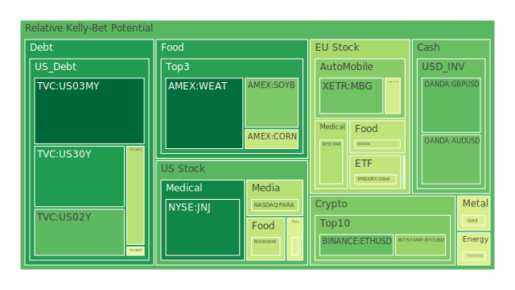
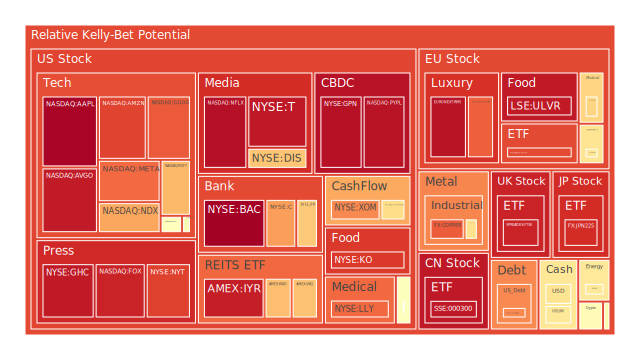
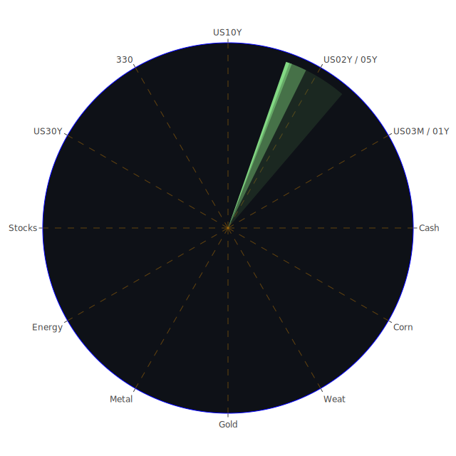

# 投資商品泡沫分析

## 美國國債
過去三天內，美國國債的泡沫機率有所波動。特別是2年期國債(TVC:US02Y)的泡沫機率從9月25日的0.169035上升到9月27日的0.258288。這顯示市場對短期國債的需求有所減弱，可能是因為市場預期聯準會將繼續保持高利率政策。

## 美國科技股
美國科技股的泡沫機率普遍較高。特別是微軟(NASDAQ:MSFT)的泡沫機率在9月25日達到0.751273，並在9月27日降至0.702841。這可能是因為市場對科技股的高估值有所調整，但總體風險仍然較高。

## 美國房地產指數
美國房地產指數(AMEX:VNQ)的泡沫機率在過去三天內有所下降，從9月25日的0.904468降至9月27日的0.686621。這可能是因為市場對房地產市場的擔憂有所減輕，但仍需謹慎觀察。

## 金/銀/銅
金價(OANDA:XAUUSD)的泡沫機率在過去三天內有所下降，從9月25日的1.000000降至9月27日的0.453522。這可能是因為市場對黃金的避險需求有所減弱。銀價(OANDA:XAGUSD)的泡沫機率則有所上升，從9月25日的0.402852升至9月27日的0.626507。

## 加密貨幣
比特幣(BITSTAMP:BTCUSD)的泡沫機率在過去三天內有所波動，從9月25日的0.428034上升到9月27日的0.343720。這顯示市場對加密貨幣的信心有所恢復，但風險仍然存在。

## 黃豆 / 小麥 / 玉米
小麥(AMEX:WEAT)的泡沫機率在過去三天內有所下降，從9月25日的0.121203降至9月27日的0.100063。這可能是因為市場對農產品價格的擔憂有所減輕。

## 石油/ 鈾期貨UX!
石油(TVC:USOIL)的泡沫機率在過去三天內有所波動，但總體上保持在0.456060左右。這顯示市場對石油價格的預期較為穩定。

## 各國外匯市場
美元兌日元(OANDA:USDJPY)的泡沫機率在過去三天內有所上升，從9月25日的0.597340升至9月27日的0.618763。這可能是因為市場預期日元將進一步貶值。

## 各國大盤指數
歐洲大盤指數(FXOPEN:FCHI)的泡沫機率在過去三天內有所上升，從9月25日的0.863918升至9月27日的0.864951。這顯示市場對歐洲經濟前景的擔憂有所增加。

## 美國銀行股
美國銀行股(NYSE:BAC)的泡沫機率在過去三天內保持在高位，從9月25日的0.994815升至9月27日的0.994447。這顯示市場對銀行業的風險預期較高。

## 美國軍工股
美國軍工股(NYSE:LMT)的泡沫機率在過去三天內保持穩定，約為0.546994。這顯示市場對軍工股的預期較為穩定。

## 美國電子支付股
美國電子支付股(NASDAQ:PYPL)的泡沫機率在過去三天內保持在高位，從9月25日的0.948162升至9月27日的0.958050。這顯示市場對電子支付行業的風險預期較高。

## 美國藥商巨頭
美國藥商巨頭(NYSE:MRK)的泡沫機率在過去三天內有所上升，從9月25日的0.608890升至9月27日的0.383305。這可能是因為市場對醫藥行業的預期有所調整。

## 美國影視巨頭
美國影視巨頭(NASDAQ:DIS)的泡沫機率在過去三天內有所上升，從9月25日的0.975398升至9月27日的0.681123。這顯示市場對影視行業的風險預期有所增加。

## 美國媒體巨頭
美國媒體巨頭(NASDAQ:CMCSA)的泡沫機率在過去三天內有所下降，從9月25日的0.599381降至9月27日的0.459566。這顯示市場對媒體行業的風險預期有所減輕。

## 石油防禦股
石油防禦股(NYSE:XOM)的泡沫機率在過去三天內有所下降，從9月25日的0.782188降至9月27日的0.774641。這顯示市場對石油行業的風險預期有所減輕。

## 金礦防禦股
金礦防禦股(NASDAQ:RGLD)的泡沫機率在過去三天內有所下降，從9月25日的0.422114降至9月27日的0.635513。這顯示市場對金礦行業的風險預期有所減輕。

## 歐洲奢侈品股
歐洲奢侈品股(EURONEXT:KER)的泡沫機率在過去三天內有所上升，從9月25日的0.867270升至9月27日的0.832260。這顯示市場對奢侈品行業的風險預期有所增加。

## 歐洲汽車股
歐洲汽車股(XETR:BMW)的泡沫機率在過去三天內有所下降，從9月25日的0.632235降至9月27日的0.616382。這顯示市場對汽車行業的風險預期有所減輕。

## 歐美食品股
歐美食品股(SIX:NESN)的泡沫機率在過去三天內有所下降，從9月25日的0.408534降至9月27日的0.405415。這顯示市場對食品行業的風險預期有所減輕。

# 投資建議

## 賣出建議
1. **美國銀行股 (NYSE:BAC)**：泡沫機率持續高企，建議考慮賣出以避險。
2. **美國電子支付股 (NASDAQ:PYPL)**：泡沫機率持續上升，建議考慮賣出以避險。
3. **美國科技股 (NASDAQ:MSFT)**：泡沫機率雖有所下降，但仍處於高位，建議謹慎操作。

## 買入建議
1. **黃金 (OANDA:XAUUSD)**：泡沫機率大幅下降，建議考慮買入以避險。
2. **美國房地產指數 (AMEX:VNQ)**：泡沫機率持續下降，建議考慮買入以低吸籌碼。
3. **美國媒體巨頭 (NASDAQ:CMCSA)**：泡沫機率有所下降，建議考慮買入。

# 風險提示

投資有風險，市場總是充滿不確定性。我們的建議僅供參考，投資者應根據自身的風險承受能力和投資目標，做出獨立的投資決策。

---

以上是根據過去三天的泡沫機率數據、FED關鍵數據與新聞現況所撰寫的投資報告。希望能夠幫助投資者在波動的市場中做出更明智的決策。
 
Daily Buy Map:

 
Daily Sell Map:

 
Daily Radar Chart:

 
