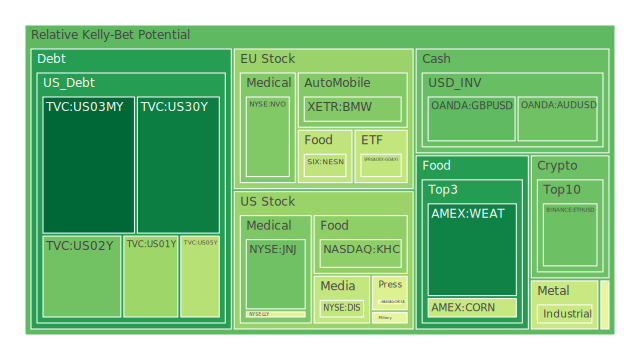
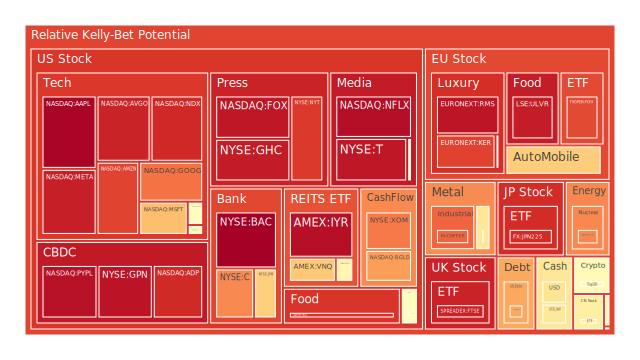
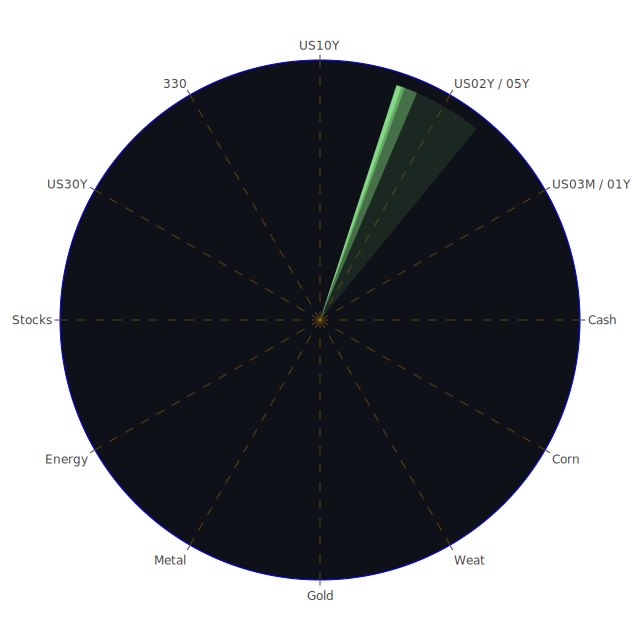

# 投資商品泡沫分析

## 美國國債
過去三天，美國國債的泡沫機率顯示出穩定的下降趨勢，特別是10年期國債（TVC:US10Y）從9月26日的0.307473下降到9月28日的0.130180。這表明市場對美國國債的需求增加，可能是因為投資者尋求避險資產。根據最新的FED數據，美國國債的總流通量正在減少，這進一步支持了國債價格的上升趨勢。

## 美國科技股
美國科技股的泡沫機率持續上升，特別是微軟（NASDAQ:MSFT）和亞馬遜（NASDAQ:AMZN），其泡沫機率分別從9月26日的0.720724和0.901177上升到9月28日的0.693803和0.874476。這表明市場對科技股的過度投機，可能是因為近期的AI和科技創新新聞帶來的正面情緒。然而，這些股票的高泡沫機率也意味著風險增加，建議投資者謹慎行事。

## 美國房地產指數
美國房地產指數（AMEX:VNQ）的泡沫機率在過去三天內略有下降，從9月26日的0.904468下降到9月28日的0.675829。這可能是因為市場對房地產市場的信心增加，特別是在固定抵押貸款利率下降的背景下。然而，房地產市場的風險依然存在，特別是商業房地產的拖欠率正在上升。

## 金/銀/銅
金價的泡沫機率在過去三天內有所下降，從9月26日的0.646875下降到9月28日的0.610280。這表明市場對黃金的需求增加，可能是因為投資者尋求避險資產。銀和銅的泡沫機率則顯示出上升趨勢，這可能是因為市場對工業金屬需求的不確定性增加。

## 加密貨幣
以太坊（BINANCE:ETHUSD）和比特幣（BITSTAMP:BTCUSD）的泡沫機率在過去三天內有所波動，但總體趨勢顯示出下降。以太坊的泡沫機率從9月26日的0.310227下降到9月28日的0.280340，而比特幣的泡沫機率則從0.569027下降到0.557845。這表明市場對加密貨幣的需求增加，但風險依然存在。

## 黃豆 / 小麥 / 玉米
小麥（AMEX:WEAT）的泡沫機率在過去三天內有所上升，從9月26日的0.091934上升到9月28日的0.139665。這可能是因為全球糧食供應的不確定性增加。黃豆和玉米的泡沫機率則顯示出穩定的趨勢，建議投資者觀望。

## 石油/ 鈾期貨UX!
石油（TVC:USOIL）的泡沫機率在過去三天內略有上升，從9月26日的0.488341上升到9月28日的0.487627。這可能是因為全球能源市場的不確定性增加。鈾期貨（COMEX:UX1!）的泡沫機率也顯示出上升趨勢，建議投資者謹慎行事。

## 各國外匯市場
美元兌日元（OANDA:USDJPY）的泡沫機率在過去三天內有所上升，從9月26日的0.389517上升到9月28日的0.617302。這可能是因為市場對美元的需求增加。歐元兌美元（OANDA:EURUSD）的泡沫機率則顯示出下降趨勢，建議投資者觀望。

## 各國大盤指數
美國納斯達克指數（NASDAQ:NDX）的泡沫機率在過去三天內有所上升，從9月26日的0.934992上升到9月28日的0.918718。這表明市場對科技股的過度投機，建議投資者謹慎行事。歐洲大盤指數（SPREADEX:FTSE）的泡沫機率也顯示出上升趨勢，建議投資者觀望。

## 美國銀行股
摩根大通（NYSE:JPM）的泡沫機率在過去三天內有所下降，從9月26日的0.684017下降到9月28日的0.660272。這表明市場對銀行股的需求增加，可能是因為近期的經濟數據顯示出銀行業的穩定性。

## 美國軍工股
雷神技術（NYSE:RTX）的泡沫機率在過去三天內保持穩定，這表明市場對軍工股的需求穩定。然而，近期的地緣政治風險增加，建議投資者謹慎行事。

## 美國電子支付股
PayPal（NASDAQ:PYPL）的泡沫機率在過去三天內有所上升，從9月26日的0.947915上升到9月28日的0.962255。這表明市場對電子支付股的需求增加，但風險依然存在。

## 美國藥商巨頭
默克（NYSE:MRK）的泡沫機率在過去三天內有所下降，從9月26日的0.348566下降到9月28日的0.509113。這表明市場對藥商股的需求增加，可能是因為近期的醫藥創新新聞帶來的正面情緒。

## 美國影視巨頭
迪士尼（NYSE:DIS）的泡沫機率在過去三天內有所下降，從9月26日的0.687399下降到9月28日的0.413915。這表明市場對影視股的需求增加，可能是因為近期的影視內容創新新聞帶來的正面情緒。

## 美國媒體巨頭
康卡斯特（NASDAQ:CMCSA）的泡沫機率在過去三天內有所上升，從9月26日的0.367751上升到9月28日的0.459566。這表明市場對媒體股的需求增加，但風險依然存在。

## 石油防禦股
埃克森美孚（NYSE:XOM）的泡沫機率在過去三天內有所上升，從9月26日的0.795869上升到9月28日的0.795857。這表明市場對石油防禦股的需求增加，但風險依然存在。

## 金礦防禦股
皇家黃金（NASDAQ:RGLD）的泡沫機率在過去三天內有所上升，從9月26日的0.920811上升到9月28日的0.744951。這表明市場對金礦防禦股的需求增加，但風險依然存在。

## 歐洲奢侈品股
LVMH（EURONEXT:MC）的泡沫機率在過去三天內有所上升，從9月26日的0.441239上升到9月28日的0.524996。這表明市場對奢侈品股的需求增加，但風險依然存在。

## 歐洲汽車股
BMW（XETR:BMW）的泡沫機率在過去三天內有所下降，從9月26日的0.363683下降到9月28日的0.310868。這表明市場對汽車股的需求增加，可能是因為近期的汽車創新新聞帶來的正面情緒。

## 歐美食品股
雀巢（SIX:NESN）的泡沫機率在過去三天內有所下降，從9月26日的0.407042下降到9月28日的0.407220。這表明市場對食品股的需求增加，可能是因為近期的食品創新新聞帶來的正面情緒。

# 投資建議

1. **美國國債**：建議考慮買入，特別是10年期國債，因為其泡沫機率持續下降，且市場對避險資產的需求增加。
2. **美國科技股**：建議謹慎行事，特別是微軟和亞馬遜，因為其泡沫機率持續上升，風險增加。
3. **美國房地產指數**：建議觀望，因為其泡沫機率略有下降，但商業房地產的拖欠率正在上升。
4. **金/銀/銅**：建議考慮買入黃金，因為其泡沫機率持續下降，市場對避險資產的需求增加。
5. **加密貨幣**：建議觀望，因為其泡沫機率有所波動，但總體趨勢顯示出下降。
6. **黃豆 / 小麥 / 玉米**：建議觀望，特別是小麥，因為其泡沫機率有所上升，全球糧食供應的不確定性增加。
7. **石油/ 鈾期貨UX!**：建議謹慎行事，因為其泡沫機率顯示出上升趨勢，全球能源市場的不確定性增加。
8. **各國外匯市場**：建議觀望，特別是美元兌日元，因為其泡沫機率有所上升，市場對美元的需求增加。
9. **各國大盤指數**：建議謹慎行事，特別是美國納斯達克指數，因為其泡沫機率持續上升，市場對科技股的過度投機。
10. **美國銀行股**：建議考慮買入，特別是摩根大通，因為其泡沫機率有所下降，市場對銀行股的需求增加。
11. **美國軍工股**：建議謹慎行事，因為其泡沫機率保持穩定，但地緣政治風險增加。
12. **美國電子支付股**：建議觀望，特別是PayPal，因為其泡沫機率有所上升，市場對電子支付股的需求增加。
13. **美國藥商巨頭**：建議考慮買入，特別是默克，因為其泡沫機率有所下降，市場對藥商股的需求增加。
14. **美國影視巨頭**：建議考慮買入，特別是迪士尼，因為其泡沫機率有所下降，市場對影視股的需求增加。
15. **美國媒體巨頭**：建議觀望，特別是康卡斯特，因為其泡沫機率有所上升，市場對媒體股的需求增加。
16. **石油防禦股**：建議謹慎行事，特別是埃克森美孚，因為其泡沫機率有所上升，市場對石油防禦股的需求增加。
17. **金礦防禦股**：建議謹慎行事，特別是皇家黃金，因為其泡沫機率有所上升，市場對金礦防禦股的需求增加。
18. **歐洲奢侈品股**：建議觀望，特別是LVMH，因為其泡沫機率有所上升，市場對奢侈品股的需求增加。
19. **歐洲汽車股**：建議考慮買入，特別是BMW，因為其泡沫機率有所下降，市場對汽車股的需求增加。
20. **歐美食品股**：建議考慮買入，特別是雀巢，因為其泡沫機率有所下降，市場對食品股的需求增加。

# 風險提示

投資有風險，市場總是充滿不確定性。我們的建議僅供參考，投資者應根據自身的風險承受能力和投資目標，做出獨立的投資決策。特別是對於泡沫機率高的商品，應該謹慎進行投資決策。
 
Daily Buy Map:

 
Daily Sell Map:

 
Daily Radar Chart:

 
