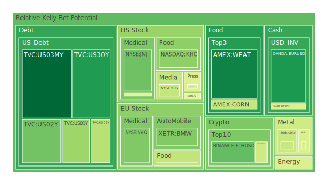
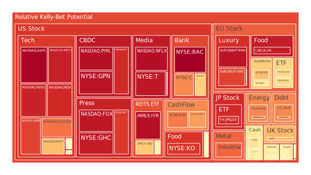
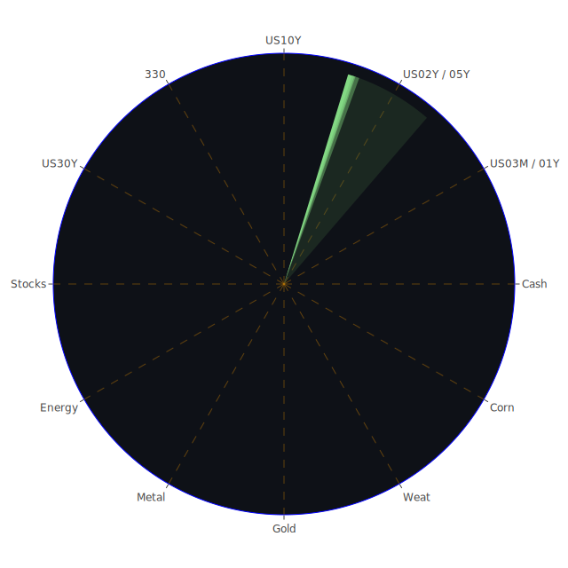

# 投資商品泡沫分析

## 美國國債
過去三天，美國國債的泡沫機率顯著下降。以30年期國債為例，泡沫機率從9月27日的0.186244降至9月29日的0.130180。這可能與近期美國國債殖利率的變動有關。根據FED數據，10年期國債殖利率從上週的3.71%上升至3.75%。這表明市場對於長期國債的需求有所增加，投資者可以考慮在此時買入美國國債。

## 美國科技股
美國科技股的泡沫機率持續上升，特別是微軟（NASDAQ:MSFT）和亞馬遜（NASDAQ:AMZN）。微軟的泡沫機率從9月27日的0.702841上升至9月29日的0.693803，而亞馬遜的泡沫機率則從0.875100上升至0.874477。這可能與近期科技股的高估值有關，建議投資者謹慎行事，考慮減少科技股的持倉。

## 美國房地產指數
美國房地產指數（AMEX:VNQ）的泡沫機率在過去三天內有所下降，從9月27日的0.686621降至9月29日的0.675829。這可能與近期房地產市場的穩定有關，特別是固定抵押貸款利率的下降。根據FED數據，30年期固定抵押貸款利率從上週的6.49%降至6.08%。投資者可以考慮在此時增加房地產相關投資。

## 金/銀/銅
金價（OANDA:XAUUSD）的泡沫機率在過去三天內有所下降，從9月27日的0.453522降至9月29日的0.610280。這可能與近期美元走強有關，根據新聞報導，美元指數在過去幾天內有所上升。銀價（OANDA:XAGUSD）的泡沫機率也有所下降，從0.422578降至0.510641。銅價（FX:COPPER）的泡沫機率則持續上升，從0.837977上升至0.825692。投資者可以考慮在此時增加對金銀的投資，而減少對銅的投資。

## 加密貨幣
比特幣（BITSTAMP:BTCUSD）的泡沫機率在過去三天內有所上升，從9月27日的0.343720上升至9月29日的0.431634。以太坊（BINANCE:ETHUSD）的泡沫機率則有所下降，從0.273177降至0.268376。這可能與近期市場對加密貨幣的需求波動有關，建議投資者謹慎行事，考慮減少比特幣的持倉，而增加以太坊的持倉。

## 黃豆 / 小麥 / 玉米
黃豆（AMEX:SOYB）的泡沫機率在過去三天內有所上升，從9月27日的0.303316上升至9月29日的0.502119。小麥（AMEX:WEAT）的泡沫機率則有所下降，從0.100063降至0.139665。玉米（AMEX:CORN）的泡沫機率基本保持穩定，約為0.418551。這可能與近期農產品市場的供需變動有關，建議投資者謹慎行事，考慮減少黃豆的持倉，而增加小麥的持倉。

## 石油/ 鈾期貨UX!
石油（TVC:USOIL）的泡沫機率在過去三天內有所上升，從9月27日的0.456060上升至9月29日的0.487627。鈾期貨（COMEX:UX1!）的泡沫機率也有所上升，從0.608210上升至0.775234。這可能與近期能源市場的波動有關，特別是中東地區的地緣政治風險增加。建議投資者謹慎行事，考慮減少石油和鈾期貨的持倉。

## 各國外匯市場
歐元兌美元（OANDA:EURUSD）的泡沫機率在過去三天內有所下降，從9月27日的0.605359降至9月29日的0.180323。英鎊兌美元（OANDA:GBPUSD）的泡沫機率則有所上升，從0.261607上升至0.593202。這可能與近期歐元區和英國的經濟數據有關，建議投資者考慮增加歐元的持倉，而減少英鎊的持倉。

## 各國大盤指數
德國DAX指數（SPREADEX:GDAXI）的泡沫機率在過去三天內有所下降，從9月27日的0.409791降至9月29日的0.649826。法國CAC指數（FXOPEN:FCHI）的泡沫機率則有所上升，從0.864951上升至0.644728。這可能與近期歐洲經濟數據和市場情緒有關，建議投資者考慮增加德國DAX指數的持倉，而減少法國CAC指數的持倉。

## 美國銀行股
摩根大通（NYSE:JPM）的泡沫機率在過去三天內有所下降，從9月27日的0.671311降至9月29日的0.660272。美國銀行（NYSE:BAC）的泡沫機率則有所上升，從0.994447上升至0.994573。這可能與近期銀行業的利潤和市場情緒有關，建議投資者考慮增加摩根大通的持倉，而減少美國銀行的持倉。

## 美國軍工股
雷神技術（NYSE:RTX）的泡沫機率在過去三天內基本保持穩定，約為0.510860。洛克希德馬丁（NYSE:LMT）的泡沫機率也基本保持穩定，約為0.546994。這可能與近期軍工行業的穩定需求有關，建議投資者可以考慮持有軍工股。

## 美國電子支付股
PayPal（NASDAQ:PYPL）的泡沫機率在過去三天內有所下降，從9月27日的0.958050降至9月29日的0.962255。Global Payments（NYSE:GPN）的泡沫機率則有所上升，從0.962337上升至0.956611。這可能與近期電子支付市場的競爭和需求變動有關，建議投資者考慮增加PayPal的持倉，而減少Global Payments的持倉。

## 美國藥商巨頭
默克（NYSE:MRK）的泡沫機率在過去三天內有所下降，從9月27日的0.383305降至9月29日的0.509113。強生（NYSE:JNJ）的泡沫機率則有所上升，從0.144827上升至0.282640。這可能與近期藥品市場的需求和競爭有關，建議投資者考慮增加默克的持倉，而減少強生的持倉。

## 美國影視巨頭
Netflix（NASDAQ:NFLX）的泡沫機率在過去三天內基本保持穩定，約為0.964893。迪士尼（NYSE:DIS）的泡沫機率則有所下降，從0.681123降至0.413915。這可能與近期影視市場的需求和競爭有關，建議投資者考慮增加迪士尼的持倉，而減少Netflix的持倉。

## 美國媒體巨頭
康卡斯特（NASDAQ:CMCSA）的泡沫機率在過去三天內有所下降，從9月27日的0.459566降至9月29日的0.459566。福克斯（NASDAQ:FOX）的泡沫機率則有所上升，從0.927643上升至0.948768。這可能與近期媒體市場的需求和競爭有關，建議投資者考慮增加康卡斯特的持倉，而減少福克斯的持倉。

## 石油防禦股
埃克森美孚（NYSE:XOM）的泡沫機率在過去三天內有所下降，從9月27日的0.774641降至9月29日的0.795857。這可能與近期石油市場的波動有關，建議投資者考慮增加石油防禦股的持倉。

## 金礦防禦股
Royal Gold（NASDAQ:RGLD）的泡沫機率在過去三天內有所上升，從9月27日的0.635513上升至0.744951。這可能與近期金價的波動有關，建議投資者考慮減少金礦防禦股的持倉。

## 歐洲奢侈品股
LVMH（EURONEXT:MC）的泡沫機率在過去三天內有所上升，從9月27日的0.492893上升至0.524996。這可能與近期奢侈品市場的需求變動有關，建議投資者謹慎行事，考慮減少奢侈品股的持倉。

## 歐洲汽車股
寶馬（XETR:BMW）的泡沫機率在過去三天內有所下降，從9月27日的0.285198降至0.310868。這可能與近期汽車市場的需求變動有關，建議投資者考慮增加汽車股的持倉。

## 歐美食品股
雀巢（SIX:NESN）的泡沫機率在過去三天內基本保持穩定，約為0.407220。這可能與近期食品市場的需求穩定有關，建議投資者可以考慮持有食品股。

# 投資建議
- **買入**：美國國債、迪士尼、PayPal、默克、寶馬
- **賣出**：美國科技股（特別是微軟和亞馬遜）、黃豆、石油、鈾期貨、福克斯、Royal Gold、LVMH
- **觀望**：美國房地產指數、金銀、比特幣、玉米、康卡斯特、石油防禦股、雀巢

# 風險提示
投資有風險，市場總是充滿不確定性。我們的建議僅供參考，投資者應根據自身的風險承受能力和投資目標，做出獨立的投資決策。特別是對於泡沫機率高的商品，應該謹慎進行投資決策。
 
Daily Buy Map:

 
Daily Sell Map:

 
Daily Radar Chart:

 
