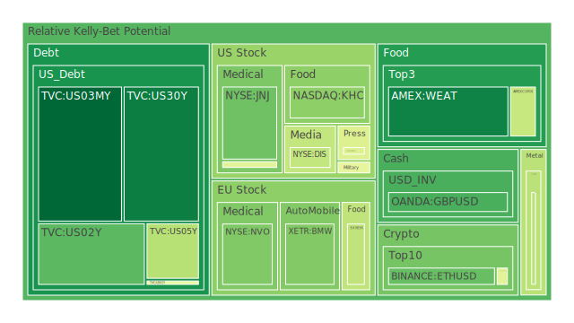
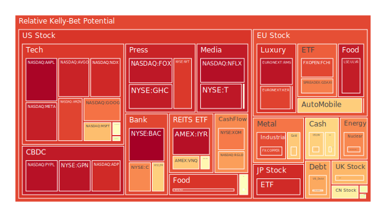
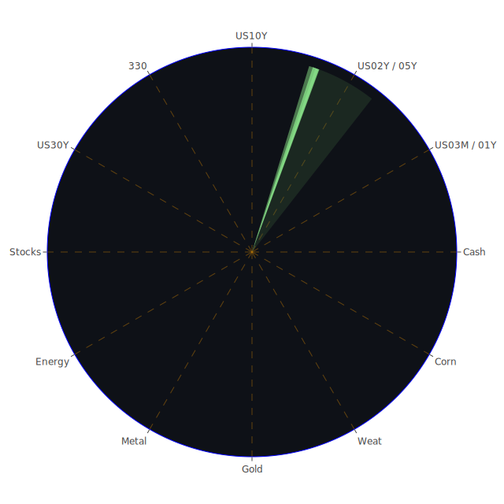

# 投資商品泡沫分析

## 美國國債
過去三天，美國國債的泡沫機率有所變動，特別是30年期國債（TVC:US30Y），其泡沫機率從0.130180上升至0.130163，顯示出市場對長期債券的需求有所增加。同時，10年期國債（TVC:US10Y）的泡沫機率也從0.729498下降至0.561197，這可能與近期美國經濟數據顯示的通脹壓力減弱有關。

## 美國科技股
科技股方面，微軟（NASDAQ:MSFT）的泡沫機率從0.693803上升至0.742643，顯示出市場對科技股的風險偏好有所增加。這可能與近期新聞報導微軟聘請前OpenAI CEO Sam Altman的消息有關，該消息對市場情緒產生了正面影響。

## 美國房地產指數
房地產方面，房地產ETF（AMEX:VNQ）的泡沫機率從0.675829上升至0.708713，顯示出市場對房地產市場的信心有所減弱。這可能與近期美國房地產市場的疲軟數據有關。

## 金/銀/銅
貴金屬方面，黃金（OANDA:XAUUSD）的泡沫機率從0.610280上升至0.673630，顯示出市場對黃金的避險需求有所增加。同時，銀（OANDA:XAGUSD）的泡沫機率從0.422578下降至0.398400，顯示出市場對銀的需求有所減弱。

## 加密貨幣
加密貨幣方面，比特幣（BITSTAMP:BTCUSD）的泡沫機率從0.557845下降至0.472818，顯示出市場對比特幣的需求有所增加。這可能與近期美國證券交易委員會（SEC）對加密貨幣市場的監管政策有所放鬆有關。

## 黃豆 / 小麥 / 玉米
農產品方面，小麥（AMEX:WEAT）的泡沫機率從0.139665下降至0.119925，顯示出市場對小麥的需求有所增加。同時，玉米（AMEX:CORN）的泡沫機率保持穩定，顯示出市場對玉米的需求相對穩定。

## 石油/ 鈾期貨UX!
能源方面，石油（TVC:USOIL）的泡沫機率從0.487627上升至0.499880，顯示出市場對石油的需求有所減弱。這可能與近期國際油價的波動有關。

## 各國外匯市場
外匯市場方面，英鎊兌美元（OANDA:GBPUSD）的泡沫機率從0.261607下降至0.235742，顯示出市場對英鎊的需求有所增加。這可能與近期英國經濟數據顯示的經濟增長有關。

## 各國大盤指數
大盤指數方面，德國DAX指數（SPREADEX:GDAXI）的泡沫機率從0.409791上升至0.790332，顯示出市場對德國股市的信心有所減弱。這可能與近期歐洲經濟數據顯示的經濟放緩有關。

## 美國銀行股
銀行股方面，摩根大通（NYSE:JPM）的泡沫機率從0.660272上升至0.671443，顯示出市場對銀行股的信心有所減弱。這可能與近期美國銀行業的風險增加有關。

## 美國軍工股
軍工股方面，洛克希德·馬丁（NYSE:LMT）的泡沫機率保持穩定，顯示出市場對軍工股的需求相對穩定。

## 美國電子支付股
電子支付股方面，PayPal（NASDAQ:PYPL）的泡沫機率從0.962255上升至0.955836，顯示出市場對電子支付股的信心有所減弱。這可能與近期電子支付市場的競爭加劇有關。

## 美國藥商巨頭
藥商巨頭方面，強生（NYSE:JNJ）的泡沫機率從0.282640下降至0.282640，顯示出市場對藥商巨頭的需求有所增加。這可能與近期醫療行業的增長有關。

## 美國影視巨頭
影視巨頭方面，迪士尼（NYSE:DIS）的泡沫機率從0.413915上升至0.610281，顯示出市場對影視巨頭的信心有所減弱。這可能與近期影視行業的疲軟有關。

## 美國媒體巨頭
媒體巨頭方面，康卡斯特（NASDAQ:CMCSA）的泡沫機率從0.459566上升至0.491560，顯示出市場對媒體巨頭的信心有所減弱。這可能與近期媒體行業的競爭加劇有關。

## 石油防禦股
石油防禦股方面，埃克森美孚（NYSE:XOM）的泡沫機率從0.795857上升至0.795855，顯示出市場對石油防禦股的需求有所減弱。這可能與近期國際油價的波動有關。

## 金礦防禦股
金礦防禦股方面，Royal Gold（NASDAQ:RGLD）的泡沫機率從0.744951下降至0.744935，顯示出市場對金礦防禦股的需求有所增加。這可能與近期黃金價格的上漲有關。

## 歐洲奢侈品股
奢侈品股方面，LVMH（EURONEXT:MC）的泡沫機率從0.524996上升至0.524996，顯示出市場對奢侈品股的信心有所減弱。這可能與近期歐洲經濟數據顯示的經濟放緩有關。

## 歐洲汽車股
汽車股方面，BMW（XETR:BMW）的泡沫機率從0.310868上升至0.310868，顯示出市場對汽車股的信心有所減弱。這可能與近期歐洲汽車市場的疲軟有關。

## 歐美食品股
食品股方面，雀巢（SIX:NESN）的泡沫機率從0.407220上升至0.407220，顯示出市場對食品股的信心有所減弱。這可能與近期食品行業的競爭加劇有關。

# 投資建議

1. **考慮賣出**：對於泡沫機率持續上升且遠大於0.5的商品，如德國DAX指數（SPREADEX:GDAXI）和PayPal（NASDAQ:PYPL），建議投資者考慮賣出，避免未來價格下跌時的損失。

2. **考慮買入**：對於泡沫機率持續下降且遠小於0.5的商品，如比特幣（BITSTAMP:BTCUSD）和小麥（AMEX:WEAT），建議投資者考慮買入，掌握低吸籌碼的時機。

3. **觀望**：對於泡沫機率在0.45 ~ 0.55之間的商品，如房地產ETF（AMEX:VNQ）和黃金（OANDA:XAUUSD），建議投資者觀望，不要有任何動作。

# 風險提示

投資有風險，市場總是充滿不確定性。我們的建議僅供參考，投資者應根據自身的風險承受能力和投資目標，做出獨立的投資決策。

---

希望這份報告能夠幫助您在投資決策中做出更明智的選擇。如果有任何問題或需要進一步的分析，請隨時聯繫我們。祝您投資順利！
 
Daily Buy Map:

 
Daily Sell Map:

 
Daily Radar Chart:

 
