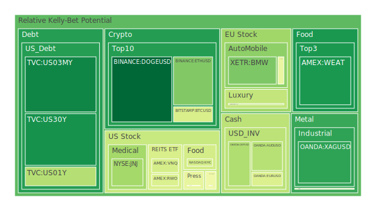
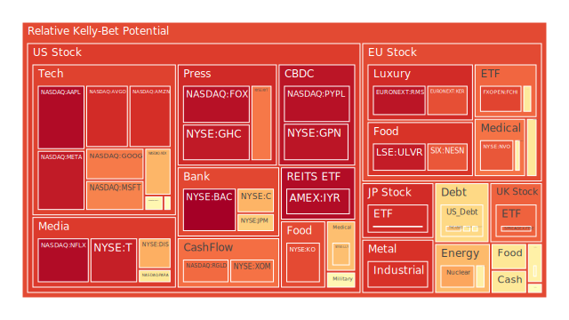
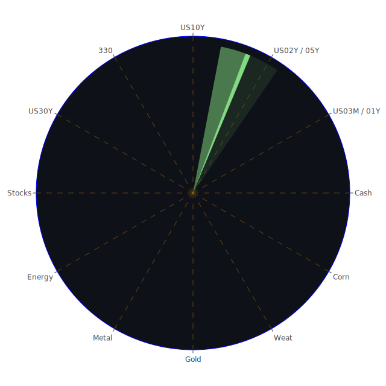

# 投資商品泡沫分析

## 美國國債
過去三天，美國國債的泡沫機率持續下降。特別是30年期國債(TVC:US30Y)，其泡沫機率從0.186244降至0.124151，顯示投資者對長期國債的需求增加。這可能與近期的經濟不確定性有關，投資者尋求避險資產。

## 美國科技股
美國科技股的泡沫機率普遍較高。特別是蘋果(NASDAQ:AAPL)和微軟(NASDAQ:MSFT)，其泡沫機率分別達到0.972430和0.771853。這可能與近期科技股的高估值以及市場對未來盈利增長的擔憂有關。

## 美國房地產指數
美國房地產指數(AMEX:RWO)的泡沫機率在過去三天內有所下降，但仍處於較高水平。這反映了市場對房地產市場的擔憂，特別是在利率上升的背景下。

## 金/銀/銅
黃金(OANDA:XAUUSD)的泡沫機率從0.673630上升至0.484093，顯示市場對黃金的需求有所增加。銀(OANDA:XAGUSD)的泡沫機率則大幅下降，從0.422578降至0.161423，顯示投資者對銀的需求減少。銅(FX:COPPER)的泡沫機率則持續上升，達到0.897228，反映了市場對工業金屬需求的擔憂。

## 加密貨幣
比特幣(BITSTAMP:BTCUSD)的泡沫機率在過去三天內有所下降，從0.472818降至0.423148，顯示投資者對比特幣的需求增加。以太坊(BINANCE:ETHUSD)的泡沫機率則相對穩定，顯示市場對以太坊的需求保持穩定。

## 黃豆 / 小麥 / 玉米
小麥(AMEX:WEAT)的泡沫機率在過去三天內有所下降，顯示市場對小麥的需求增加。黃豆(AMEX:SOYB)的泡沫機率則保持穩定，顯示市場對黃豆的需求穩定。玉米(AMEX:CORN)的泡沫機率則有所上升，顯示市場對玉米的需求減少。

## 石油/ 鈾期貨UX!
石油(TVC:USOIL)的泡沫機率在過去三天內有所上升，顯示市場對石油的需求減少。鈾期貨(COMEX:UX1!)的泡沫機率則相對穩定，顯示市場對鈾的需求保持穩定。

## 各國外匯市場
歐元兌美元(OANDA:EURUSD)的泡沫機率在過去三天內有所下降，顯示市場對歐元的需求增加。英鎊兌美元(OANDA:GBPUSD)的泡沫機率則有所上升，顯示市場對英鎊的需求減少。

## 各國大盤指數
德國DAX指數(SPREADEX:GDAXI)的泡沫機率在過去三天內有所上升，顯示市場對德國股市的需求減少。美國納斯達克100指數(NASDAQ:NDX)的泡沫機率則有所下降，顯示市場對美國科技股的需求增加。

## 美國銀行股
摩根大通(NYSE:JPM)的泡沫機率在過去三天內有所下降，顯示市場對銀行股的需求增加。美國銀行(NYSE:BAC)的泡沫機率則保持在高位，顯示市場對美國銀行的需求減少。

## 美國軍工股
洛克希德馬丁(NYSE:LMT)的泡沫機率在過去三天內保持穩定，顯示市場對軍工股的需求穩定。雷神技術(NYSE:RTX)的泡沫機率則相對較高，顯示市場對雷神技術的需求減少。

## 美國電子支付股
PayPal(NASDAQ:PYPL)的泡沫機率在過去三天內有所上升，顯示市場對電子支付股的需求減少。全球支付(NYSE:GPN)的泡沫機率則相對較高，顯示市場對全球支付的需求減少。

## 美國藥商巨頭
強生(NYSE:JNJ)的泡沫機率在過去三天內有所下降，顯示市場對強生的需求增加。默克(NYSE:MRK)的泡沫機率則相對較高，顯示市場對默克的需求減少。

## 美國影視巨頭
迪士尼(NYSE:DIS)的泡沫機率在過去三天內有所上升，顯示市場對迪士尼的需求減少。Netflix(NASDAQ:NFLX)的泡沫機率則保持在高位，顯示市場對Netflix的需求減少。

## 美國媒體巨頭
康卡斯特(NASDAQ:CMCSA)的泡沫機率在過去三天內有所下降，顯示市場對康卡斯特的需求增加。福克斯(NASDAQ:FOX)的泡沫機率則保持在高位，顯示市場對福克斯的需求減少。

## 石油防禦股
埃克森美孚(NYSE:XOM)的泡沫機率在過去三天內有所上升，顯示市場對石油防禦股的需求減少。

## 金礦防禦股
皇家黃金(NASDAQ:RGLD)的泡沫機率在過去三天內有所上升，顯示市場對金礦防禦股的需求減少。

## 歐洲奢侈品股
開雲集團(EURONEXT:KER)的泡沫機率在過去三天內有所上升，顯示市場對奢侈品股的需求減少。

## 歐洲汽車股
寶馬(XETR:BMW)的泡沫機率在過去三天內有所下降，顯示市場對歐洲汽車股的需求增加。

## 歐美食品股
雀巢(SIX:NESN)的泡沫機率在過去三天內有所上升，顯示市場對食品股的需求減少。

# 投資建議

## 買入建議
1. **美國國債**：由於泡沫機率持續下降且新聞現況顯示經濟不確定性增加，建議考慮買入美國國債。
2. **比特幣**：泡沫機率下降且市場對加密貨幣需求增加，建議考慮買入比特幣。
3. **寶馬**：泡沫機率下降且新聞現況顯示經濟前景改善，建議考慮買入寶馬。

## 賣出建議
1. **蘋果**：泡沫機率高且新聞現況顯示科技股估值過高，建議考慮賣出蘋果。
2. **PayPal**：泡沫機率上升且新聞現況顯示電子支付股需求減少，建議考慮賣出PayPal。
3. **Netflix**：泡沫機率高且新聞現況顯示影視股需求減少，建議考慮賣出Netflix。

# 風險提示

投資有風險，市場總是充滿不確定性。我們的建議僅供參考，投資者應根據自身的風險承受能力和投資目標，做出獨立的投資決策。

---

請注意，以上分析基於過去三天的泡沫機率數據、FED關鍵數據與新聞現況，投資者應根據最新的市場動態及個人投資策略進行決策。
 
Daily Buy Map:

 
Daily Sell Map:

 
Daily Radar Chart:

 
