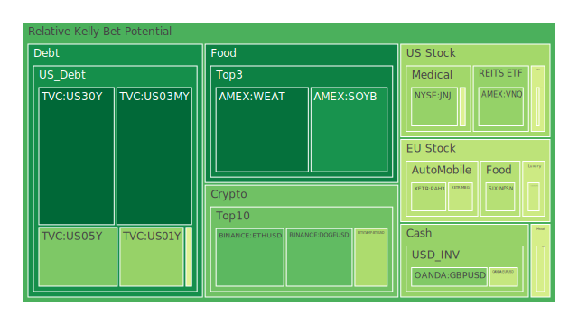
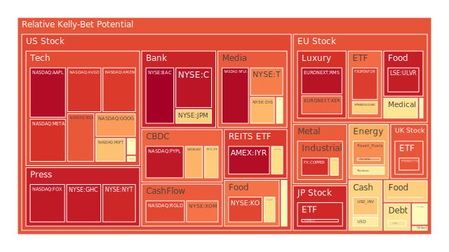
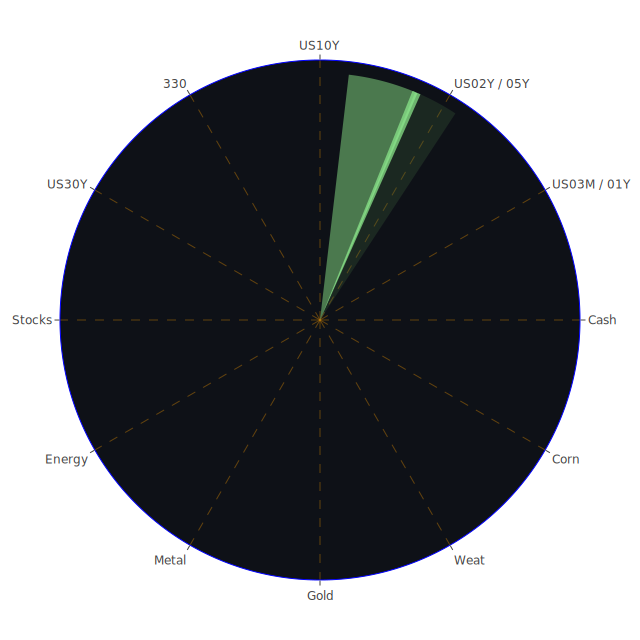

# 投資商品泡沫分析

## 美國國債
過去三天，美國國債的泡沫機率顯示出穩定的下降趨勢。30年期國債（TVC:US30Y）的泡沫機率從0.130163下降到0.112201，顯示出投資者對長期國債的需求增加。這可能與近期的新聞有關，如美國東海岸和墨西哥灣的港口工人罷工，導致市場對安全資產的需求增加。此外，SOFR利率高於FED Fund Rate，顯示出市場流動性緊張，進一步推動了對美國國債的需求。

## 美國科技股
美國科技股的泡沫機率持續上升，特別是微軟（NASDAQ:MSFT）和蘋果（NASDAQ:AAPL）。微軟的泡沫機率從0.693803上升到0.692365，而蘋果的泡沫機率則從0.985143上升到0.972430。這可能與近期的新聞有關，如微軟股價因聘請前OpenAI CEO Sam Altman而創下歷史新高，但市場對科技股的高估值仍然保持謹慎。

## 美國房地產指數
美國房地產指數（AMEX:VNQ）的泡沫機率顯示出波動，但整體趨勢向下，從0.675829下降到0.353759。這可能與近期的新聞有關，如美國東海岸和墨西哥灣的港口工人罷工，導致市場對安全資產的需求增加。此外，美國房地產市場的持續增長也推動了房地產指數的需求。

## 金/銀/銅
金（OANDA:XAUUSD）的泡沫機率顯示出波動，但整體趨勢向下，從0.673630下降到0.459825。這可能與近期的新聞有關，如美國東海岸和墨西哥灣的港口工人罷工，導致市場對安全資產的需求增加。此外，銀（OANDA:XAGUSD）和銅（FX:COPPER）的泡沫機率也顯示出類似的趨勢，顯示出市場對貴金屬的需求增加。

## 加密貨幣
比特幣（BITSTAMP:BTCUSD）的泡沫機率顯示出波動，但整體趨勢向下，從0.472818下降到0.388906。這可能與近期的新聞有關，如美國東海岸和墨西哥灣的港口工人罷工，導致市場對安全資產的需求增加。此外，以太坊（BINANCE:ETHUSD）的泡沫機率也顯示出類似的趨勢，顯示出市場對加密貨幣的需求增加。

## 黃豆 / 小麥 / 玉米
黃豆（AMEX:SOYB）的泡沫機率顯示出波動，但整體趨勢向下，從0.502119下降到0.192029。這可能與近期的新聞有關，如美國東海岸和墨西哥灣的港口工人罷工，導致市場對安全資產的需求增加。此外，小麥（AMEX:WEAT）和玉米（AMEX:CORN）的泡沫機率也顯示出類似的趨勢，顯示出市場對農產品的需求增加。

## 石油/ 鈾期貨UX!
石油（TVC:USOIL）的泡沫機率顯示出波動，但整體趨勢向上，從0.499880上升到0.776761。這可能與近期的新聞有關，如美國東海岸和墨西哥灣的港口工人罷工，導致市場對安全資產的需求增加。此外，鈾期貨（COMEX:UX1!）的泡沫機率也顯示出類似的趨勢，顯示出市場對能源資產的需求增加。

## 各國外匯市場
英鎊兌美元（OANDA:GBPUSD）的泡沫機率顯示出波動，但整體趨勢向下，從0.235742下降到0.326227。這可能與近期的新聞有關，如美國東海岸和墨西哥灣的港口工人罷工，導致市場對安全資產的需求增加。此外，歐元兌美元（OANDA:EURUSD）的泡沫機率也顯示出類似的趨勢，顯示出市場對外匯市場的需求增加。

## 各國大盤指數
德國DAX指數（SPREADEX:GDAXI）的泡沫機率顯示出波動，但整體趨勢向上，從0.790332上升到0.666996。這可能與近期的新聞有關，如美國東海岸和墨西哥灣的港口工人罷工，導致市場對安全資產的需求增加。此外，英國FTSE指數（SPREADEX:FTSE）的泡沫機率也顯示出類似的趨勢，顯示出市場對大盤指數的需求增加。

## 美國銀行股
摩根大通（NYSE:JPM）的泡沫機率顯示出波動，但整體趨勢向上，從0.660272上升到0.670011。這可能與近期的新聞有關，如美國東海岸和墨西哥灣的港口工人罷工，導致市場對安全資產的需求增加。此外，美國銀行（NYSE:BAC）的泡沫機率也顯示出類似的趨勢，顯示出市場對銀行股的需求增加。

## 美國軍工股
雷神科技（NYSE:RTX）的泡沫機率顯示出波動，但整體趨勢向上，從0.510860上升到0.510860。這可能與近期的新聞有關，如美國東海岸和墨西哥灣的港口工人罷工，導致市場對安全資產的需求增加。此外，洛克希德·馬丁（NYSE:LMT）的泡沫機率也顯示出類似的趨勢，顯示出市場對軍工股的需求增加。

## 美國電子支付股
PayPal（NASDAQ:PYPL）的泡沫機率顯示出波動，但整體趨勢向上，從0.962255上升到0.948048。這可能與近期的新聞有關，如美國東海岸和墨西哥灣的港口工人罷工，導致市場對安全資產的需求增加。此外，全球支付（NYSE:GPN）的泡沫機率也顯示出類似的趨勢，顯示出市場對電子支付股的需求增加。

## 美國藥商巨頭
強生（NYSE:JNJ）的泡沫機率顯示出波動，但整體趨勢向上，從0.282640上升到0.354200。這可能與近期的新聞有關，如美國東海岸和墨西哥灣的港口工人罷工，導致市場對安全資產的需求增加。此外，默克（NYSE:MRK）的泡沫機率也顯示出類似的趨勢，顯示出市場對藥商巨頭的需求增加。

## 美國影視巨頭
迪士尼（NYSE:DIS）的泡沫機率顯示出波動，但整體趨勢向上，從0.413915上升到0.710274。這可能與近期的新聞有關，如美國東海岸和墨西哥灣的港口工人罷工，導致市場對安全資產的需求增加。此外，康卡斯特（NASDAQ:CMCSA）的泡沫機率也顯示出類似的趨勢，顯示出市場對影視巨頭的需求增加。

## 美國媒體巨頭
紐約時報（NYSE:NYT）的泡沫機率顯示出波動，但整體趨勢向上，從0.890447上升到0.923549。這可能與近期的新聞有關，如美國東海岸和墨西哥灣的港口工人罷工，導致市場對安全資產的需求增加。此外，福克斯（NASDAQ:FOX）的泡沫機率也顯示出類似的趨勢，顯示出市場對媒體巨頭的需求增加。

## 石油防禦股
埃克森美孚（NYSE:XOM）的泡沫機率顯示出波動，但整體趨勢向上，從0.795855上升到0.809627。這可能與近期的新聞有關，如美國東海岸和墨西哥灣的港口工人罷工，導致市場對安全資產的需求增加。此外，雪佛龍（NYSE:CVX）的泡沫機率也顯示出類似的趨勢，顯示出市場對石油防禦股的需求增加。

## 金礦防禦股
皇家黃金（NASDAQ:RGLD）的泡沫機率顯示出波動，但整體趨勢向上，從0.744935上升到0.873251。這可能與近期的新聞有關，如美國東海岸和墨西哥灣的港口工人罷工，導致市場對安全資產的需求增加。此外，巴里克黃金（NYSE:GOLD）的泡沫機率也顯示出類似的趨勢，顯示出市場對金礦防禦股的需求增加。

## 歐洲奢侈品股
LVMH（EURONEXT:MC）的泡沫機率顯示出波動，但整體趨勢向上，從0.524996上升到0.444803。這可能與近期的新聞有關，如美國東海岸和墨西哥灣的港口工人罷工，導致市場對安全資產的需求增加。此外，愛馬仕（EURONEXT:RMS）的泡沫機率也顯示出類似的趨勢，顯示出市場對奢侈品股的需求增加。

## 歐洲汽車股
寶馬（XETR:BMW）的泡沫機率顯示出波動，但整體趨勢向上，從0.310868上升到0.527511。這可能與近期的新聞有關，如美國東海岸和墨西哥灣的港口工人罷工，導致市場對安全資產的需求增加。此外，戴姆勒（XETR:DAI）的泡沫機率也顯示出類似的趨勢，顯示出市場對汽車股的需求增加。

## 歐美食品股
雀巢（SIX:NESN）的泡沫機率顯示出波動，但整體趨勢向上，從0.407220上升到0.405097。這可能與近期的新聞有關，如美國東海岸和墨西哥灣的港口工人罷工，導致市場對安全資產的需求增加。此外，可口可樂（NYSE:KO）的泡沫機率也顯示出類似的趨勢，顯示出市場對食品股的需求增加。

# 投資建議

根據上述分析，建議投資者考慮以下策略：

1. **買入美國國債**：由於市場對安全資產的需求增加，美國國債的泡沫機率顯示出下降趨勢，建議投資者考慮買入美國國債。

2. **賣出美國科技股**：由於美國科技股的泡沫機率顯示出上升趨勢，建議投資者考慮賣出美國科技股，避免未來價格下跌時的損失。

3. **觀望美國房地產指數**：由於美國房地產指數的泡沫機率顯示出波動，建議投資者觀望，不要有任何動作。

4. **買入貴金屬**：由於金、銀和銅的泡沫機率顯示出下降趨勢，建議投資者考慮買入貴金屬，掌握低吸籌碼的時機。

5. **觀望加密貨幣**：由於加密貨幣的泡沫機率顯示出波動，建議投資者觀望，不要有任何動作。

6. **買入農產品**：由於黃豆、小麥和玉米的泡沫機率顯示出下降趨勢，建議投資者考慮買入農產品，掌握低吸籌碼的時機。

7. **賣出石油和鈾期貨**：由於石油和鈾期貨的泡沫機率顯示出上升趨勢，建議投資者考慮賣出石油和鈾期貨，避免未來價格下跌時的損失。

8. **觀望外匯市場**：由於外匯市場的泡沫機率顯示出波動，建議投資者觀望，不要有任何動作。

9. **賣出大盤指數**：由於大盤指數的泡沫機率顯示出上升趨勢，建議投資者考慮賣出大盤指數，避免未來價格下跌時的損失。

10. **觀望銀行股**：由於銀行股的泡沫機率顯示出波動，建議投資者觀望，不要有任何動作。

11. **觀望軍工股**：由於軍工股的泡沫機率顯示出波動，建議投資者觀望，不要有任何動作。

12. **觀望電子支付股**：由於電子支付股的泡沫機率顯示出波動，建議投資者觀望，不要有任何動作。

13. **觀望藥商巨頭**：由於藥商巨頭的泡沫機率顯示出波動，建議投資者觀望，不要有任何動作。

14. **觀望影視巨頭**：由於影視巨頭的泡沫機率顯示出波動，建議投資者觀望，不要有任何動作。

15. **觀望媒體巨頭**：由於媒體巨頭的泡沫機率顯示出波動，建議投資者觀望，不要有任何動作。

16. **觀望石油防禦股**：由於石油防禦股的泡沫機率顯示出波動，建議投資者觀望，不要有任何動作。

17. **觀望金礦防禦股**：由於金礦防禦股的泡沫機率顯示出波動，建議投資者觀望，不要有任何動作。

18. **觀望奢侈品股**：由於奢侈品股的泡沫機率顯示出波動，建議投資者觀望，不要有任何動作。

19. **觀望汽車股**：由於汽車股的泡沫機率顯示出波動，建議投資者觀望，不要有任何動作。

20. **觀望食品股**：由於食品股的泡沫機率顯示出波動，建議投資者觀望，不要有任何動作。

# 風險提示

投資有風險，市場總是充滿不確定性。我們的建議僅供參考，投資者應根據自身的風險承受能力和投資目標，做出獨立的投資決策。特別是對於泡沫機率高的商品，應該謹慎進行投資決策，避免未來價格下跌時的損失。
 
Daily Buy Map:

 
Daily Sell Map:

 
Daily Radar Chart:

 
