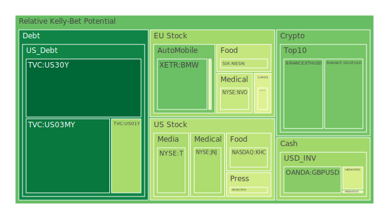
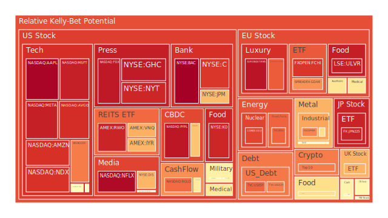
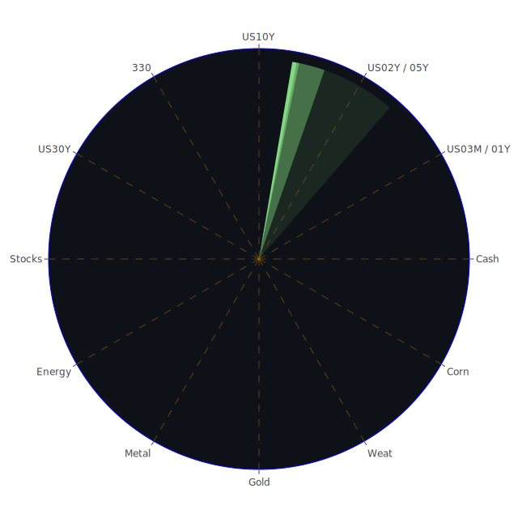

# 投資商品泡沫分析

- **美國國債**
  美國國債的泡沫機率持續下降，尤其是30年期國債（TVC:US30Y），從10月1日的0.124151降至10月3日的0.075609，顯示市場對長期債券的需求增加。這可能與近期的經濟不確定性有關，投資者尋求避險資產。

- **美國科技股**
  科技股如微軟（NASDAQ:MSFT）和谷歌（NASDAQ:GOOG）的泡沫機率高企，分別在0.935689和0.788634，顯示市場對科技股的熱情依然高漲。然而，這也意味著價格可能已經過高，需謹慎投資。

- **美國房地產指數**
  房地產相關ETF（AMEX:VNQ）的泡沫機率上升至0.716523，顯示市場對房地產的信心減弱，可能受到高利率和經濟不確定性的影響。

- **金/銀/銅**
  黃金（OANDA:XAUUSD）的泡沫機率有所下降，但仍然高於0.5，顯示市場對避險資產的需求依然存在。銅（FX:COPPER）的泡沫機率則高達0.778630，顯示市場對工業金屬的需求減弱。

- **加密貨幣**
  比特幣（BITSTAMP:BTCUSD）的泡沫機率大幅上升至0.790071，顯示市場對加密貨幣的熱情減弱，可能受到監管壓力和市場波動的影響。

- **黃豆 / 小麥 / 玉米**
  小麥（AMEX:WEAT）的泡沫機率上升至0.614490，顯示市場對農產品的需求減弱，可能受到供應鏈問題和全球經濟放緩的影響。

- **石油/ 鈾期貨UX!**
  石油（TVC:USOIL）的泡沫機率上升至0.825805，顯示市場對能源價格的擔憂加劇，可能受到中東地區緊張局勢的影響。

- **各國外匯市場**
  英鎊兌美元（OANDA:GBPUSD）的泡沫機率下降至0.309127，顯示市場對英鎊的信心增強，可能受到英國經濟數據改善的影響。

- **各國大盤指數**
  歐洲主要股指（SPREADEX:FTSE）的泡沫機率上升至0.709863，顯示市場對歐洲經濟的擔憂加劇，可能受到地緣政治風險和經濟數據疲弱的影響。

- **美國銀行股**
  美國銀行（NYSE:BAC）的泡沫機率接近1，顯示市場對銀行股的信心極低，可能受到信貸風險上升和經濟不確定性的影響。

# 投資建議

1. **避險資產**：考慮增加對美國國債和黃金的配置，因其泡沫機率下降，顯示市場對避險資產的需求增強。
2. **科技股**：謹慎對待高泡沫機率的科技股，建議在價格回調時再考慮進場。
3. **能源股**：由於中東局勢緊張，石油價格波動加劇，建議密切關注相關新聞，適時調整投資組合。

# 風險提示

投資有風險，市場總是充滿不確定性。我們的建議僅供參考，投資者應根據自身的風險承受能力和投資目標，做出獨立的投資決策。特別是對於泡沫機率高的商品，應該謹慎進行投資決策。
 
Daily Buy Map:

 
Daily Sell Map:

 
Daily Radar Chart:

 
