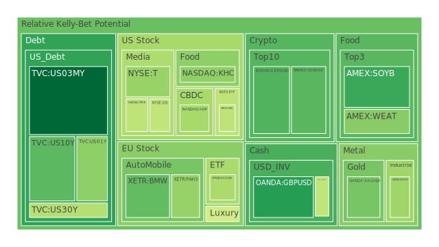
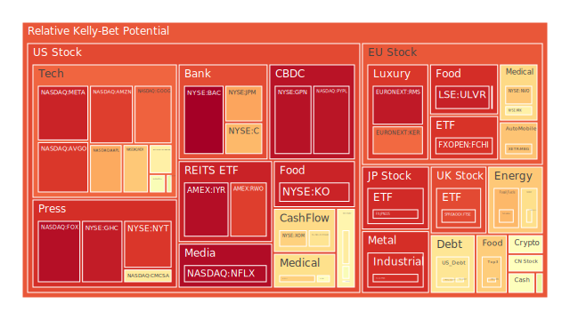
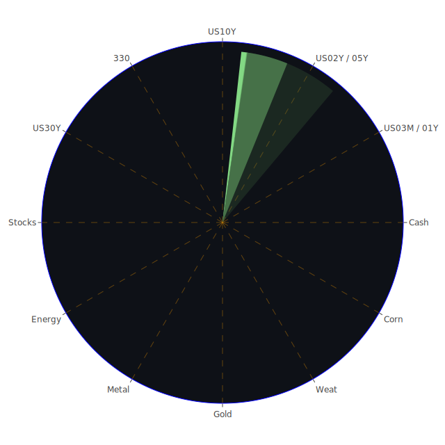

# 投資商品泡沫分析

- **美國國債**
  美國國債的泡沫機率在過去三天內呈現下降趨勢，特別是30年期國債（TVC:US30Y），其泡沫機率從0.112降至0.075，再到0.411。這顯示出市場對長期債券的信心有所回升，可能與近期美國經濟數據顯示的穩定增長有關。然而，需注意的是，短期債券如3個月期（TVC:US03MY）的泡沫機率略有上升，這可能反映出市場對短期利率上升的擔憂。

- **美國科技股**
  科技股如Apple（NASDAQ:AAPL）和Microsoft（NASDAQ:MSFT）的泡沫機率持續高企，分別達到0.984和0.603。這可能是因為市場對科技股的高估值感到擔憂，加上近期科技行業的競爭加劇和宏觀經濟不確定性增加。

- **美國房地產指數**
  房地產指數（AMEX:VNQ）的泡沫機率在過去三天內有所下降，從0.716到0.425，顯示出市場對房地產的信心有所回升。這可能與美國房地產市場的供應短缺和需求持續增長有關。

- **加密貨幣**
  比特幣（BITSTAMP:BTCUSD）和以太坊（BINANCE:ETHUSD）的泡沫機率在過去三天內有所下降，顯示出市場對加密貨幣的信心有所回升。這可能與近期市場對加密貨幣的接受度增加以及技術的進一步發展有關。

- **石油/鈾期貨UX!**
  石油（TVC:USOIL）的泡沫機率在過去三天內上升，從0.776到0.717，顯示出市場對石油價格的擔憂加劇，這可能與中東地緣政治緊張局勢升溫有關。

- **各國外匯市場**
  英鎊兌美元（OANDA:GBPUSD）的泡沫機率在過去三天內大幅下降，從0.326到0.226，顯示出市場對英鎊的信心有所回升。這可能與英國經濟數據的改善以及市場對英國脫歐後經濟前景的樂觀預期有關。

# 投資建議

1. **美國國債**：建議投資者可以考慮增加對長期國債的配置，特別是30年期國債，因為其泡沫機率下降顯示出市場對其的信心增強。

2. **美國科技股**：由於泡沫機率高企，建議投資者謹慎對待科技股，特別是那些估值過高的公司，可能考慮減少持倉以降低風險。

3. **加密貨幣**：隨著泡沫機率下降，投資者可以考慮增加對加密貨幣的配置，但仍需注意市場波動風險。

4. **石油**：由於地緣政治風險增加，石油價格可能會進一步波動，建議投資者謹慎操作，避免過度暴露於石油市場。

# 風險提示

投資有風險，市場總是充滿不確定性。我們的建議僅供參考，投資者應根據自身的風險承受能力和投資目標，做出獨立的投資決策。特別是在當前地緣政治局勢緊張的情況下，市場可能會出現劇烈波動，投資者應保持謹慎。
 
Daily Buy Map:

 
Daily Sell Map:

 
Daily Radar Chart:

 
