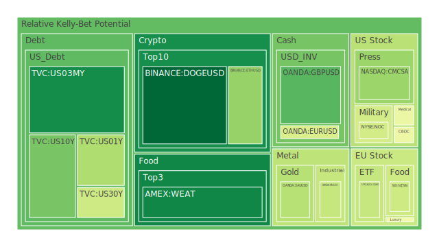
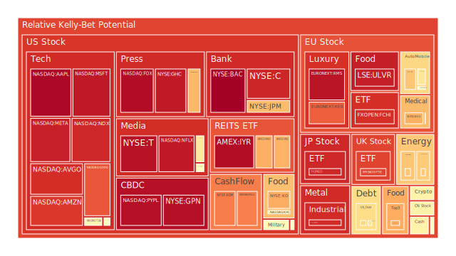
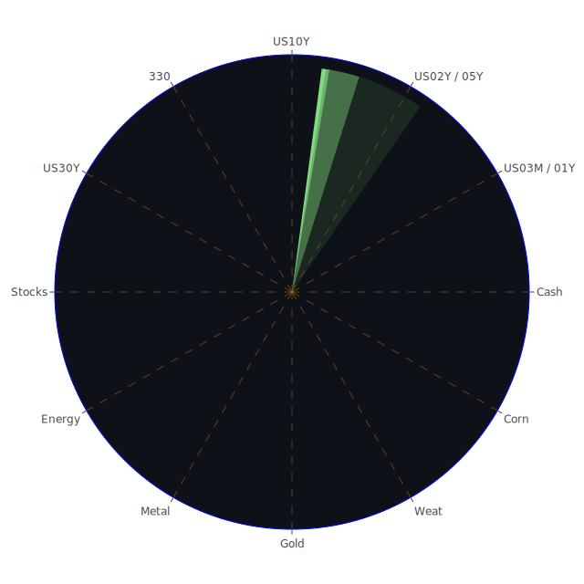

# 投資商品泡沫分析

- **美國國債**
  美國國債的泡沫機率顯示出近期的波動性。30年期國債（TVC:US30Y）的泡沫機率從10月3日的0.075609上升到10月5日的0.411690，顯示出市場對長期債券的擔憂增加。這可能與近期美國國債殖利率的上升有關，尤其是30年期國債殖利率從上週的4.13%上升到目前的4.25%。這種上升的趨勢可能反映出市場對於未來經濟不確定性的預期增加。

- **美國科技股**
  科技股的泡沫機率普遍較高，特別是蘋果（NASDAQ:AAPL），其泡沫機率從10月3日的0.984653稍微下降至10月5日的0.980537，但仍然處於高位。這可能與近期科技股的高估值有關，而市場對於美國經濟增長放緩的擔憂也可能影響投資者對科技股的信心。

- **加密貨幣**
  以太坊（BINANCE:ETHUSD）的泡沫機率從10月3日的0.278611上升至10月5日的0.314926，顯示出市場對加密貨幣的波動性預期增加。這可能與近期的市場情緒波動以及監管政策的不確定性有關。

- **石油/鈾期貨UX!**
  石油（TVC:USOIL）的泡沫機率從10月3日的0.825805下降至10月5日的0.658613，顯示出市場對石油價格的預期有所緩和。這可能與近期中東地區的地緣政治緊張局勢有所緩解有關。

- **各國外匯市場**
  英鎊兌美元（OANDA:GBPUSD）的泡沫機率從10月3日的0.309127下降至10月5日的0.226600，顯示出市場對英鎊的信心有所增強。這可能與英國近期的經濟數據表現較好有關。

- **美國銀行股**
  美國銀行（NYSE:BAC）的泡沫機率持續高企，從10月3日的0.994741稍微下降至10月5日的0.994483，顯示出市場對銀行業的擔憂仍然存在。這可能與近期美國經濟增長放緩以及潛在的信貸風險有關。

# 投資建議

1. **美國國債**：由於30年期國債的泡沫機率上升，建議投資者謹慎觀望，特別是考慮到近期美國國債殖利率的上升。
   
2. **美國科技股**：由於科技股的泡沫機率普遍較高，建議投資者考慮逐步減持，特別是對於估值過高的股票，如蘋果。

3. **加密貨幣**：由於加密貨幣的泡沫機率上升，建議投資者保持謹慎，並密切關注市場情緒和監管政策的變化。

4. **石油/鈾期貨UX!**：由於石油的泡沫機率下降，建議投資者可以考慮逢低吸納，但需注意地緣政治風險。

5. **各國外匯市場**：由於英鎊的泡沫機率下降，建議投資者可以考慮增加英鎊的持倉，特別是在英國經濟數據表現良好的情況下。

6. **美國銀行股**：由於銀行股的泡沫機率高企，建議投資者謹慎觀望，特別是在信貸風險增加的背景下。

# 風險提示

投資有風險，市場總是充滿不確定性。我們的建議僅供參考，投資者應根據自身的風險承受能力和投資目標，做出獨立的投資決策。特別是對於泡沫機率高的商品，應該謹慎進行投資決策。
 
Daily Buy Map:

 
Daily Sell Map:

 
Daily Radar Chart:

 
