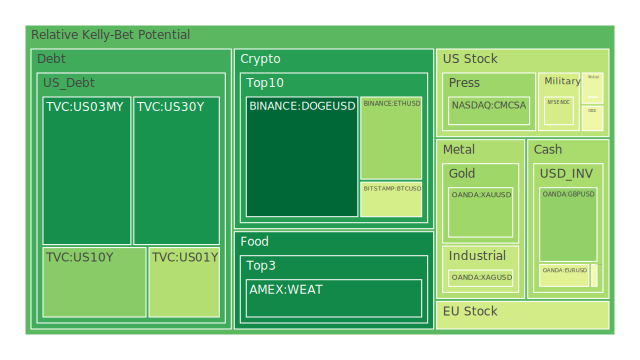
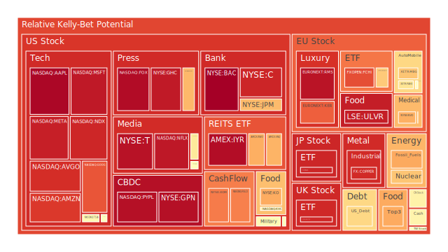
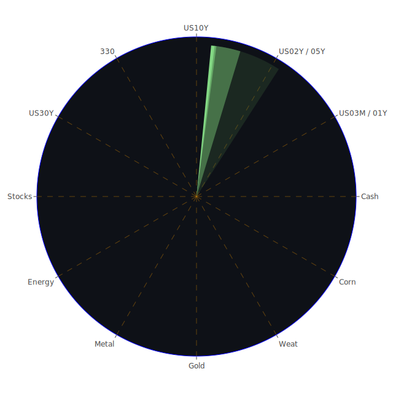

# 投資商品泡沫分析

- **美國國債**
  美國國債的泡沫機率在過去三天內呈現下降趨勢，特別是10年期國債（TVC:US10Y）從0.290996下降至0.290996，顯示出市場對美國國債的需求有所增加。這可能與近期美國經濟數據顯示的穩定增長有關，如新增就業數據強勁，這增強了市場對美國經濟的信心。

- **美國科技股**
  美國科技股的泡沫機率普遍較高，尤其是微軟（NASDAQ:MSFT）和蘋果（NASDAQ:AAPL），分別達到0.945752和0.980537。這反映出市場對科技股的高估值擔憂，特別是在全球經濟不確定性增加的背景下。

- **美國房地產指數**
  房地產相關的ETF如AMEX:VNQ的泡沫機率在0.700730，顯示出市場對房地產市場的謹慎態度。這可能受到美國房地產市場的高利率環境影響，抑制了購房需求。

- **金/銀/銅**
  黃金（OANDA:XAUUSD）的泡沫機率下降至0.325742，顯示出市場對避險資產的需求增加，這可能與中東地區的地緣政治緊張局勢有關。

- **加密貨幣**
  比特幣（BITSTAMP:BTCUSD）的泡沫機率顯著下降至0.423391，這可能顯示出市場對加密貨幣的信心有所回升，特別是在傳統市場波動加劇的情況下。

- **黃豆 / 小麥 / 玉米**
  小麥（AMEX:WEAT）的泡沫機率持續下降至0.116028，顯示出市場對農產品的需求穩定，這可能與全球供應鏈問題的緩解有關。

- **石油/ 鈾期貨UX!**
  石油（TVC:USOIL）的泡沫機率上升至0.717395，這可能受到中東地區緊張局勢推高油價的影響。

- **各國外匯市場**
  英鎊兌美元（OANDA:GBPUSD）的泡沫機率上升至0.305416，顯示出市場對英國經濟前景的擔憂，特別是在英國脫歐後的經濟政策不確定性增加的背景下。

- **各國大盤指數**
  歐洲主要指數如FTSE（SPREADEX:FTSE）的泡沫機率上升至0.915076，這可能反映出市場對歐洲經濟增長放緩的擔憂。

- **美國銀行股**
  美國銀行（NYSE:BAC）的泡沫機率接近1.0，顯示出市場對銀行業的高度擔憂，這可能與信貸市場的壓力有關。

# 投資建議

1. **考慮買入**：對於泡沫機率持續下降且遠小於0.5的商品，如比特幣（BITSTAMP:BTCUSD）和黃金（OANDA:XAUUSD），建議投資者可以考慮分批買入，這些資產在市場不確定性增加時可能提供良好的避險效果。

2. **考慮賣出**：對於泡沫機率持續上升且遠大於0.5的商品，如美國科技股（NASDAQ:MSFT, NASDAQ:AAPL）和石油（TVC:USOIL），建議投資者考慮減少持倉，避免未來價格下跌帶來的損失。

3. **觀望**：對於泡沫機率在0.45至0.55之間的商品，如美國房地產指數（AMEX:VNQ），建議投資者保持觀望，等待市場進一步的信號。

# 風險提示

投資有風險，市場總是充滿不確定性。我們的建議僅供參考，投資者應根據自身的風險承受能力和投資目標，做出獨立的投資決策。特別是在當前地緣政治緊張和經濟政策不確定性增加的背景下，投資者應該更加謹慎。
 
Daily Buy Map:

 
Daily Sell Map:

 
Daily Radar Chart:

 
