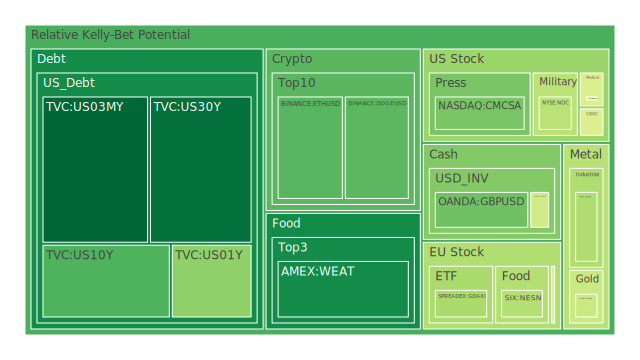
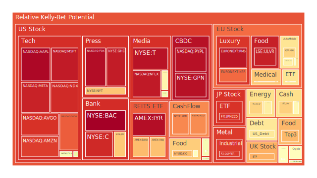
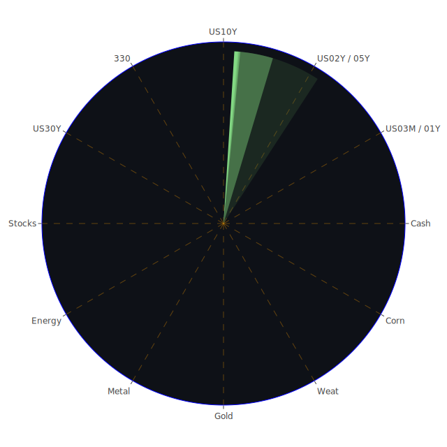

# 投資商品泡沫分析

- **美國國債**
  美國國債的泡沫機率持續下降，特別是30年期國債（US30Y），其泡沫機率從10月5日的0.411690下降至10月7日的0.137618。這顯示出投資者對長期國債的需求增加，可能是因為市場對經濟增長的擔憂以及對安全資產的需求增加。此外，近期的新聞顯示，德國經濟預計將萎縮0.2%，這可能進一步推動對美國國債的需求。

- **美國科技股**
  科技股如Google（GOOG）和Meta（META）的泡沫機率持續高企，分別在0.842936和0.932920左右。這可能受到近期科技股普遍高估值的影響，以及市場對於AI和科技創新的過度樂觀情緒。然而，三星的獲利預期疲弱可能預示著科技股的潛在風險。

- **美國房地產指數**
  房地產相關的ETF如AMEX:VNQ的泡沫機率在0.700730，顯示出市場對房地產的擔憂，特別是在商業房地產違約率上升的背景下。這可能是因為高利率環境下，房地產融資成本增加，導致投資者對該類資產的信心下降。

- **金/銀/銅**
  黃金（XAUUSD）的泡沫機率從10月5日的0.368995下降至10月7日的0.446461，顯示出市場對黃金的需求有所增加，這可能是因為地緣政治風險上升以及市場避險情緒增強所致。銀和銅的泡沫機率則相對較高，顯示出工業金屬市場的不確定性。

- **加密貨幣**
  比特幣（BTCUSD）的泡沫機率在0.562026，顯示出市場對加密貨幣的投資情緒仍然謹慎。近期的新聞顯示，市場對於加密貨幣的監管擔憂可能影響其價格走勢。

- **黃豆 / 小麥 / 玉米**
  小麥（WEAT）的泡沫機率從10月5日的0.116028上升至10月7日的0.188831，顯示出市場對農產品價格的波動性增加，這可能與全球氣候變化和供應鏈問題有關。

- **石油/ 鈾期貨UX!**
  石油（USOIL）的泡沫機率在0.606000，顯示出市場對能源價格的擔憂，特別是在中東地緣政治緊張局勢升溫的背景下。鈾期貨的泡沫機率也較高，顯示出市場對核能需求的不確定性。

- **各國外匯市場**
  英鎊（GBPUSD）的泡沫機率在0.311730，顯示出市場對英國經濟的不確定性，特別是在英國政府政策變動和經濟增長放緩的背景下。

- **各國大盤指數**
  歐洲主要指數如FTSE的泡沫機率在0.730103，顯示出市場對歐洲經濟的擔憂，這可能與德國經濟預期萎縮以及歐洲央行可能降息的消息有關。

- **美國銀行股**
  美國銀行（BAC）的泡沫機率接近1，顯示出市場對銀行業的擔憂，特別是在消費者和信用卡違約率上升的背景下。

- **美國軍工股**
  軍工股如洛克希德·馬丁（LMT）的泡沫機率在0.546994，顯示出市場對軍工股的需求相對穩定，這可能與全球地緣政治風險上升有關。

- **美國電子支付股**
  電子支付股如PayPal（PYPL）的泡沫機率在0.963934，顯示出市場對電子支付行業的高度關注，這可能與數字支付需求的持續增長有關。

- **美國藥商巨頭**
  藥商如禮來（LLY）的泡沫機率在0.476046，顯示出市場對醫藥行業的信心，特別是在疫苗和新藥研發的背景下。

- **美國影視巨頭**
  迪士尼（DIS）的泡沫機率在0.530859，顯示出市場對影視行業的擔憂，這可能與消費者支出減少和競爭加劇有關。

- **美國媒體巨頭**
  媒體股如康卡斯特（CMCSA）的泡沫機率在0.323348，顯示出市場對媒體行業的信心，這可能與廣告收入的增長有關。

- **石油防禦股**
  石油公司如埃克森美孚（XOM）的泡沫機率在0.784824，顯示出市場對能源行業的擔憂，這可能與油價波動和環境政策變動有關。

- **金礦防禦股**
  金礦公司如Royal Gold（RGLD）的泡沫機率在0.778622，顯示出市場對金礦行業的需求，這可能與黃金價格的上升有關。

- **歐洲奢侈品股**
  奢侈品公司如LVMH（MC）的泡沫機率在0.489719，顯示出市場對奢侈品行業的信心，這可能與消費者需求的增長有關。

- **歐洲汽車股**
  汽車公司如BMW的泡沫機率在0.527511，顯示出市場對汽車行業的擔憂，這可能與電動車市場競爭加劇和供應鏈問題有關。

- **歐美食品股**
  食品公司如雀巢（NESN）的泡沫機率在0.408776，顯示出市場對食品行業的信心，這可能與消費者需求的穩定增長有關。

# 投資建議

- **買入建議**：對於泡沫機率持續下降且遠小於0.5的商品，如美國國債和黃金，建議投資者考慮買入，特別是在市場避險情緒增強的背景下。
  
- **賣出建議**：對於泡沫機率持續上升且遠大於0.5的商品，如美國科技股和電子支付股，建議投資者考慮賣出，避免未來價格下跌時的損失。

# 風險提示

投資有風險，市場總是充滿不確定性。我們的建議僅供參考，投資者應根據自身的風險承受能力和投資目標，做出獨立的投資決策。特別是對於泡沫機率高的商品，應該謹慎進行投資決策。
 
Daily Buy Map:

 
Daily Sell Map:

 
Daily Radar Chart:

 
