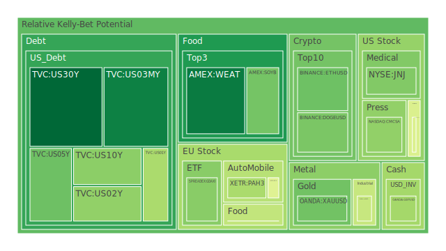
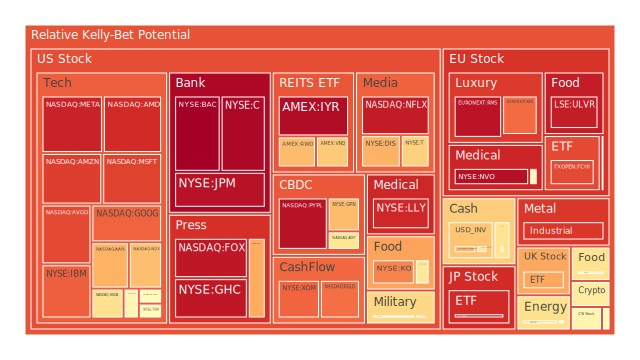
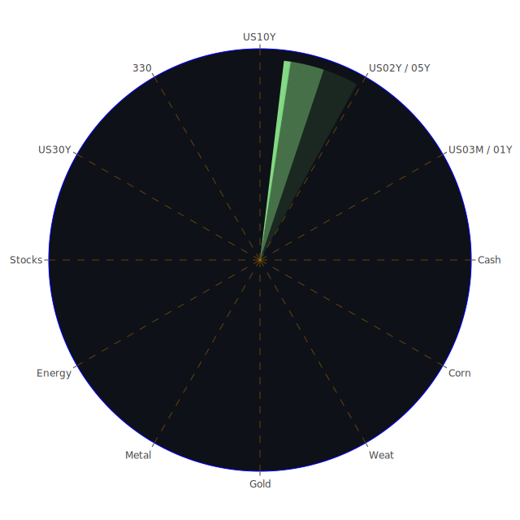

# 投資商品泡沫分析

- **美國國債**
  美國國債的泡沫機率在過去三天內顯示出下降趨勢，特別是30年期國債的泡沫機率從0.137625下降至0.068067，這表明市場對長期國債的需求增加，可能是因為投資者尋求避險資產以應對全球經濟不確定性。根據最新的FED數據，長期國債的殖利率有所上升，這也可能吸引了更多投資者進入市場。

- **美國科技股**
  科技股的泡沫機率普遍偏高，特別是微軟和亞馬遜的泡沫機率分別達到0.874537和0.879868。這可能與近期科技股的高估值和市場對於AI技術的過度樂觀預期有關。然而，新聞報導指出三星在AI芯片市場的困境，這可能預示著科技股未來的波動性。

- **加密貨幣**
  比特幣的泡沫機率在過去三天內有所上升，從0.423391增至0.586962，顯示出市場對加密貨幣的風險偏好減弱。這可能與全球經濟不確定性增加以及監管環境的變化有關。

- **金/銀/銅**
  黃金的泡沫機率顯著下降，從0.325742降至0.270130，這可能是因為投資者在面對市場不確定性時，將黃金視為避險資產。與此同時，銅的泡沫機率仍然很高，達到0.891686，這可能反映出市場對於全球經濟增長放緩的擔憂。

- **石油/ 鈾期貨UX!**
  石油的泡沫機率在過去三天內有所下降，從0.717395降至0.525353，這可能是由於市場對於中東地區緊張局勢的擔憂有所緩解。然而，鈾期貨的泡沫機率仍然較高，這可能與全球能源轉型帶來的需求預期有關。

- **各國外匯市場**
  美元兌日元的泡沫機率在過去三天內上升，這可能反映出市場對於美元的需求增加，特別是在全球經濟不確定性加劇的情況下。

- **各國大盤指數**
  歐洲主要股指的泡沫機率普遍偏高，這可能與歐洲經濟增長放緩以及地緣政治風險上升有關。

# 投資建議

1. **長期國債**：考慮增加配置，因為其泡沫機率下降且市場需求增加，適合作為避險資產。
2. **科技股**：建議謹慎觀望，特別是對於泡沫機率高的科技股，因為市場可能對其未來增長過於樂觀。
3. **黃金**：考慮增加配置，作為對抗市場不確定性的避險資產。
4. **加密貨幣**：建議謹慎，因為其泡沫機率上升，市場風險增加。
5. **石油**：考慮減少配置，因為泡沫機率下降且市場對中東局勢的擔憂有所緩解。

# 風險提示

投資有風險，市場總是充滿不確定性。我們的建議僅供參考，投資者應根據自身的風險承受能力和投資目標，做出獨立的投資決策。特別是對於泡沫機率高的商品，應該謹慎進行投資決策。
 
Daily Buy Map:

 
Daily Sell Map:

 
Daily Radar Chart:

 
