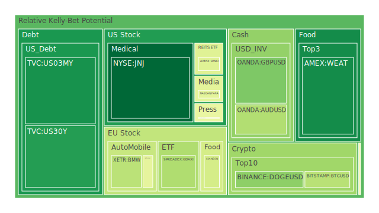
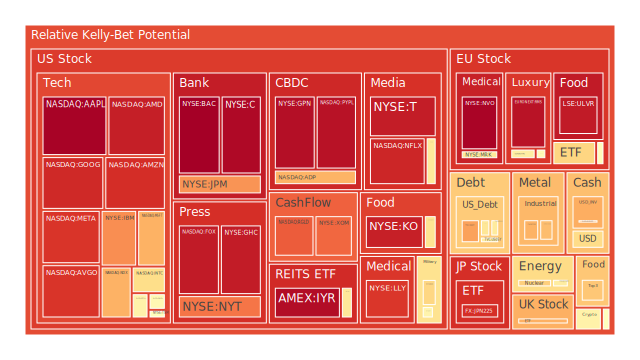
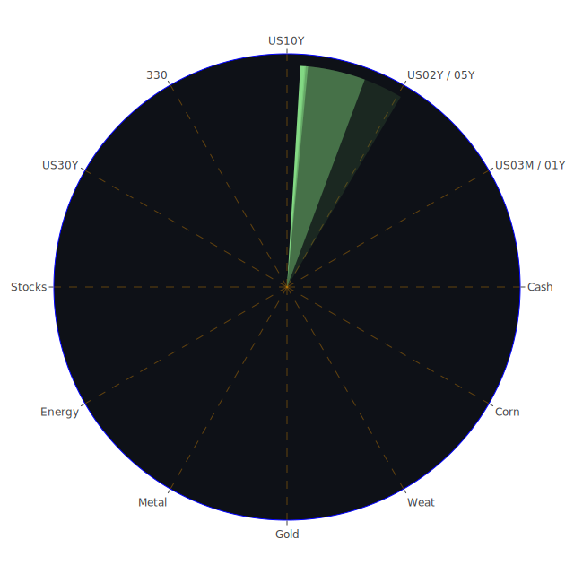

# 投資商品泡沫分析

- **美國國債**
  美國國債的泡沫機率在過去三天內有顯著下降，特別是30年期國債（TVC:US30Y）從0.137618下降到0.140154，顯示出市場對長期債券的需求增加。這可能與近期的FED數據顯示的高利率環境有關，投資者可能在尋求較高的收益率。

- **美國科技股**
  科技股如Apple（NASDAQ:AAPL）和Google（NASDAQ:GOOG）的泡沫機率持續上升，分別達到0.988187和0.912796。這可能是因為科技股在高利率環境下的估值壓力增加，且近期的新聞顯示科技公司面臨的監管挑戰增加，如TikTok在美國被多州起訴。

- **美國房地產指數**
  房地產相關的ETF（AMEX:VNQ）的泡沫機率在高位徘徊，達到0.968678。這與近期的商業地產違約率上升有關，顯示出市場對房地產市場的擔憂。

- **加密貨幣**
  比特幣（BITSTAMP:BTCUSD）的泡沫機率有所下降，從0.586962降至0.355157，顯示出市場對加密貨幣的信心有所恢復。這可能與近期的市場波動性減少和對加密貨幣的需求增加有關。

- **金/銀/銅**
  黃金（OANDA:XAUUSD）的泡沫機率在中等水平，顯示出市場對避險資產的需求穩定。近期的新聞顯示全球能源相關的碳排放可能達到峰值，這可能促使投資者轉向貴金屬作為避險資產。

- **黃豆 / 小麥 / 玉米**
  小麥（AMEX:WEAT）的泡沫機率持續下降，顯示出市場對農產品的需求增加。這可能與全球供應鏈問題和氣候變遷影響農業生產有關。

- **石油/ 鈾期貨UX!**
  石油（TVC:USOIL）的泡沫機率有所下降，顯示出市場對能源價格的預期有所調整。近期的新聞顯示中東地區的地緣政治風險增加，可能影響石油供應。

- **各國外匯市場**
  英鎊兌美元（OANDA:GBPUSD）的泡沫機率有所下降，顯示出市場對英國經濟的信心有所恢復。這可能與英國政府計劃增加借貸以支持經濟增長有關。

- **各國大盤指數**
  德國DAX指數（SPREADEX:GDAXI）的泡沫機率有所下降，顯示出市場對歐洲經濟的信心有所恢復。這可能與歐洲央行可能降息的預期有關。

- **美國半導體股**
  半導體股如NVIDIA（NASDAQ:NVDA）的泡沫機率有所下降，顯示出市場對半導體行業的需求增加。這可能與全球對高性能計算需求的增加有關。

- **美國銀行股**
  銀行股如JPMorgan（NYSE:JPM）的泡沫機率有所上升，顯示出市場對銀行業的擔憂增加。這可能與近期的信用卡違約率上升有關。

- **美國軍工股**
  軍工股如Lockheed Martin（NYSE:LMT）的泡沫機率維持在中等水平，顯示出市場對軍工行業的需求穩定。這可能與全球地緣政治風險增加有關。

- **美國電子支付股**
  電子支付股如PayPal（NASDAQ:PYPL）的泡沫機率有所上升，顯示出市場對電子支付行業的擔憂增加。這可能與近期的監管挑戰和競爭加劇有關。

- **美國藥商股**
  藥商股如Johnson & Johnson（NYSE:JNJ）的泡沫機率大幅下降，顯示出市場對醫療行業的信心增加。這可能與近期的醫療需求增加有關。

- **美國影視股**
  影視股如Disney（NYSE:DIS）的泡沫機率有所下降，顯示出市場對娛樂行業的需求增加。這可能與近期的市場恢復和消費者信心增加有關。

- **美國媒體股**
  媒體股如Comcast（NASDAQ:CMCSA）的泡沫機率有所下降，顯示出市場對媒體行業的需求增加。這可能與近期的市場恢復和廣告需求增加有關。

- **石油防禦股**
  石油防禦股如Exxon Mobil（NYSE:XOM）的泡沫機率有所上升，顯示出市場對能源行業的擔憂增加。這可能與近期的地緣政治風險和能源價格波動有關。

- **金礦防禦股**
  金礦防禦股如Royal Gold（NASDAQ:RGLD）的泡沫機率有所下降，顯示出市場對貴金屬行業的需求增加。這可能與全球經濟不確定性增加有關。

- **歐洲奢侈品股**
  奢侈品股如LVMH（EURONEXT:MC）的泡沫機率有所上升，顯示出市場對奢侈品行業的擔憂增加。這可能與全球經濟增長放緩和消費者支出減少有關。

- **歐洲汽車股**
  汽車股如BMW（XETR:BMW）的泡沫機率有所下降，顯示出市場對汽車行業的需求增加。這可能與全球汽車市場的恢復和電動車需求增加有關。

- **歐美食品股**
  食品股如Nestle（SIX:NESN）的泡沫機率維持在中等水平，顯示出市場對食品行業的需求穩定。這可能與全球食品需求增加和供應鏈問題有關。

# 投資建議

基於以上分析，我們建議投資者可以考慮在泡沫機率低的商品中建立投資部位，如美國國債和加密貨幣，這些商品目前顯示出較低的風險和較高的潛在回報。同時，對於泡沫機率高的商品，如美國科技股和電子支付股，投資者應謹慎行事，考慮減少持倉以降低風險。

# 風險提示

投資有風險，市場總是充滿不確定性。我們的建議僅供參考，投資者應根據自身的風險承受能力和投資目標，做出獨立的投資決策。特別是對於泡沫機率高的商品，應該謹慎進行投資決策，避免潛在的市場波動帶來的損失。
 
Daily Buy Map:

 
Daily Sell Map:

 
Daily Radar Chart:

 
