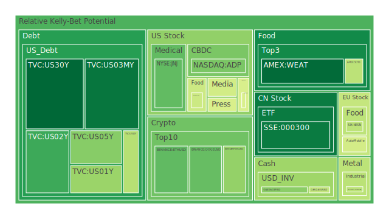
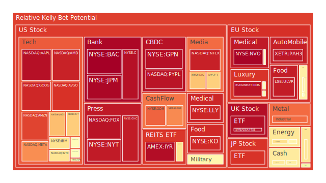
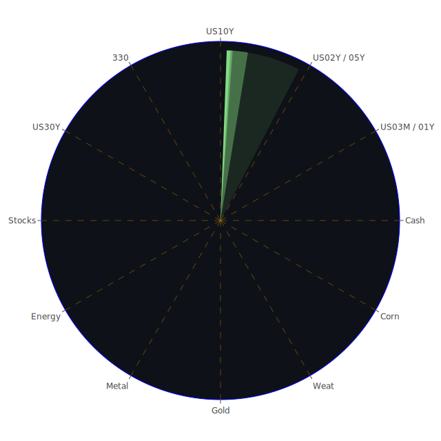

# 投資商品泡沫分析

- **美國國債**
  美國國債的泡沫機率在過去三天內顯示出下降趨勢，尤其是30年期國債的泡沫機率從0.140154降至0.103053，這反映出市場對長期債券的需求增加。這可能與近期聯準會的鷹派言論有關，投資者預期利率將維持在較高水平，從而增加了對長期固定收益資產的吸引力。

- **美國科技股**
  美國科技股的泡沫機率普遍較高，特別是像META和GOOG這樣的公司，泡沫機率分別達到0.928009和0.922205。這可能受到近期科技行業的新聞影響，例如TikTok面臨的法律挑戰和AI技術的發展。投資者應該謹慎對待這些高泡沫機率的科技股，特別是在市場情緒不穩定的情況下。

- **加密貨幣**
  比特幣的泡沫機率從0.355157下降至0.346095，顯示出市場對加密貨幣的信心略有回升。然而，ETH的泡沫機率仍然較高，建議投資者在進行加密貨幣投資時保持謹慎，特別是在市場波動性較大的時期。

- **金/銀/銅**
  黃金的泡沫機率有所下降，從0.514888降至0.496777，這可能與全球經濟不確定性增加有關，投資者轉向避險資產。銀和銅的泡沫機率則顯示出不同的趨勢，銀的泡沫機率略有下降，而銅的泡沫機率則相對較高，這可能受到全球製造業需求波動的影響。

- **石油/鈾期貨UX!**
  石油的泡沫機率從0.567913上升至0.580980，顯示出市場對石油需求的擔憂，特別是在中東地區局勢緊張的背景下。鈾期貨的泡沫機率則相對穩定，建議投資者在考慮能源類資產時，應關注地緣政治風險。

- **各國外匯市場**
  英鎊和歐元的泡沫機率顯示出不同的走勢，英鎊的泡沫機率從0.260277上升至0.333365，而歐元的泡沫機率則從0.705876下降至0.420722。這可能與英國和歐洲的經濟政策和市場預期變化有關。

# 投資建議

1. **美國國債**：由於泡沫機率下降且市場對長期債券的需求增加，建議考慮增加美國長期國債的持倉。
   
2. **美國科技股**：由於泡沫機率較高且市場情緒不穩定，建議減少對高泡沫科技股的投資，特別是META和GOOG。

3. **加密貨幣**：比特幣的泡沫機率下降，顯示出一定的投資機會，但仍需謹慎。

4. **金/銀/銅**：黃金的避險屬性仍然吸引投資者，建議在市場不確定性增加時考慮增加黃金持倉。

5. **石油/鈾期貨**：考慮到中東局勢的影響，建議在投資石油時保持謹慎。

# 風險提示

投資有風險，市場總是充滿不確定性。我們的建議僅供參考，投資者應根據自身的風險承受能力和投資目標，做出獨立的投資決策。特別是對於泡沫機率高的商品，應該謹慎進行投資決策，避免潛在的市場波動帶來的損失。
 
Daily Buy Map:

 
Daily Sell Map:

 
Daily Radar Chart:

 
