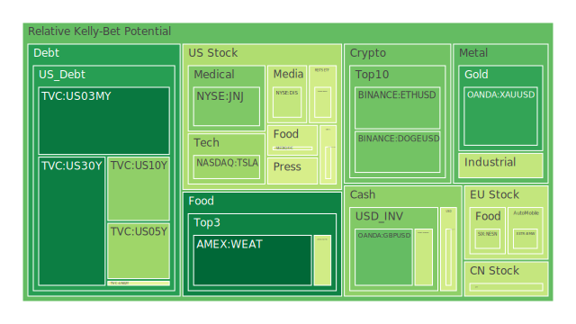
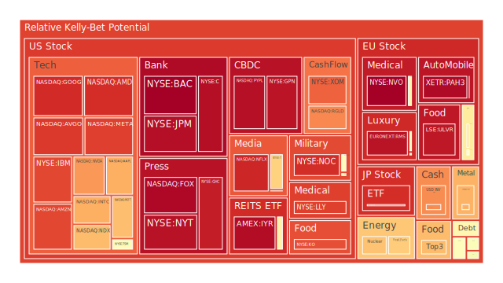
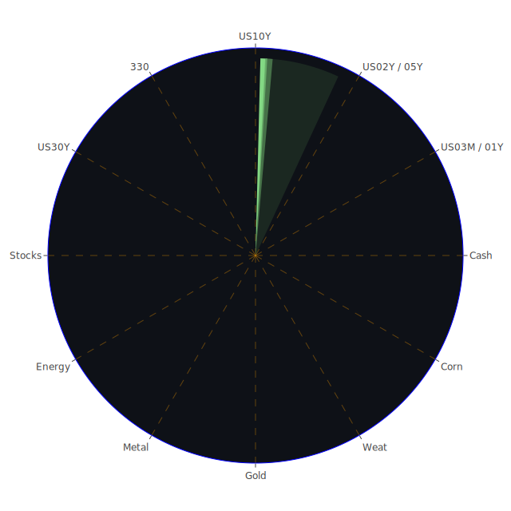

# 投資商品泡沫分析

- **美國國債**
  美國國債的泡沫機率在過去三天內有小幅波動，但整體趨勢是下降的。這可能與近期美國經濟數據顯示的通脹壓力減弱有關，儘管SOFR交易量上升，但未超過FED Fund Rate + 0.2的危險水平。這意味著目前美國國債的投資風險相對較低。

- **美國科技股**
  科技股的泡沫機率普遍偏高，尤其是像META、GOOG和NFLX等公司。這些股票的泡沫機率持續上升，並且新聞中提到的TikTok訴訟和美國科技公司面臨的監管壓力可能進一步影響市場情緒。建議投資者謹慎行事，考慮減少持倉。

- **加密貨幣**
  比特幣和以太坊的泡沫機率在過去三天內有所下降，這可能是因為市場對於加密貨幣的需求回升。然而，考慮到整體市場的不確定性和潛在的監管風險，投資者應該保持警惕。

- **金/銀/銅**
  黃金的泡沫機率顯著下降，這與近期全球經濟不確定性增加有關，黃金作為避險資產的需求上升。銀和銅的泡沫機率則相對較高，這可能是因為市場對工業金屬需求的擔憂。

- **石油/鈾期貨UX!**
  石油的泡沫機率上升，受全球經濟增長放緩和能源需求不確定性影響。鈾期貨的泡沫機率也較高，這可能與市場對核能需求的預期變化有關。

- **各國外匯市場**
  美元兌日元和歐元的泡沫機率均呈現下降趨勢，這可能反映了市場對美元的需求增加，特別是在全球經濟不確定性增加的背景下。

- **各國大盤指數**
  歐洲和美國的大盤指數泡沫機率普遍較高，這可能是因為市場對於全球經濟增長的擔憂加劇。建議投資者在此類資產上保持謹慎。

# 投資建議

1. **考慮減少科技股持倉**：由於科技股的泡沫機率較高，且面臨監管壓力，建議投資者考慮減少持倉以降低風險。

2. **增加黃金配置**：黃金的泡沫機率下降，且市場不確定性增加，黃金作為避險資產的需求可能上升，適合增加配置。

3. **謹慎對待石油和鈾期貨**：這些商品的泡沫機率較高，建議投資者謹慎操作，避免過度暴露於高風險資產。

# 風險提示

投資有風險，市場總是充滿不確定性。我們的建議僅供參考，投資者應根據自身的風險承受能力和投資目標，做出獨立的投資決策。特別是對於泡沫機率高的商品，應該謹慎進行投資決策。
 
Daily Buy Map:

 
Daily Sell Map:

 
Daily Radar Chart:

 
