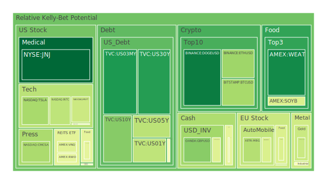
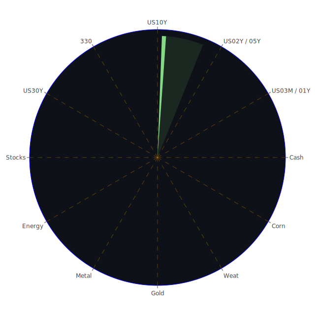

# 投資商品泡沫分析

- **美國國債**
  美國國債的泡沫機率在過去三天內有輕微的變動。30年期國債的泡沫機率略微上升，但仍然低於0.2，顯示市場對長期債券的需求穩定。這與近期美國國債殖利率上升有關，特別是30年期國債殖利率從上週的4.18%上升到目前的4.41%，顯示市場對長期利率的預期有所調整。

- **美國科技股**
  科技股如蘋果 (AAPL) 和微軟 (MSFT) 的泡沫機率仍然較高，分別為0.717和0.379。儘管微軟的泡沫機率有所下降，但整體科技股的高估值仍需謹慎對待。新聞中提到的美國科技公司如特斯拉 (TSLA) 的新產品發佈，可能會對市場情緒產生影響。

- **美國房地產指數**
  房地產相關的ETF如VNQ的泡沫機率略有下降，但仍在0.4以上，顯示市場對房地產的信心有所回升。然而，商業房地產的拖欠率上升，可能會對未來的房地產市場造成壓力。

- **加密貨幣**
  比特幣 (BTC) 和以太坊 (ETH) 的泡沫機率分別為0.310和0.296，顯示市場對加密貨幣的信心有所增強。這可能與近期市場對於加密貨幣的接受度提高有關。

- **金/銀/銅**
  黃金的泡沫機率略有下降至0.377，顯示市場對黃金的避險需求增加。這與近期中東地緣政治緊張局勢有關，投資者尋求避險資產。

- **黃豆 / 小麥 / 玉米**
  小麥 (WEAT) 的泡沫機率持續下降至0.082，顯示市場對農產品的需求穩定。這可能與全球供應鏈恢復有關。

- **石油/ 鈾期貨UX!**
  石油的泡沫機率上升至0.603，顯示市場對石油價格的波動性增加。這與中東局勢緊張和供應鏈不穩定有關。

- **各國外匯市場**
  英鎊兌美元 (GBPUSD) 的泡沫機率穩定在0.262，顯示市場對英國經濟的信心有所增強，這可能與英國政府的財政政策有關。

- **各國大盤指數**
  歐洲大盤指數如德國DAX (GDAXI) 的泡沫機率略有上升，顯示市場對歐洲經濟的擔憂加劇。

- **美國半導體股**
  半導體股如英特爾 (INTC) 的泡沫機率上升至0.353，顯示市場對半導體行業的前景持謹慎態度。

- **美國銀行股**
  銀行股如摩根大通 (JPM) 的泡沫機率上升至0.947，顯示市場對銀行業的信心受到挑戰，這可能與近期的經濟數據和銀行業績有關。

- **美國軍工股**
  軍工股如洛克希德馬丁 (LMT) 的泡沫機率保持穩定，顯示市場對軍工行業的需求穩定。

- **美國電子支付股**
  電子支付股如PayPal (PYPL) 的泡沫機率高達0.950，顯示市場對電子支付行業的競爭加劇感到擔憂。

- **美國藥商股**
  藥商股如輝瑞 (PFE) 的泡沫機率略有下降，顯示市場對醫藥行業的信心有所回升。

- **美國影視股**
  影視股如迪士尼 (DIS) 的泡沫機率上升至0.572，顯示市場對影視行業的前景持謹慎態度。

- **美國媒體股**
  媒體股如Netflix (NFLX) 的泡沫機率高達0.949，顯示市場對媒體行業的競爭加劇感到擔憂。

- **石油防禦股**
  石油防禦股如埃克森美孚 (XOM) 的泡沫機率上升至0.843，顯示市場對石油行業的前景持謹慎態度。

- **金礦防禦股**
  金礦防禦股的泡沫機率略有下降，顯示市場對黃金的避險需求增加。

- **歐洲奢侈品股**
  奢侈品股如LVMH的泡沫機率略有上升，顯示市場對奢侈品行業的需求持謹慎態度。

- **歐洲汽車股**
  汽車股如BMW的泡沫機率略有下降，顯示市場對汽車行業的信心有所增強。

- **歐美食品股**
  食品股如雀巢 (NESN) 的泡沫機率略有下降，顯示市場對食品行業的需求穩定。

# 投資建議

根據以上分析，建議投資者對於泡沫機率高的科技股和銀行股保持謹慎，考慮減少持倉以降低風險。對於泡沫機率低的黃金和小麥等避險資產，可以考慮增加持倉以分散風險。

# 風險提示

投資有風險，市場總是充滿不確定性。我們的建議僅供參考，投資者應根據自身的風險承受能力和投資目標，做出獨立的投資決策。特別是對於泡沫機率高的商品，應該謹慎進行投資決策。
 
Daily Buy Map:

 
Daily Sell Map:

 
Daily Radar Chart:

 
