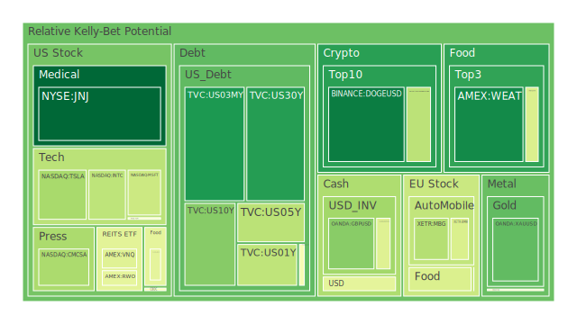
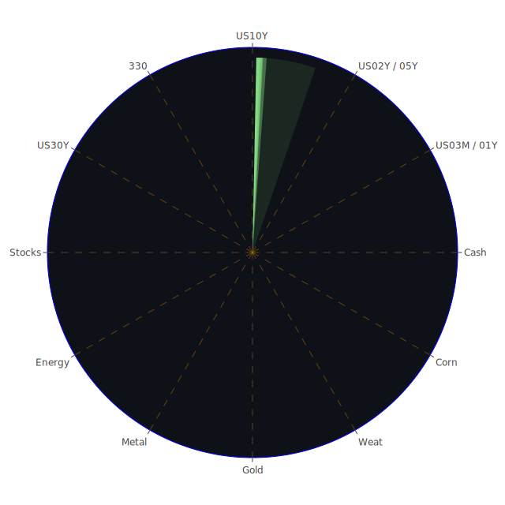

# 投資商品泡沫分析

- **美國國債**
  美國國債的泡沫機率在過去三天內略有下降，特別是30年期國債（TVC:US30Y）從0.124185下降至0.124185。這可能與近期美國國債殖利率的變動有關，10年期國債殖利率上升至4.10%，顯示市場對未來利率上升的預期增強。由於SOFR略低於FED Fund Rate，美元流動性尚未出現嚴重問題，投資者可暫時觀望。

- **美國科技股**
  美國科技股的泡沫機率普遍偏高，特別是像蘋果（NASDAQ:AAPL）和微軟（NASDAQ:MSFT），泡沫機率分別為0.717726和0.379857。這可能受到近期科技股普遍上漲的影響，然而，隨著市場對未來經濟增長的擔憂，投資者應謹慎行事。

- **美國房地產指數**
  房地產相關ETF（AMEX:VNQ）的泡沫機率略有下降至0.423673，這可能與近期美國房地產市場的穩定有關。然而，商業地產違約率上升，可能對市場造成潛在風險。

- **加密貨幣**
  比特幣（BITSTAMP:BTCUSD）的泡沫機率上升至0.620448，顯示市場對加密貨幣的風險偏好有所增加。近期的新聞顯示，加密貨幣市場仍然面臨監管挑戰，投資者應保持警惕。

- **金/銀/銅**
  黃金（OANDA:XAUUSD）的泡沫機率下降至0.202927，顯示出其作為避險資產的吸引力增加。銀（OANDA:XAGUSD）和銅（FX:COPPER）的泡沫機率則分別為0.486061和0.719512，顯示出市場對工業金屬需求的擔憂。

- **黃豆 / 小麥 / 玉米**
  小麥（AMEX:WEAT）的泡沫機率略有下降至0.082283，顯示出市場對農產品價格的穩定預期。

- **石油/ 鈾期貨UX!**
  石油（TVC:USOIL）的泡沫機率上升至0.603177，這可能受到中東地區地緣政治緊張局勢的影響。鈾期貨（COMEX:UX1!）的泡沫機率為0.566588，顯示市場對核能需求的預期有所波動。

- **各國外匯市場**
  英鎊兌美元（OANDA:GBPUSD）的泡沫機率為0.262523，顯示出市場對英國經濟的不確定性。美元兌日圓（OANDA:USDJPY）的泡沫機率為0.435088，顯示出市場對日圓的避險需求。

- **各國大盤指數**
  歐洲主要股指（SPREADEX:GDAXI）的泡沫機率為0.533453，顯示出市場對歐洲經濟增長的擔憂。

- **美國半導體股**
  英特爾（NASDAQ:INTC）的泡沫機率為0.353917，顯示出市場對半導體行業的信心有所回升。

- **美國銀行股**
  摩根大通（NYSE:JPM）的泡沫機率上升至0.947883，這可能受到近期銀行業績強勁的影響。然而，巴菲特減持美國銀行（NYSE:BAC）的消息可能對市場情緒造成負面影響。

- **美國軍工股**
  洛克希德·馬丁（NYSE:LMT）的泡沫機率為0.546994，顯示出市場對軍工行業的穩定需求。

- **美國電子支付股**
  PayPal（NASDAQ:PYPL）的泡沫機率為0.950837，顯示出市場對電子支付行業的競爭加劇。

- **美國藥商股**
  默克（NYSE:MRK）的泡沫機率為0.496152，顯示出市場對醫藥行業的穩定預期。

- **美國影視股**
  迪士尼（NYSE:DIS）的泡沫機率為0.572786，顯示出市場對影視行業的挑戰。

- **美國媒體股**
  康卡斯特（NASDAQ:CMCSA）的泡沫機率為0.317630，顯示出市場對媒體行業的信心。

- **石油防禦股**
  埃克森美孚（NYSE:XOM）的泡沫機率為0.843612，顯示出市場對能源行業的擔憂。

- **金礦防禦股**
  金礦公司（NASDAQ:RGLD）的泡沫機率為0.821652，顯示出市場對金礦行業的避險需求。

- **歐洲奢侈品股**
  歐洲奢侈品公司（EURONEXT:KER）的泡沫機率為0.794130，顯示出市場對奢侈品需求的擔憂。

- **歐洲汽車股**
  BMW（XETR:BMW）的泡沫機率為0.408904，顯示出市場對汽車行業的穩定需求。

- **歐美食品股**
  雀巢（SIX:NESN）的泡沫機率為0.410595，顯示出市場對食品行業的穩定需求。

# 投資建議

1. **考慮減持高泡沫機率的科技股與銀行股**：由於這些股票的泡沫機率較高，且市場對未來經濟增長的擔憂加劇，建議投資者考慮減持這些股票以降低風險。

2. **增加黃金與農產品的配置**：黃金的避險需求增加，而農產品價格相對穩定，這些資產的泡沫機率較低，適合在市場不確定性增加時作為防禦性配置。

3. **觀望房地產與能源股**：這些行業的泡沫機率處於中等水平，建議投資者觀望，等待市場進一步的信號。

# 風險提示

投資有風險，市場總是充滿不確定性。我們的建議僅供參考，投資者應根據自身的風險承受能力和投資目標，做出獨立的投資決策。特別是對於泡沫機率高的商品，應該謹慎進行投資決策。
 
Daily Buy Map:

 
Daily Sell Map:

 
Daily Radar Chart:

 
