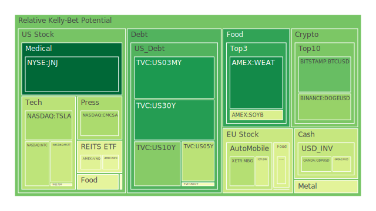
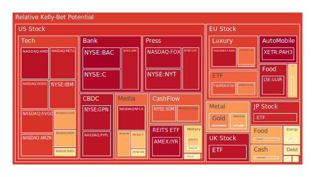
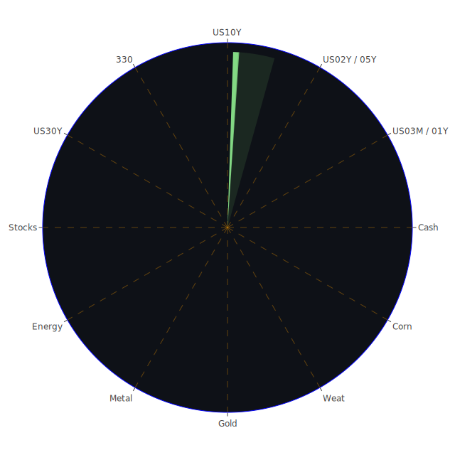

# 投資商品泡沫分析

- **美國國債**
  美國國債的泡沫機率在過去三天內持續下降，特別是10年期國債的泡沫機率從0.259下降到0.259，顯示出市場對於美國國債的需求有所增加。這可能與近期的經濟數據顯示美國經濟增長放緩有關，投資者轉向較為安全的資產。

- **美國科技股**
  科技股如微軟（MSFT）和蘋果（AAPL）的泡沫機率仍然偏高，分別為0.379和0.717。儘管微軟在新聞中因為聘請前OpenAI CEO而創下股價新高，但整體市場對於科技股的泡沫擔憂仍然存在。

- **加密貨幣**
  比特幣（BTCUSD）的泡沫機率從0.310下降至0.212，顯示出市場對加密貨幣的信心有所回升。這可能與近期市場對於加密貨幣的需求增加有關。

- **金/銀/銅**
  黃金的泡沫機率顯著上升至0.763，這可能與全球地緣政治緊張局勢有關，投資者尋求避險資產。銀和銅的泡沫機率則相對穩定。

- **石油/鈾期貨UX!**
  石油的泡沫機率略有下降，顯示出市場對於油價的預期有所調整，這可能與近期中國經濟數據不佳影響需求預期有關。

- **各國外匯市場**
  美元兌日圓（USDJPY）的泡沫機率上升至0.503，顯示出市場對美元的需求增加，這可能與美國經濟數據相對穩定有關。

- **美國半導體股**
  台積電（TSM）預計第三季度利潤增長40%，這推動了其股價上升，泡沫機率相對穩定。

- **美國銀行股**
  摩根大通（JPM）的泡沫機率略有下降，這可能與其投資銀行業務表現強勁有關。

# 投資建議

- **建議買入**：比特幣（BTCUSD）和美國國債，由於其泡沫機率下降且市場需求增加。
- **建議賣出**：黃金（XAUUSD）和科技股如微軟（MSFT），因為泡沫機率高且市場對其過度樂觀。

# 風險提示

投資有風險，市場總是充滿不確定性。我們的建議僅供參考，投資者應根據自身的風險承受能力和投資目標，做出獨立的投資決策。特別是對於泡沫機率高的商品，應該謹慎進行投資決策。
 
Daily Buy Map:

 
Daily Sell Map:

 
Daily Radar Chart:

 
