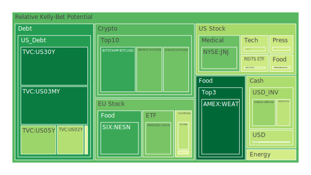
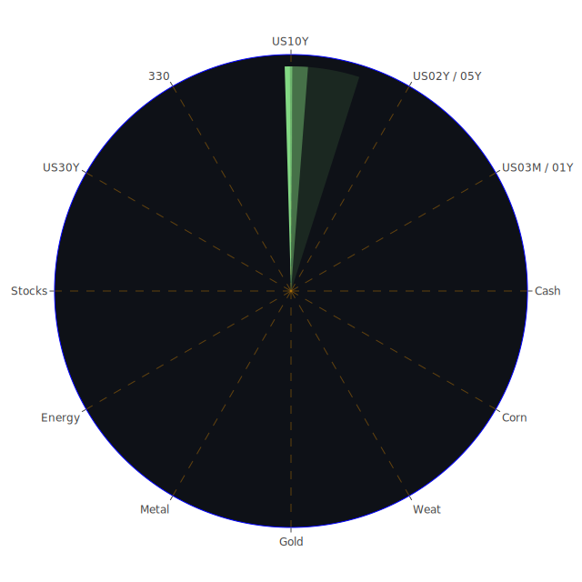

# 投資商品泡沫分析

- **美國國債**
  美國國債的泡沫機率在過去三天內呈現穩定下降的趨勢，尤其是30年期國債（TVC:US30Y）的泡沫機率從0.124185下降至0.121608。這顯示出投資者對長期國債的信心有所回升。根據FED的數據，雖然美國國債殖利率略有上升，但整體市場對於美國國債的需求依然強勁，特別是在全球經濟不確定性增加的情況下。

- **美國科技股**
  美國科技股如微軟（NASDAQ:MSFT）和特斯拉（NASDAQ:TSLA）的泡沫機率在過去三天有明顯的上升。微軟的泡沫機率從0.379857上升至0.421316，特斯拉則從0.313006上升至0.551998。這可能與近期科技股的高估值和市場對於未來盈利增長的擔憂有關。此外，新聞報導中提到的科技股創新高可能進一步推高了市場的投機情緒。

- **美國房地產指數**
  房地產相關的ETF如AMEX:VNQ的泡沫機率在過去三天內有所上升，從0.423673上升至0.574073。這與新聞中提到的美國房地產市場面臨的挑戰相符，特別是在高利率環境下，房地產市場的流動性可能受到影響。

- **加密貨幣**
  比特幣（BITSTAMP:BTCUSD）的泡沫機率在過去三天內有所下降，從0.212382下降至0.211595。這顯示出市場對於比特幣的信心有所增強，可能是因為近期市場對於加密貨幣的接受度提高，以及一些國家開始考慮將加密貨幣納入其金融體系。

- **金/銀/銅**
  黃金（OANDA:XAUUSD）的泡沫機率在過去三天內有所上升，從0.509616上升至0.763408。這可能是因為市場對於避險資產的需求增加，特別是在全球地緣政治緊張局勢升溫的背景下。

- **黃豆 / 小麥 / 玉米**
  小麥（AMEX:WEAT）的泡沫機率在過去三天內略有下降，從0.089404下降至0.082283。這可能與全球農產品供應鏈的改善有關，特別是在中國經濟數據不佳的情況下，市場對於農產品的需求有所減少。

- **石油/ 鈾期貨UX!**
  石油（TVC:USOIL）的泡沫機率在過去三天內有所上升，從0.547597上升至0.576662。這可能是因為全球經濟增長放緩，導致市場對於石油需求的擔憂增加。此外，新聞中提到的中國經濟數據不佳也可能對石油市場造成壓力。

- **各國外匯市場**
  外匯市場中，英鎊兌美元（OANDA:GBPUSD）的泡沫機率在過去三天內有所下降，從0.347108下降至0.342485。這可能是因為英國近期的經濟政策和市場對於英國經濟的信心有所改善。

- **各國大盤指數**
  歐洲主要股指如SPREADEX:GDAXI的泡沫機率在過去三天內有所下降，從0.767545下降至0.297773。這可能與歐洲市場對於經濟復甦的信心增強有關，特別是在一些國家推出新的經濟刺激政策後。

# 投資建議

根據以上分析，我們建議投資者在當前市場環境下謹慎行事：

1. **考慮減持高泡沫機率的科技股**，如微軟和特斯拉，因為這些股票的估值可能已經過高，且市場對於未來盈利增長的預期可能過於樂觀。

2. **增加對於低泡沫機率的黃金和比特幣的配置**，這些資產在當前全球經濟不確定性增加的情況下，可能提供較好的避險效果。

3. **謹慎觀望房地產市場**，由於高利率環境可能對房地產市場造成壓力，建議投資者在進行房地產相關投資時保持謹慎。

# 風險提示

投資有風險，市場總是充滿不確定性。我們的建議僅供參考，投資者應根據自身的風險承受能力和投資目標，做出獨立的投資決策。特別是對於泡沫機率高的商品，應該謹慎進行投資決策，以避免潛在的市場波動帶來的損失。
 
Daily Buy Map:

 
Daily Sell Map:

 
Daily Radar Chart:

 
