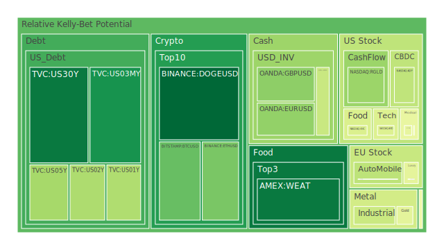
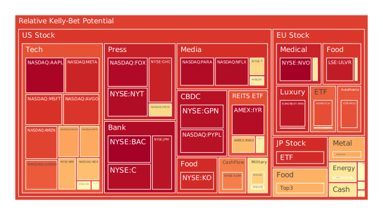
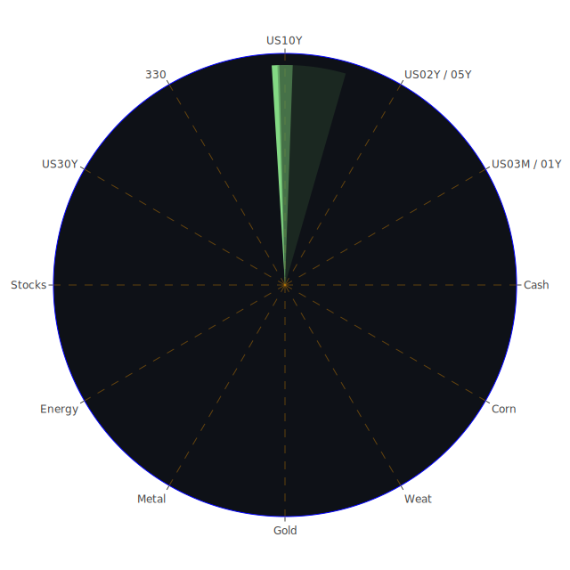

# 投資商品泡沫分析

- **美國國債**
  美國國債的泡沫機率在過去三天內呈現下降趨勢，特別是30年期國債（US30Y）從0.121608下降至0.088522。這表明市場對長期美債的需求增加，可能是因為投資者尋求避險資產，特別是在全球經濟不確定性增加的情況下。近期的新聞顯示，全球經濟面臨挑戰，尤其是中國經濟數據不佳，這可能促使資金流入美國國債。

- **美國科技股**
  美國科技股的泡沫機率普遍較高，例如微軟（MSFT）在10月16日的泡沫機率達到0.898334。儘管微軟股價創下歷史新高，但市場對科技股的高估值仍需謹慎。新聞指出，科技股受到ASML銷售預測疲軟的影響，這可能進一步加劇市場對科技股的擔憂。

- **加密貨幣**
  比特幣（BTCUSD）的泡沫機率在過去三天內略有上升，從0.211595增加到0.246480，顯示市場對加密貨幣的興趣仍然高漲。然而，市場波動性仍然很大，投資者應該謹慎行事。

- **金/銀/銅**
  黃金（XAUUSD）的泡沫機率在過去三天內有所下降，從0.509616降至0.459902，顯示出市場對黃金的需求增加。這可能是由於全球地緣政治風險上升，投資者尋求避險資產所致。

- **石油/鈾期貨UX!**
  石油的泡沫機率在過去三天內有所下降，從0.576662降至0.529878。儘管如此，近期的新聞顯示，石油價格因中國經濟數據不佳而下跌，這可能對石油市場造成進一步的壓力。

- **各國外匯市場**
  歐元兌美元（EURUSD）的泡沫機率在過去三天內下降，從0.403474降至0.309561，顯示出市場對歐元的需求增加。這可能是由於歐洲央行的政策預期以及市場對美元的需求減少所致。

- **美國半導體股**
  英特爾（INTC）的泡沫機率在過去三天內上升，從0.608289增加到0.719516，顯示出市場對半導體股的擔憂增加。這可能與近期科技股的疲軟表現有關。

- **美國銀行股**
  摩根大通（JPM）的泡沫機率在過去三天內上升，從0.921740增加到0.955811，顯示出市場對銀行股的擔憂增加。這可能與近期的經濟數據和市場對未來利率走勢的不確定性有關。

# 投資建議

- 對於泡沫機率持續下降且遠小於0.5的商品，如黃金（XAUUSD），建議投資者考慮買入，因為其避險屬性在當前市場環境下可能提供良好的保值效果。
- 對於泡沫機率持續上升且遠大於0.5的商品，如美國科技股和銀行股，建議投資者考慮賣出，避免未來價格下跌時的損失。
- 對於泡沫機率在0.45至0.55之間的商品，如美國國債，建議投資者觀望，等待市場進一步的明確信號。

# 風險提示

投資有風險，市場總是充滿不確定性。我們的建議僅供參考，投資者應根據自身的風險承受能力和投資目標，做出獨立的投資決策。特別是對於泡沫機率高的商品，應該謹慎進行投資決策。
 
Daily Buy Map:

 
Daily Sell Map:

 
Daily Radar Chart:

 
