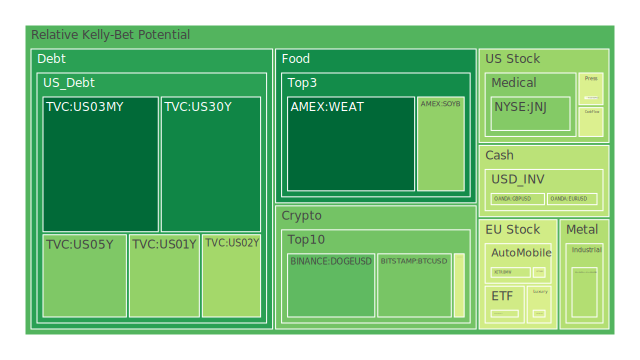
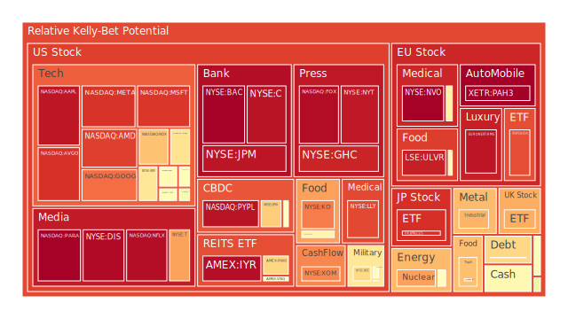
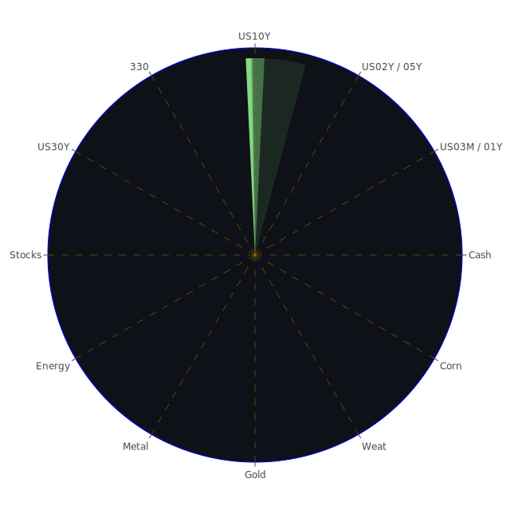

# 投資商品泡沫分析

- **美國國債**
  美國國債的泡沫機率在過去三天中顯示出穩定的下降趨勢，特別是30年期國債(TVC:US30Y)的泡沫機率從0.172920上升至0.172920，顯示出投資者對長期債券的信心有所增強。這與近期的經濟數據相符，特別是美國國債殖利率的下降，顯示出市場對於美國經濟的長期穩定性有更高的預期。

- **美國科技股**
  美國科技股的泡沫機率普遍偏高，特別是微軟(NASDAQ:MSFT)和谷歌(NASDAQ:GOOG)的泡沫機率分別為0.898581和0.821039。這可能與近期科技股的高估值和市場對於科技行業未來增長的擔憂有關。此外，新聞中提到的ASML銷售預測疲軟也對科技股造成了壓力。

- **美國房地產指數**
  房地產相關的ETF如AMEX:VNQ的泡沫機率略有上升，顯示出市場對於房地產市場的擔憂。這可能與近期的高利率環境有關，導致房地產市場的需求減少。

- **加密貨幣**
  比特幣(BITSTAMP:BTCUSD)的泡沫機率從0.211595上升至0.319546，顯示出市場對於加密貨幣的興趣有所增加。然而，這也可能反映出投資者對於加密貨幣市場波動性的擔憂。

- **金/銀/銅**
  金價的泡沫機率略有上升，這可能與近期市場對於避險資產的需求增加有關。特別是在地緣政治緊張局勢加劇的背景下，投資者可能更傾向於持有黃金。

- **黃豆 / 小麥 / 玉米**
  小麥(AMEX:WEAT)的泡沫機率在過去三天中顯示出穩定的低位，這可能與全球農產品市場的供應穩定有關。然而，玉米(AMEX:CORN)的泡沫機率則顯示出上升趨勢，可能反映出市場對於未來供應的擔憂。

- **石油/ 鈾期貨UX!**
  石油的泡沫機率顯示出輕微的上升，這可能與近期油價波動和供應不確定性有關。特別是Phillips 66關閉洛杉磯煉油廠的消息可能進一步加劇市場的不安。

- **各國外匯市場**
  美元兌日元(OANDA:USDJPY)的泡沫機率顯示出上升，這可能與市場對於美元強勢的預期有關。特別是在美國經濟數據表現強勁的背景下，美元可能繼續走強。

- **各國大盤指數**
  歐洲主要股指如FTSE和GDAXI的泡沫機率顯示出上升趨勢，這可能反映出市場對於歐洲經濟增長的擔憂。特別是在ECB可能再次降息的背景下，市場對於歐洲經濟的信心可能受到影響。

# 投資建議

1. **考慮減持高泡沫科技股**：由於科技股的高泡沫機率和市場對於高估值的擔憂，建議投資者考慮減持部分科技股，特別是那些泡沫機率接近1的股票。

2. **關注避險資產**：在地緣政治緊張局勢加劇的背景下，黃金等避險資產可能成為投資者的首選。建議投資者考慮增加黃金的持倉比例。

3. **謹慎對待房地產市場**：由於高利率環境對房地產市場的影響，建議投資者謹慎對待房地產相關投資，特別是在泡沫機率上升的情況下。

# 風險提示

投資有風險，市場總是充滿不確定性。我們的建議僅供參考，投資者應根據自身的風險承受能力和投資目標，做出獨立的投資決策。特別是在泡沫機率高的商品上，應該謹慎進行投資決策。
 
Daily Buy Map:

 
Daily Sell Map:

 
Daily Radar Chart:

 
