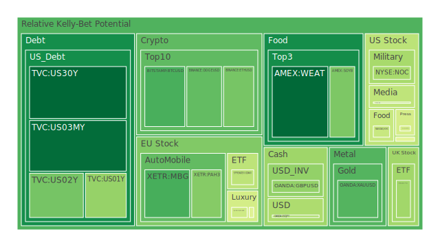
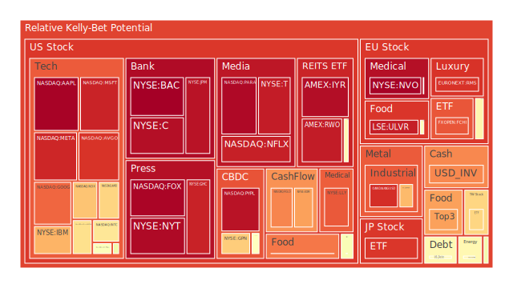
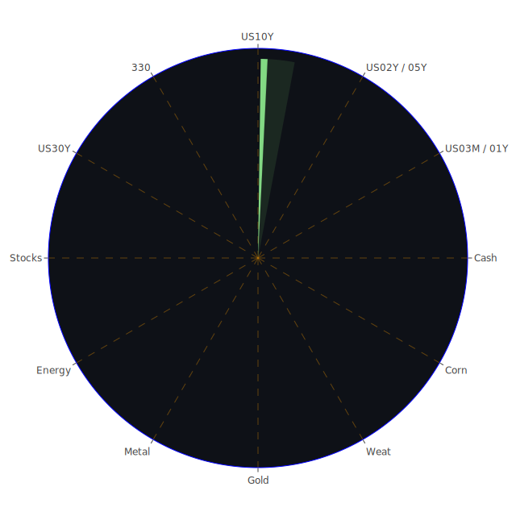

# 每日投資報告

# 投資商品泡沫分析

- **美國國債**
  - 最近美國國債的泡沫機率顯著下降，特別是30年期國債（US30Y），這可能與近期市場對長期利率的預期調整有關。根據最新的數據顯示，SOFR仍低於FED Fund Rate，這意味著美元流動性相對充裕，對於國債的需求可能會有所增加。

- **美國科技股**
  - 科技股的泡沫機率普遍偏高，特別是微軟（MSFT）和蘋果（AAPL），這可能反映了市場對於科技股未來增長的過度樂觀。近期新聞顯示，科技股受到供應鏈問題和市場需求波動的影響，建議投資者謹慎行事。

- **美國房地產指數**
  - 房地產相關的ETF（如VNQ）的泡沫機率略有上升，這可能與近期的房地產市場波動有關。儘管固定抵押貸款利率有所上升，但市場對房地產的需求仍然強勁。

- **加密貨幣**
  - 比特幣（BTCUSD）和以太坊（ETHUSD）的泡沫機率有所下降，這可能反映了市場對於加密貨幣的信心回升。然而，投資者仍需警惕市場的高波動性。

- **金/銀/銅**
  - 黃金（XAUUSD）的泡沫機率有所下降，這可能與全球經濟不確定性增加有關，黃金作為避險資產的需求上升。銀（XAGUSD）和銅（COPPER）的泡沫機率則相對較高，反映了市場對工業金屬需求的擔憂。

- **黃豆 / 小麥 / 玉米**
  - 小麥（WEAT）和玉米（CORN）的泡沫機率有所下降，這可能與全球農產品供應改善有關。近期新聞顯示，儘管某些地區的氣候條件不佳，但整體供應鏈的恢復對農產品價格形成支撐。

- **石油/ 鈾期貨UX!**
  - 石油（USOIL）的泡沫機率略有上升，這可能與近期的地緣政治風險和供應鏈問題有關。鈾期貨（UX1!）的泡沫機率則相對穩定，反映了市場對核能需求的穩定預期。

- **各國外匯市場**
  - 美元兌日元（USDJPY）和歐元兌美元（EURUSD）的泡沫機率顯示出市場對美元的需求增加，這可能與美國經濟數據強勁和全球不確定性增加有關。

- **各國大盤指數**
  - 美國大盤指數（NDX）的泡沫機率較高，這可能反映了市場對於美國經濟增長的過度樂觀。歐洲大盤指數（FCHI）的泡沫機率也較高，顯示出市場對於歐洲經濟的擔憂。

- **美國半導體股**
  - 半導體股（如NVDA）的泡沫機率有所下降，這可能與市場對於AI和自動駕駛技術的需求增加有關。

- **美國銀行股**
  - 美國銀行股（如BAC）的泡沫機率仍然很高，這可能反映了市場對於銀行業未來盈利能力的擔憂。

- **美國軍工股**
  - 軍工股（如LMT）的泡沫機率相對穩定，這可能與全球地緣政治緊張局勢有關。

- **美國電子支付股**
  - 電子支付股（如PYPL）的泡沫機率較高，這可能反映了市場對於電子支付行業競爭加劇的擔憂。

- **美國藥商股**
  - 藥商股（如JNJ）的泡沫機率有所上升，這可能與市場對於醫藥行業未來增長的擔憂有關。

- **美國影視股**
  - 影視股（如DIS）的泡沫機率略有下降，這可能與市場對於影視行業復甦的信心增加有關。

- **美國媒體股**
  - 媒體股（如CMCSA）的泡沫機率相對穩定，這可能反映了市場對於媒體行業的中性預期。

- **石油防禦股**
  - 石油防禦股的泡沫機率較高，這可能與市場對於能源行業未來增長的擔憂有關。

- **金礦防禦股**
  - 金礦防禦股的泡沫機率有所下降，這可能反映了市場對於金礦行業的信心增加。

- **歐洲奢侈品股**
  - 歐洲奢侈品股（如KER）的泡沫機率較高，這可能與市場對於中國消費者需求減少的擔憂有關。

- **歐洲汽車股**
  - 歐洲汽車股（如BMW）的泡沫機率有所下降，這可能反映了市場對於汽車行業需求回升的信心。

- **歐美食品股**
  - 歐美食品股的泡沫機率相對穩定，這可能反映了市場對於食品行業的中性預期。

# 投資建議

- **建議買入**：對於泡沫機率持續下降且遠小於0.5的商品，如美國國債和黃金，建議投資者考慮買入，因為這些資產在市場不確定性增加時，通常被視為避險選擇。
  
- **建議賣出**：對於泡沫機率持續上升且遠大於0.5的商品，如美國科技股和電子支付股，建議投資者考慮賣出，以避免未來可能的價格下跌。

- **觀望**：對於泡沫機率在0.45至0.55之間的商品，如美國房地產指數和部分歐洲汽車股，建議投資者保持觀望，等待市場進一步明朗。

# 風險提示

投資有風險，市場總是充滿不確定性。我們的建議僅供參考，投資者應根據自身的風險承受能力和投資目標，做出獨立的投資決策。特別是對於泡沫機率高的商品，應該謹慎進行投資決策。
 
Daily Buy Map:

 
Daily Sell Map:

 
Daily Radar Chart:

 
