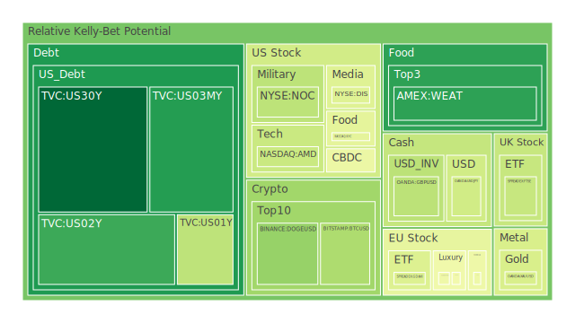
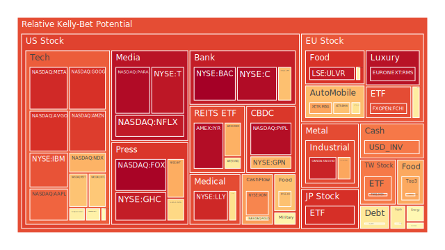
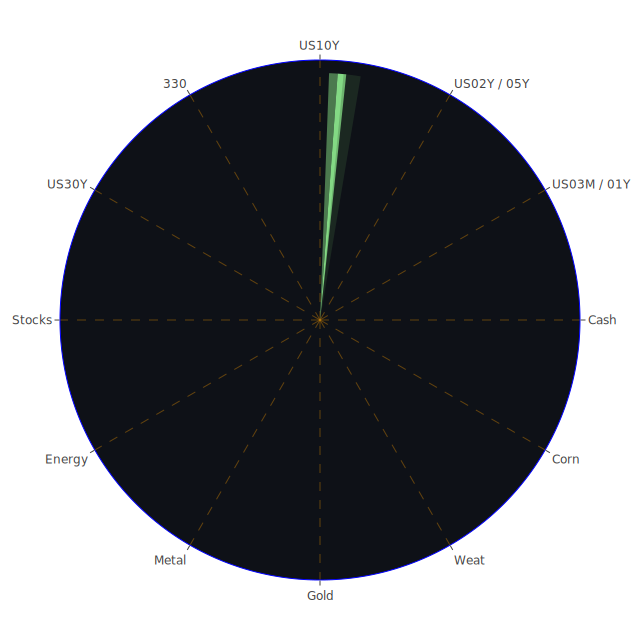

# 投資商品泡沫分析

- **美國國債**
  美國國債的泡沫機率在過去三天內顯著下降，特別是30年期國債（TVC:US30Y），其泡沫機率從0.113170降至0.015284。這表明投資者對長期國債的信心增強，可能是因為近期美國國債收益率的穩定，以及市場對於美國經濟的長期信心。由於SOFR交易量上升，這可能反映出市場對流動性的需求增加，但目前SOFR仍低於FED Fund Rate + 0.2，暫時不構成重大風險。

- **美國科技股**
  科技股如蘋果（NASDAQ:AAPL）和微軟（NASDAQ:MSFT）的泡沫機率持續高企，分別達到0.813244和0.659353。這可能是由於市場對科技股的高估值以及近期市場對於科技股的過度樂觀情緒所致。新聞中提到的美國科技股創下歷史新高，可能進一步推動了這一泡沫。

- **美國房地產指數**
  房地產相關ETF（AMEX:VNQ）的泡沫機率略有上升，從0.569525升至0.569169，顯示出市場對房地產市場的擔憂。這與新聞中提到的商業房地產拖欠率上升相吻合，可能預示著未來房地產市場的挑戰。

- **加密貨幣**
  比特幣（BITSTAMP:BTCUSD）的泡沫機率在過去三天內略有波動，目前為0.324207，顯示市場對加密貨幣的信心有所恢復。這可能與近期市場對於加密貨幣的接受度提高有關。

- **金/銀/銅**
  黃金（OANDA:XAUUSD）的泡沫機率有所下降，從0.268862降至0.406639，顯示出市場對黃金的需求增加，可能是因為市場對於經濟不確定性的避險需求增加。

- **黃豆 / 小麥 / 玉米**
  小麥（AMEX:WEAT）的泡沫機率略有上升，從0.115721升至0.137265，顯示出市場對農產品價格的波動性增加，這可能與全球氣候變遷和供應鏈問題有關。

- **石油/ 鈾期貨UX!**
  石油（TVC:USOIL）的泡沫機率在過去幾天內略有上升，顯示出市場對石油價格的擔憂，這可能與全球經濟放緩和供應鏈中斷有關。

- **各國外匯市場**
  日元兌美元（OANDA:USDJPY）的泡沫機率略有下降，顯示出市場對日元的需求增加，這可能與日本經濟政策的變化有關。

- **各國大盤指數**
  歐洲大盤指數（SPREADEX:FTSE）的泡沫機率有所下降，顯示出市場對歐洲經濟的信心增強，這可能與歐洲央行的政策調整有關。

- **美國半導體股**
  半導體股如台積電（NYSE:TSM）的泡沫機率略有上升，顯示出市場對半導體行業的樂觀情緒，這可能與AI技術的快速發展有關。

- **美國銀行股**
  美國銀行（NYSE:BAC）的泡沫機率持續高企，顯示出市場對銀行業的擔憂，這可能與近期的經濟數據和銀行業的挑戰有關。

- **美國軍工股**
  軍工股如洛克希德·馬丁（NYSE:LMT）的泡沫機率保持穩定，顯示出市場對軍工行業的信心。

- **美國電子支付股**
  電子支付股如PayPal（NASDAQ:PYPL）的泡沫機率持續上升，顯示出市場對電子支付行業的擔憂，這可能與競爭加劇和市場飽和有關。

- **美國藥商股**
  藥商股如默克（NYSE:MRK）的泡沫機率略有上升，顯示出市場對醫藥行業的擔憂，這可能與近期的醫藥政策變化有關。

- **美國影視股**
  影視股如迪士尼（NYSE:DIS）的泡沫機率略有下降，顯示出市場對影視行業的信心增強，這可能與近期的市場表現有關。

- **美國媒體股**
  媒體股如康卡斯特（NASDAQ:CMCSA）的泡沫機率略有上升，顯示出市場對媒體行業的擔憂，這可能與市場競爭加劇有關。

- **石油防禦股**
  石油防禦股如埃克森美孚（NYSE:XOM）的泡沫機率略有下降，顯示出市場對石油行業的信心增強，這可能與油價的穩定有關。

- **金礦防禦股**
  金礦防禦股如皇家黃金（NASDAQ:RGLD）的泡沫機率略有上升，顯示出市場對金礦行業的擔憂，這可能與黃金價格的波動有關。

- **歐洲奢侈品股**
  奢侈品股如路易威登（EURONEXT:MC）的泡沫機率略有下降，顯示出市場對奢侈品行業的信心增強，這可能與中國市場需求的回升有關。

- **歐洲汽車股**
  汽車股如寶馬（XETR:BMW）的泡沫機率略有上升，顯示出市場對汽車行業的擔憂，這可能與全球經濟放緩有關。

- **歐美食品股**
  食品股如可口可樂（NYSE:KO）的泡沫機率略有下降，顯示出市場對食品行業的信心增強，這可能與消費者需求的回升有關。

# 投資建議

1. **考慮買入**：對於泡沫機率顯著下降且低於0.5的商品，如美國國債和黃金，建議投資者考慮分批買入，這些商品在市場不確定性增加時通常具有避險功能。

2. **考慮賣出**：對於泡沫機率顯著上升且高於0.5的商品，如美國科技股和電子支付股，建議投資者謹慎考慮賣出，避免未來可能的價格下跌。

3. **觀望**：對於泡沫機率在0.45至0.55之間的商品，建議投資者保持觀望，等待市場進一步的明確信號。

# 風險提示

投資有風險，市場總是充滿不確定性。我們的建議僅供參考，投資者應根據自身的風險承受能力和投資目標，做出獨立的投資決策。特別是對於泡沫機率高的商品，應該謹慎進行投資決策。
 
Daily Buy Map:

 
Daily Sell Map:

 
Daily Radar Chart:

 
