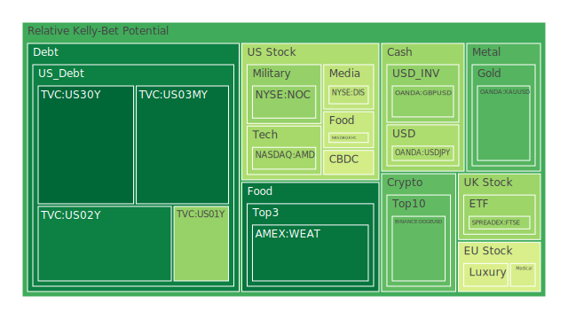
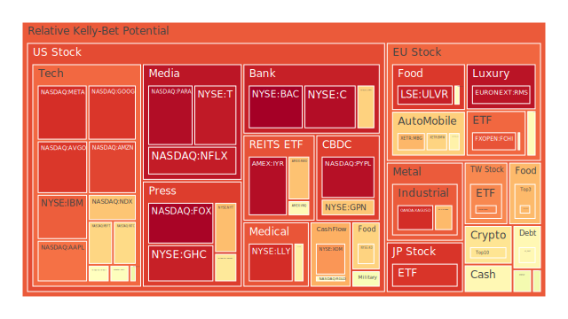
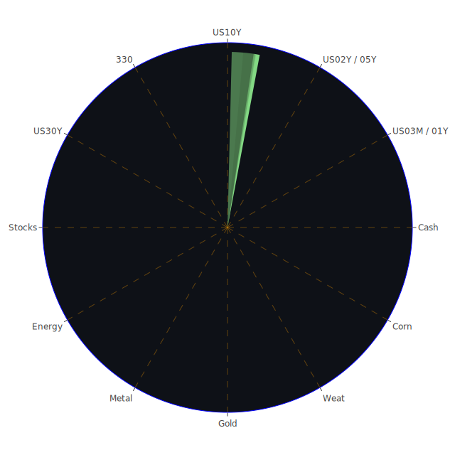

# 投資商品泡沫分析

- **美國國債**
  美國國債的泡沫機率在過去三天內有輕微波動，但整體仍維持在低位。特別是30年期國債（TVC:US30Y），其泡沫機率在0.113170，顯示出市場對長期債券的需求相對穩定。這可能與近期美國經濟數據顯示的通脹壓力減緩有關。

- **美國科技股**
  科技股如微軟（NASDAQ:MSFT）和蘋果（NASDAQ:AAPL）的泡沫機率持續上升，分別達到0.659375和0.813244。這可能受到近期市場對科技股高估值的擔憂影響，加上新聞中提到的科技公司裁員和市場競爭加劇，投資者應謹慎行事。

- **美國房地產指數**
  房地產相關股票如AMEX:VNQ的泡沫機率持續高企，達到0.569169，顯示出市場對房地產的信心不足。這與近期商業地產違約率上升和消費者信貸違約率高企有關。

- **加密貨幣**
  比特幣（BITSTAMP:BTCUSD）的泡沫機率從0.255898上升至0.651647，顯示出市場對加密貨幣的投資熱情有所降溫。這可能與全球監管趨嚴和市場波動性增加有關。

- **金/銀/銅**
  黃金（OANDA:XAUUSD）的泡沫機率在0.268862，顯示出市場對避險資產的需求仍然強勁。近期的地緣政治緊張局勢和市場不確定性增加了投資者對黃金的偏好。

- **黃豆 / 小麥 / 玉米**
  小麥（AMEX:WEAT）的泡沫機率在0.137265，顯示出市場對農產品的需求穩定。這可能與全球糧食供應鏈的穩定有關。

- **石油/ 鈾期貨UX!**
  石油（TVC:USOIL）的泡沫機率為0.512102，顯示出市場對能源價格的預期仍然不穩定。近期的新聞報導顯示，全球能源需求和供應的不確定性可能影響油價走勢。

- **各國外匯市場**
  英鎊兌美元（OANDA:GBPUSD）的泡沫機率為0.350383，顯示出市場對英鎊的信心有所回升。這可能與英國近期的經濟數據改善和市場對英國央行政策的預期有關。

- **各國大盤指數**
  歐洲股市（FXOPEN:FCHI）的泡沫機率為0.854219，顯示出市場對歐洲經濟前景的擔憂。這可能與歐洲央行的政策調整和地緣政治風險有關。

- **美國半導體股**
  半導體股如AMD（NASDAQ:AMD）的泡沫機率為0.378471，顯示出市場對半導體行業的需求仍然強勁。這可能與全球科技需求的增長和供應鏈的改善有關。

- **美國銀行股**
  美國銀行（NYSE:BAC）的泡沫機率高達0.994723，顯示出市場對銀行業的信心不足。這可能與近期的信貸市場波動和銀行業務挑戰有關。

# 投資建議

根據以上分析，我們建議投資者對於泡沫機率高的科技股和銀行股保持謹慎，考慮減少持倉以降低風險。相反，對於泡沫機率低的黃金和小麥等避險資產，投資者可以考慮增加持倉，以應對市場的不確定性。

# 風險提示

投資有風險，市場總是充滿不確定性。我們的建議僅供參考，投資者應根據自身的風險承受能力和投資目標，做出獨立的投資決策。特別是對於泡沫機率高的商品，應該謹慎進行投資決策。
 
Daily Buy Map:

 
Daily Sell Map:

 
Daily Radar Chart:

 
