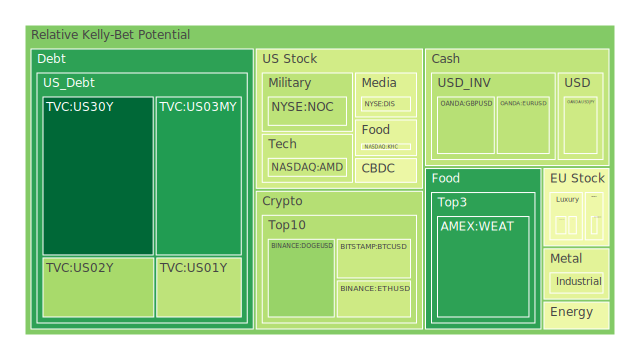
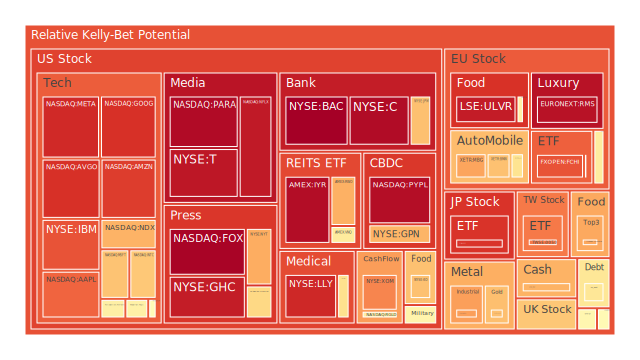
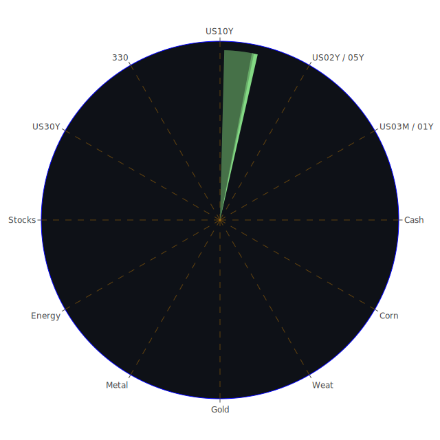

# 投資商品泡沫分析

- **美國國債**
  美國國債的泡沫機率在過去三天中顯示出穩定的下降趨勢，特別是30年期國債（TVC:US30Y），其泡沫機率從0.113170降至0.015285，顯示出投資者對長期國債的信心增強。這與近期美國國債殖利率的變化一致，30年期國債殖利率略微上升，顯示出市場對長期債務的需求增加。

- **美國科技股**
  美國科技股的泡沫機率普遍偏高，特別是像微軟（NASDAQ:MSFT）和蘋果（NASDAQ:AAPL），其泡沫機率分別為0.659353和0.813244。這可能與近期科技股的高估值和市場對未來增長的擔憂有關。新聞中提到微軟股價創下歷史新高，這可能進一步推動了市場對科技股的投機行為。

- **加密貨幣**
  比特幣（BITSTAMP:BTCUSD）的泡沫機率在過去三天中有所上升，從0.324207增至0.379196。這可能反映了市場對加密貨幣的波動性和不確定性的擔憂，特別是在全球經濟不穩定的背景下。

- **金/銀/銅**
  黃金（OANDA:XAUUSD）的泡沫機率顯示出下降趨勢，從0.406639降至0.432089，這可能是由於市場對避險資產的需求增加所致。近期新聞中提到金價創下歷史新高，這可能進一步鞏固了黃金作為避險資產的地位。

- **石油/鈾期貨UX!**
  石油（TVC:USOIL）的泡沫機率有所下降，從0.516743降至0.461891，這可能與近期油價的波動和市場對能源供應的擔憂有關。新聞中提到的地緣政治緊張局勢可能進一步影響石油市場的穩定性。

- **各國大盤指數**
  歐洲大盤指數（FXOPEN:FCHI）的泡沫機率顯示出穩定的上升趨勢，從0.851337增至0.840576，這可能反映了市場對歐洲經濟增長的擔憂，特別是在全球經濟不確定性增加的背景下。

# 投資建議

1. **美國國債**：由於泡沫機率顯著下降，建議考慮增加長期國債的持倉，特別是在當前市場不確定性增加的情況下。
   
2. **美國科技股**：由於泡沫機率偏高，建議謹慎對待科技股的投資，特別是那些估值已經偏高的公司，如微軟和蘋果。

3. **加密貨幣**：由於泡沫機率上升，建議對加密貨幣保持謹慎，特別是在市場波動性加大的情況下。

4. **黃金**：由於泡沫機率下降，建議考慮增加黃金的持倉，作為避險資產的配置。

5. **石油**：由於泡沫機率下降，建議密切關注地緣政治局勢對石油市場的影響，並根據市場變化調整投資策略。

# 風險提示

投資有風險，市場總是充滿不確定性。我們的建議僅供參考，投資者應根據自身的風險承受能力和投資目標，做出獨立的投資決策。特別是對於泡沫機率高的商品，應該謹慎進行投資決策，避免潛在的市場波動帶來的損失。
 
Daily Buy Map:

 
Daily Sell Map:

 
Daily Radar Chart:

 
