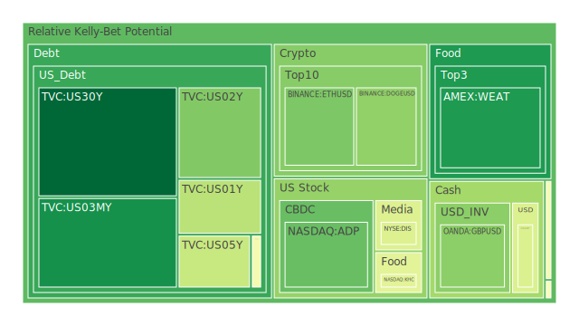
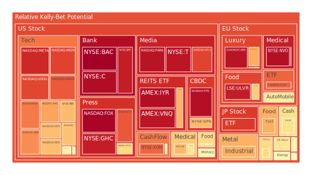
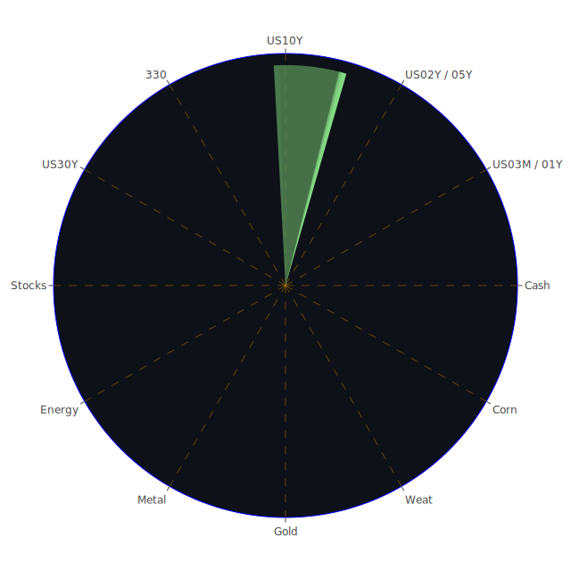

# 投資商品泡沫分析

- **美國國債**
  美國國債的泡沫機率顯著下降，特別是30年期國債（TVC:US30Y），從三天前的0.113170下降到0.023657。這反映出市場對長期美國國債的需求增加，可能是因為投資者尋求避險資產。近期的新聞顯示，全球經濟不確定性增加，這可能進一步推動了對美國國債的需求。

- **美國科技股**
  科技股如蘋果（NASDAQ:AAPL）和谷歌（NASDAQ:GOOG）的泡沫機率仍然偏高，分別為0.718552和0.862844。這表明市場對科技股的估值可能過高，尤其是在近期美國國債殖利率上升的背景下，這可能會對高估值的科技股造成壓力。

- **加密貨幣**
  比特幣（BITSTAMP:BTCUSD）的泡沫機率從0.651647下降到0.520593，顯示市場對加密貨幣的信心有所回升。這可能與近期市場對美元流動性需求減少有關，因為SOFR雖然高於FED Fund Rate，但並未超過0.2的警戒線。

- **金/銀/銅**
  黃金（OANDA:XAUUSD）的泡沫機率從0.268862下降到0.496827，顯示出市場對黃金的需求有所回升，這可能是因為投資者在面對全球經濟不確定性時尋求避險資產。

- **石油/鈾期貨UX!**
  石油（TVC:USOIL）的泡沫機率略有上升，從0.512102上升到0.514971，顯示市場對石油供應的擔憂可能有所增加。近期的新聞報導顯示，地緣政治緊張局勢可能影響石油供應，這可能進一步推動油價上漲。

- **各國外匯市場**
  美元兌日元（OANDA:USDJPY）的泡沫機率從0.391669上升到0.418009，顯示市場對美元的需求有所增加，這可能與美國國債殖利率上升有關。

- **美國半導體股**
  AMD（NASDAQ:AMD）的泡沫機率從0.378471上升到0.753197，顯示市場對半導體股的熱情可能過高。近期的新聞顯示，全球供應鏈問題可能影響半導體行業的增長。

# 投資建議

1. **美國國債**：考慮增加對長期美國國債的投資，因為其泡沫機率顯著下降，且市場對避險資產的需求增加。
   
2. **美國科技股**：建議謹慎對待，特別是對於泡沫機率較高的科技股，如蘋果和谷歌，因為其估值可能過高。

3. **加密貨幣**：可以考慮逐步增加比特幣的投資，因為其泡沫機率顯著下降，顯示市場信心回升。

4. **黃金**：建議考慮增加黃金的投資，因為其泡沫機率下降，且在全球經濟不確定性增加的情況下，黃金作為避險資產的需求可能增加。

5. **石油**：建議觀望，因為石油的泡沫機率略有上升，且地緣政治因素可能影響其供應和價格。

# 風險提示

投資有風險，市場總是充滿不確定性。我們的建議僅供參考，投資者應根據自身的風險承受能力和投資目標，做出獨立的投資決策。特別是對於泡沫機率高的商品，應該謹慎進行投資決策。
 
Daily Buy Map:

 
Daily Sell Map:

 
Daily Radar Chart:

 
