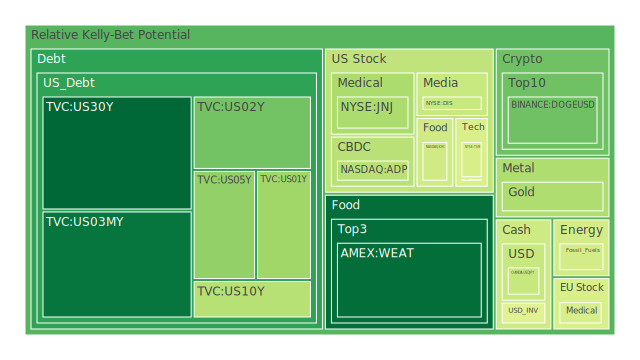
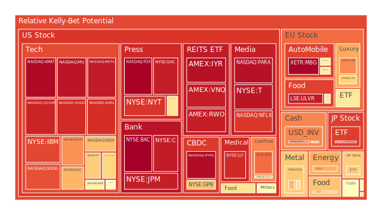
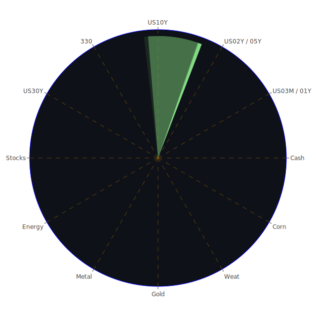

# 投資商品泡沫分析

- **美國國債**
  美國國債的泡沫機率在過去三天內略有下降，特別是30年期國債（TVC:US30Y）從0.023657上升到0.092180，顯示出市場對長期債務的需求增加。這可能與近期美國國債殖利率上升有關，投資者對於長期收益的追求增加。此外，近期的新聞顯示，市場對於美國選舉的不確定性以及利率政策的擔憂，可能進一步推動了對美國國債的需求。

- **美國科技股**
  科技股如微軟（NASDAQ:MSFT）和蘋果（NASDAQ:AAPL）的泡沫機率仍然較高，分別為0.650473和0.907635。這反映出市場對於科技股的高估值仍然存在疑慮。儘管微軟因為聘請前OpenAI CEO Sam Altman而股價創新高，但整體市場對於科技股的未來表現仍持謹慎態度。

- **加密貨幣**
  比特幣（BITSTAMP:BTCUSD）的泡沫機率在過去三天內略有上升，從0.520593上升到0.525367。這可能反映出市場對於加密貨幣的波動性仍然保持警惕，特別是在全球經濟不確定性增加的背景下。

- **金/銀/銅**
  黃金（OANDA:XAUUSD）的泡沫機率有所下降，從0.496827下降到0.378796，顯示出市場對於避險資產的需求增加。這可能與近期全球地緣政治緊張局勢有關，投資者尋求安全資產以對沖風險。

- **石油/鈾期貨UX!**
  石油（TVC:USOIL）的泡沫機率從0.514971下降到0.441987，顯示出市場對於石油需求的樂觀情緒增強。新聞報導指出，中東戰爭和中國需求的增加可能進一步推動油價上漲。

- **各國外匯市場**
  美元兌日圓（OANDA:USDJPY）的泡沫機率略有上升，從0.418009上升到0.420723，顯示出市場對於美元的需求增加，這可能與美國經濟數據的強勁表現有關。

- **各國大盤指數**
  歐洲大盤指數（SPREADEX:FTSE）的泡沫機率從0.587228上升到0.665604，顯示出市場對於歐洲經濟前景的擔憂增加，這可能與近期的地緣政治風險和經濟數據疲弱有關。

# 投資建議

1. **美國國債**：由於泡沫機率下降且需求增加，建議投資者考慮增加對長期美國國債的配置，以對沖市場不確定性。

2. **科技股**：由於泡沫機率高企且市場對高估值的擔憂，建議投資者謹慎對待科技股，可能考慮減少持倉或進行風險對沖。

3. **加密貨幣**：由於泡沫機率略有上升，建議投資者保持謹慎，特別是在市場波動性增加的情況下。

4. **黃金**：由於泡沫機率下降且避險需求增加，建議投資者考慮增加黃金配置，以對沖地緣政治風險。

5. **石油**：由於需求預期增強且泡沫機率下降，建議投資者考慮增加石油相關投資，特別是在中東局勢緊張的背景下。

# 風險提示

投資有風險，市場總是充滿不確定性。我們的建議僅供參考，投資者應根據自身的風險承受能力和投資目標，做出獨立的投資決策。特別是對於泡沫機率高的商品，應該謹慎進行投資決策。
 
Daily Buy Map:

 
Daily Sell Map:

 
Daily Radar Chart:

 
