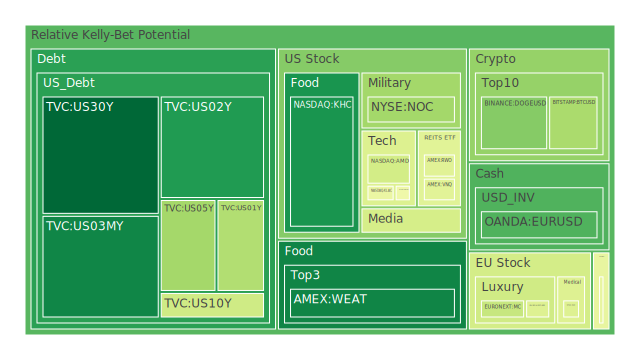
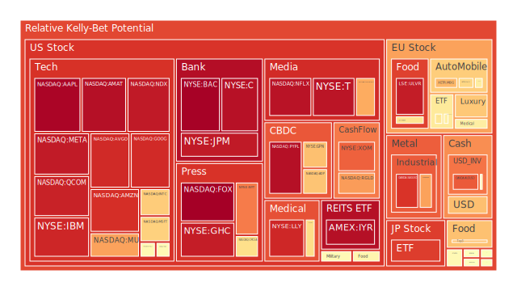
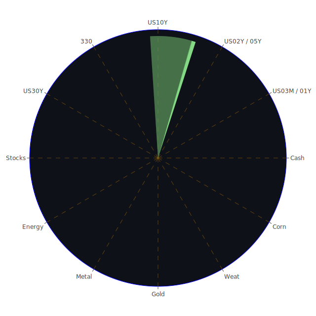

# 投資商品泡沫分析

- **美國國債**
  美國國債的泡沫機率在過去三天內顯著下降，特別是30年期國債（TVC:US30Y），從0.092180降至0.048574，顯示出市場對長期美國國債的需求增加。這可能與近期美國國債殖利率的上升有關，吸引了更多投資者的關注。

- **美國科技股**
  美國科技股的泡沫機率普遍偏高，特別是蘋果（NASDAQ:AAPL）和微軟（NASDAQ:MSFT），分別達到0.987215和0.647171。這可能反映了市場對於科技股高估值的擔憂，尤其是在高利率環境下，投資者對於未來盈利增長的預期有所減弱。

- **美國房地產指數**
  房地產相關股票如AMEX:VNQ的泡沫機率略有下降，但仍然處於高位，顯示市場對房地產市場的信心仍然不足。這可能受到高房貸利率和商業地產違約率上升的影響。

- **加密貨幣**
  比特幣（BITSTAMP:BTCUSD）的泡沫機率從0.525367下降至0.341873，顯示出市場對比特幣的信心有所恢復，可能與近期市場對於加密貨幣監管政策的放鬆有關。

- **金/銀/銅**
  黃金（OANDA:XAUUSD）的泡沫機率略有上升至0.511282，顯示出市場對於避險資產的需求增加，這可能與全球地緣政治緊張局勢有關。

- **黃豆 / 小麥 / 玉米**
  小麥（AMEX:WEAT）的泡沫機率持續下降至0.105544，顯示出市場對農產品的需求增加，這可能受到全球糧食供應鏈緊張的影響。

- **石油/ 鈾期貨UX!**
  石油（TVC:USOIL）的泡沫機率略有上升至0.466742，顯示出市場對於石油供應的不確定性仍然存在，特別是在中東地區的地緣政治風險增加的情況下。

- **各國外匯市場**
  美元兌日元（OANDA:USDJPY）的泡沫機率上升至0.679960，顯示出市場對美元的需求增加，這可能與美國利率上升和日本經濟增長放緩有關。

- **各國大盤指數**
  歐洲主要股指如DAX（SPREADEX:GDAXI）的泡沫機率略有上升至0.572545，顯示出市場對歐洲經濟前景的擔憂，這可能受到地緣政治風險和經濟增長放緩的影響。

- **美國半導體股**
  英偉達（NASDAQ:NVDA）的泡沫機率從0.495240上升至0.483953，顯示出市場對半導體行業的信心有所恢復，這可能受到全球對於高性能計算需求增加的推動。

- **美國銀行股**
  摩根大通（NYSE:JPM）的泡沫機率上升至0.945954，顯示出市場對銀行業的擔憂，這可能與高利率環境下的貸款需求減少有關。

- **美國軍工股**
  雷神科技（NYSE:RTX）的泡沫機率保持穩定在0.510860，顯示出市場對於軍工股的需求穩定，這可能受到全球地緣政治緊張局勢的影響。

- **美國電子支付股**
  PayPal（NASDAQ:PYPL）的泡沫機率上升至0.967157，顯示出市場對電子支付行業的擔憂，這可能與競爭加劇和利潤率壓力有關。

- **美國藥商股**
  默克（NYSE:MRK）的泡沫機率上升至0.575137，顯示出市場對於藥商股的信心有所恢復，這可能與近期新藥研發進展有關。

- **美國影視股**
  Netflix（NASDAQ:NFLX）的泡沫機率上升至0.960931，顯示出市場對於影視股的擔憂，這可能與競爭加劇和用戶增長放緩有關。

- **美國媒體股**
  紐約時報（NYSE:NYT）的泡沫機率上升至0.787112，顯示出市場對於媒體行業的擔憂，這可能與廣告收入下降和數字化轉型挑戰有關。

- **石油防禦股**
  埃克森美孚（NYSE:XOM）的泡沫機率上升至0.827258，顯示出市場對於石油防禦股的擔憂，這可能與油價波動和環保政策壓力有關。

- **金礦防禦股**
  金礦股的泡沫機率略有上升，顯示出市場對於避險資產的需求增加，這可能與全球經濟不確定性有關。

- **歐洲奢侈品股**
  歐洲奢侈品股的泡沫機率略有上升，顯示出市場對於奢侈品行業的擔憂，這可能與全球經濟增長放緩和消費者支出減少有關。

- **歐洲汽車股**
  歐洲汽車股的泡沫機率略有上升，顯示出市場對於汽車行業的擔憂，這可能與供應鏈問題和電動車轉型挑戰有關。

- **歐美食品股**
  歐美食品股的泡沫機率略有上升，顯示出市場對於食品行業的擔憂，這可能與成本上升和消費者需求變化有關。

# 投資建議

根據以上分析，我們建議投資者對於泡沫機率持續下降且遠小於0.5的商品，如美國國債和比特幣，考慮分批買入以掌握低吸籌碼的時機。對於泡沫機率持續上升且遠大於0.5的商品，如美國科技股和電子支付股，建議投資者考慮賣出以避免未來價格下跌時的損失。

# 風險提示

投資有風險，市場總是充滿不確定性。我們的建議僅供參考，投資者應根據自身的風險承受能力和投資目標，做出獨立的投資決策。特別是對於泡沫機率高的商品，應該謹慎進行投資決策。
 
Daily Buy Map:

 
Daily Sell Map:

 
Daily Radar Chart:

 
