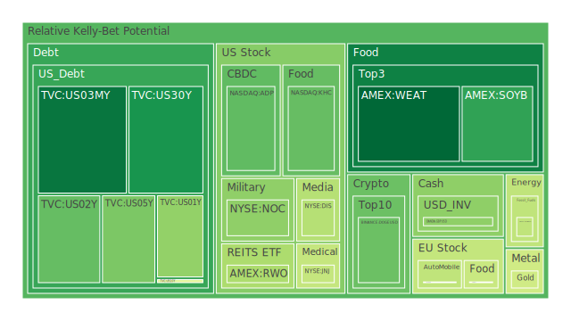
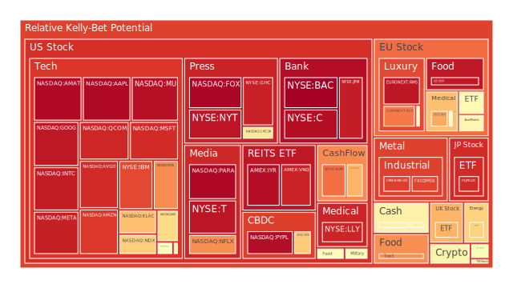
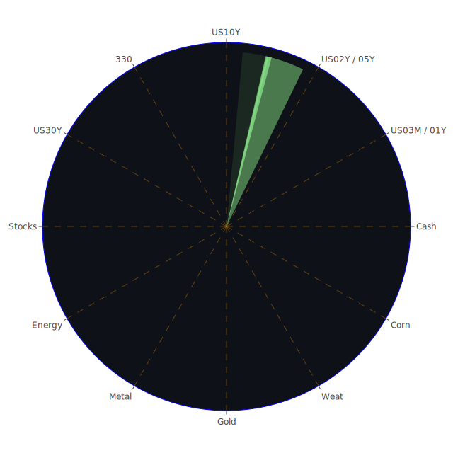

# 投資商品泡沫分析

- **美國國債**
  美國國債的泡沫機率在過去三天內有顯著下降，特別是30年期國債（US30Y），從0.092180上升至0.199630。這反映出市場對長期債券的需求增加，可能是因為投資者尋求避險資產以應對市場不確定性。近期的新聞顯示，美國的經濟數據表現不佳，這可能進一步推動了對國債的需求。

- **美國科技股**
  科技股的泡沫機率普遍較高，例如微軟（MSFT）和蘋果（AAPL）的泡沫機率分別為0.917966和0.977726。這可能是因為市場對科技股的預期過高，加上近期的新聞顯示，科技公司面臨的監管壓力增加，特別是在美國和歐洲。

- **美國房地產指數**
  房地產相關的ETF（如VNQ）的泡沫機率持續高企，達到0.930622。這反映出市場對房地產市場的擔憂，特別是在商業地產拖欠率上升的情況下。新聞報導顯示，商業地產市場面臨的挑戰加劇，這可能進一步影響房地產相關資產的表現。

- **加密貨幣**
  比特幣（BTCUSD）的泡沫機率從0.525367上升至0.605063，顯示出市場對加密貨幣的信心有所下降。這可能與近期的監管壓力和市場波動有關。

- **金/銀/銅**
  金價（XAUUSD）的泡沫機率有所下降，從0.378796下降至0.453387，顯示出市場對黃金的需求增加，可能是因為投資者尋求避險資產。相對而言，銀（XAGUSD）和銅（COPPER）的泡沫機率較高，分別為0.886333和0.879400，這可能反映出工業需求的不確定性。

- **黃豆 / 小麥 / 玉米**
  小麥（WEAT）的泡沫機率從0.103232上升至0.117744，顯示出市場對農產品價格的擔憂，可能是因為全球供應鏈問題和氣候變化的影響。

- **石油/ 鈾期貨UX!**
  石油（USOIL）的泡沫機率從0.441987下降至0.424926，顯示出市場對石油價格的信心增加，可能是因為中東地區的地緣政治緊張局勢推動了油價上漲。

- **各國外匯市場**
  美元兌日元（USDJPY）的泡沫機率有所上升，達到0.591136，這可能反映出市場對日元的需求增加，特別是在全球經濟不確定性增加的情況下。

- **各國大盤指數**
  歐洲主要指數（如FTSE）的泡沫機率較高，達到0.721164，這可能反映出市場對歐洲經濟的擔憂，特別是在英國脫歐後的經濟不確定性增加。

- **美國半導體股**
  半導體股（如NVDA）的泡沫機率上升至0.776115，這可能是因為市場對半導體供應鏈問題的擔憂，以及對未來需求的不確定性。

- **美國銀行股**
  美國銀行股（如BAC）的泡沫機率接近1，達到0.994806，顯示出市場對銀行業的擔憂，特別是在商業地產拖欠率上升和消費者信貸風險增加的情況下。

- **美國軍工股**
  軍工股（如LMT）的泡沫機率維持在中等水平，顯示出市場對軍工行業的信心相對穩定，可能是因為全球地緣政治緊張局勢的影響。

- **美國電子支付股**
  電子支付股（如PYPL）的泡沫機率較高，達到0.968961，這可能反映出市場對電子支付行業競爭加劇的擔憂。

- **美國藥商股**
  藥商股（如JNJ）的泡沫機率有所下降，顯示出市場對醫藥行業的信心增加，特別是在全球健康危機持續的情況下。

- **美國影視股**
  影視股（如DIS）的泡沫機率有所下降，顯示出市場對影視行業的信心增加，可能是因為消費者需求回升。

- **美國媒體股**
  媒體股（如FOX）的泡沫機率接近1，顯示出市場對媒體行業的擔憂，特別是在廣告收入下降和競爭加劇的情況下。

- **石油防禦股**
  石油防禦股（如XOM）的泡沫機率較高，達到0.819102，這可能反映出市場對石油價格波動的擔憂。

- **金礦防禦股**
  金礦股的泡沫機率有所下降，顯示出市場對金礦行業的信心增加，可能是因為黃金價格的上升。

- **歐洲奢侈品股**
  奢侈品股（如KER）的泡沫機率較高，達到0.802479，這可能反映出市場對奢侈品需求的不確定性，特別是在全球經濟放緩的情況下。

- **歐洲汽車股**
  汽車股（如BMW）的泡沫機率有所下降，顯示出市場對汽車行業的信心增加，可能是因為電動車需求的上升。

- **歐美食品股**
  食品股（如KO）的泡沫機率較高，達到0.559991，這可能反映出市場對食品行業成本上升的擔憂。

# 投資建議

1. **考慮買入**：對於泡沫機率持續下降且遠小於0.5的商品，如黃金（XAUUSD）和美國國債（US30Y），建議投資者考慮分批買入，因為這些資產可能提供較好的避險機會。

2. **考慮賣出**：對於泡沫機率持續上升且遠大於0.5的商品，如科技股（如MSFT）和銀行股（如BAC），建議投資者考慮獲利了結，因為這些資產可能面臨價格回調的風險。

3. **觀望**：對於泡沫機率在0.45至0.55之間的商品，如石油（USOIL）和房地產ETF（VNQ），建議投資者保持觀望，等待市場進一步明朗。

# 風險提示

投資有風險，市場總是充滿不確定性。我們的建議僅供參考，投資者應根據自身的風險承受能力和投資目標，做出獨立的投資決策。特別是對於泡沫機率高的商品，應該謹慎進行投資決策。
 
Daily Buy Map:

 
Daily Sell Map:

 
Daily Radar Chart:

 
