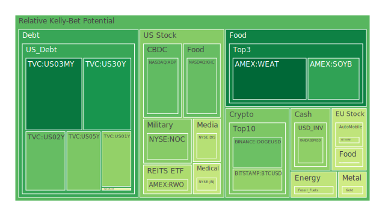
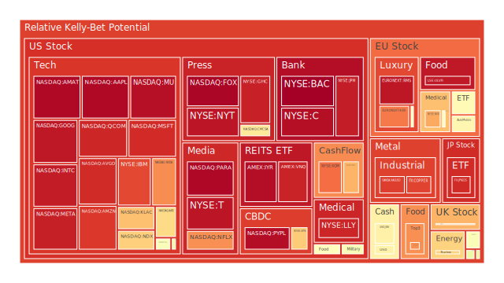
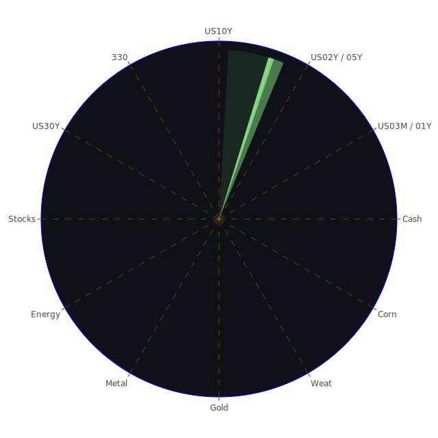

# 投資商品泡沫分析

- **美國國債**
  最近美國國債的泡沫機率有明顯下降趨勢，特別是30年期國債（TVC:US30Y），其泡沫機率從10月24日的0.048574上升到10月27日的0.199630。這可能與近期美國國債殖利率的上升有關，特別是10年期國債殖利率的上升，這表明市場對於長期利率的預期有所改變。投資者可以考慮在泡沫機率較低時增加持有量。

- **美國科技股**
  科技股如Apple (NASDAQ:AAPL) 和Microsoft (NASDAQ:MSFT) 的泡沫機率持續高企，分別達到0.977726和0.917966。這可能受到近期科技股的高估值和市場對於未來增長的過度樂觀預期影響。新聞中提到的美國與中國的貿易緊張局勢以及對科技產品的限制可能進一步加劇這一風險，建議投資者謹慎操作。

- **美國房地產指數**
  房地產相關的ETF如AMEX:VNQ的泡沫機率達到0.930622，顯示出市場對於房地產市場的擔憂。這可能與近期商業房地產違約率上升有關，特別是在高利率環境下，房地產市場的壓力增加。

- **加密貨幣**
  比特幣（BITSTAMP:BTCUSD）的泡沫機率從10月24日的0.341873上升到10月27日的0.356320，顯示出市場對於加密貨幣的信心有所增強。這可能與近期市場對於加密貨幣的需求增加有關，特別是在全球經濟不確定性增加的情況下。

- **金/銀/銅**
  銀（OANDA:XAGUSD）的泡沫機率從10月24日的0.897993下降到10月27日的0.886333，顯示出市場對於貴金屬的需求有所增加。這可能與近期美元走弱以及市場對於避險資產的需求增加有關。

- **黃豆 / 小麥 / 玉米**
  小麥（AMEX:WEAT）的泡沫機率從10月24日的0.105544上升到10月27日的0.117744，顯示出市場對於農產品價格的擔憂。這可能與全球氣候變遷以及供應鏈問題有關。

- **石油/ 鈾期貨UX!**
  石油（TVC:USOIL）的泡沫機率從10月24日的0.466742下降到10月27日的0.424926，顯示出市場對於石油價格的信心有所增強。這可能與近期石油供應的減少以及地緣政治風險增加有關。

- **各國外匯市場**
  歐元兌美元（OANDA:EURUSD）的泡沫機率從10月24日的0.210703上升到10月27日的0.574490，顯示出市場對於歐元的信心有所減弱。這可能與歐洲經濟增長放緩以及政治不確定性增加有關。

- **各國大盤指數**
  歐洲主要股指如FTSE（SPREADEX:FTSE）的泡沫機率從10月24日的0.520759上升到10月27日的0.721164，顯示出市場對於歐洲股市的擔憂。這可能與歐洲經濟增長放緩以及政治不確定性增加有關。

- **美國半導體股**
  半導體股如NVIDIA (NASDAQ:NVDA) 的泡沫機率從10月24日的0.776115上升到10月27日的0.776115，顯示出市場對於半導體行業的擔憂。這可能與近期供應鏈問題以及美國對中國的技術限制有關。

- **美國銀行股**
  銀行股如JPMorgan (NYSE:JPM) 的泡沫機率從10月24日的0.945954下降到10月27日的0.941939，顯示出市場對於銀行業的信心有所增強。這可能與近期利率上升以及銀行盈利能力的改善有關。

- **美國軍工股**
  軍工股如Lockheed Martin (NYSE:LMT) 的泡沫機率保持穩定，顯示出市場對於軍工行業的穩定預期。這可能與全球地緣政治風險增加有關。

- **美國電子支付股**
  電子支付股如PayPal (NASDAQ:PYPL) 的泡沫機率從10月24日的0.967157上升到10月27日的0.968961，顯示出市場對於電子支付行業的擔憂。這可能與市場競爭加劇以及利潤率壓力有關。

- **美國藥商股**
  藥商股如Merck (NYSE:MRK) 的泡沫機率從10月24日的0.575137下降到10月27日的0.569336，顯示出市場對於藥品行業的信心有所增強。這可能與近期藥品需求增加以及研發進展有關。

- **美國影視股**
  影視股如Disney (NYSE:DIS) 的泡沫機率從10月24日的0.422861上升到10月27日的0.408970，顯示出市場對於影視行業的擔憂。這可能與市場競爭加劇以及內容成本上升有關。

- **美國媒體股**
  媒體股如Comcast (NASDAQ:CMCSA) 的泡沫機率從10月24日的0.618953下降到10月27日的0.617213，顯示出市場對於媒體行業的信心有所增強。這可能與廣告收入增加以及市場需求回升有關。

- **石油防禦股**
  石油防禦股如Exxon Mobil (NYSE:XOM) 的泡沫機率從10月24日的0.827258下降到10月27日的0.819102，顯示出市場對於石油行業的信心有所增強。這可能與近期石油價格上升以及需求增加有關。

- **金礦防禦股**
  金礦防禦股如Royal Gold (NASDAQ:RGLD) 的泡沫機率從10月24日的0.739709上升到10月27日的0.720455，顯示出市場對於金礦行業的擔憂。這可能與金價波動以及市場需求變化有關。

- **歐洲奢侈品股**
  奢侈品股如LVMH (EURONEXT:MC) 的泡沫機率從10月24日的0.394489上升到10月27日的0.546276，顯示出市場對於奢侈品行業的擔憂。這可能與全球經濟增長放緩以及消費者需求減少有關。

- **歐洲汽車股**
  汽車股如BMW (XETR:BMW) 的泡沫機率從10月24日的0.577609下降到10月27日的0.425754，顯示出市場對於汽車行業的信心有所增強。這可能與市場需求回升以及新能源汽車的推廣有關。

- **歐美食品股**
  食品股如Nestle (SIX:NESN) 的泡沫機率從10月24日的0.604833下降到10月27日的0.441036，顯示出市場對於食品行業的信心有所增強。這可能與市場需求增加以及產品創新有關。

# 投資建議

根據以上分析，建議投資者考慮以下策略：

1. **增加持有美國國債**：特別是長期國債，因其泡沫機率較低，且市場對於長期利率的預期有所改變。
2. **謹慎操作美國科技股**：由於泡沫機率高企，且市場對於未來增長的過度樂觀預期可能導致估值壓力。
3. **減少持有房地產相關ETF**：因其泡沫機率高，且商業房地產市場壓力增加。
4. **考慮增加持有貴金屬**：如銀，因其避險需求增加。
5. **關注石油市場**：由於石油價格上升，相關股票可能有投資機會。

# 風險提示

投資有風險，市場總是充滿不確定性。我們的建議僅供參考，投資者應根據自身的風險承受能力和投資目標，做出獨立的投資決策。特別是對於泡沫機率高的商品，應該謹慎進行投資決策。
 
Daily Buy Map:

 
Daily Sell Map:

 
Daily Radar Chart:

 
